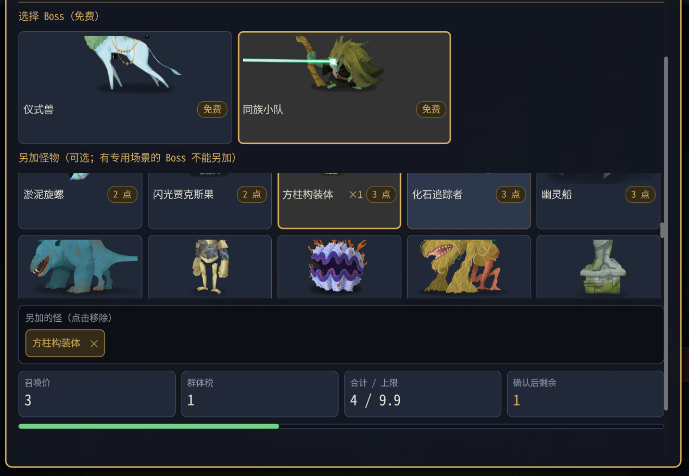

# 召唤阶段 0.0.15 实测结果

## 结论

**部分通过，有界面问题，覆盖不完整，可交 Claude 继续开发。** 只测试和只读分析，没有修改 mod 代码。

代码 ccb3ebe，游戏 v0.111.0；测试 75 个全过（Core 41、mod 34），实际游戏编译安装零警告、零错误，安装 manifest version=0.0.15。塔主 NetId=100001，爬塔玩家=100002。新局种子 13025795298417210998，第一幕 Overgrowth。

以测试说明开头 0.0.15 和设计文档“召唤规则变更”为准；说明后半段仍有旧版倒计时和禁止另加的文字，本轮不沿用。

## 画面观察和待修问题

- **不通过：Boss 召唤面板整体超出屏幕。** 用户截图显示顶部内容被截、当前画面看不到底部确认按钮；是否能通过外层滚动完全访问按钮未单独确认。
- **不通过：高个子怪物预览超出显示区域。** 用户明确补充“不止 Boss，还有一些比较高个子的怪都会超出显示”；未逐一确认怪物名称，不猜具体名单。需要覆盖普通、精英、Boss 预览的缩放与居中。
- **平衡反馈：召唤点经常花完，感觉不够用。** 本轮账本算术对得上；这不代表经济平衡合适。后半段连续花费 7、8、6、6，收入分别 4、4、4、5，使余额从 15 降至 5，其中精英确认后余额曾为 0。
- 用户确认跨幕怪画面、动画、出招正常，没有明显卡顿。
- **用户追加的平衡建议：前三场开局保护太保守。** 用户认为怪物血量已有下调、塔主召唤点少、能召唤的怪也少，叠加后偏弱，希望“稍微加强一点点”。供 Claude 调整数值或保护范围时参考，不是要求全面取消保护。日志中的跨幕降血发生在第四场，不能将用户这项感受写成已确认前三场也触发水土不服。
- 用户没有试本轮“按原版出场”；以前试过不能替代本版本覆盖。
- 精英“1 精英＋小怪”没有试，不能凭“应该不大”判通过。实际仅召唤 BygoneEffigy。
- Boss 截图选中方柱构装体，但最终广播 Monsters=[]，因此 **Boss 另加怪没有实际提交/生成，未覆盖**。墨影幻灵禁止另加未覆盖。
- 普通房和精英房面板截图未提供；仅保存本次 Boss 面板截图。



只读代码定位供开发者检查，尚未证实具体布局根因：SummonPanel.cs:64–77 为面板/外层滚动高度；:245–281 为按 Bounds 缩放预览及无有效 Bounds 的固定 0.5 倍兜底。没有修改。

## 清单、替换、生成及降血

去掉时间戳后，两端相关记录逐行比较：**31 / 31 行，完全一致=True**。包含 8 份收到清单、7 次混搭生成、Boss 替换以及跨幕降血。Boss 原版生成没有测试1b混搭生成行，不能当成追加已验证。

|序号|房间|阵容|替换载体/遭遇|结论|
|---|---|---|---|---|
|1|普通|TwigSlimeM + TwigSlimeS|FuzzyWurmCrawlerWeak → CultistsNormal|两端一致|
|2|普通|ShrinkerBeetle|NibbitsWeak → CultistsNormal|两端一致|
|3|普通|Nibbit|ShrinkerBeetleWeak → CultistsNormal|两端一致|
|4|普通|LivingShield|SlitheringStranglerNormal → CultistsNormal|两端一致|
|5|普通|BruteRubyRaider + CalcifiedCultist + Inklet|NibbitsNormal → CultistsNormal|两端一致|
|6|普通|SlitheringStrangler + CubexConstruct|RubyRaidersNormal → CultistsNormal|两端一致|
|7|精英|BygoneEffigy|ByrdonisElite → BygoneEffigyElite|两端一致|
|8|Boss|TheKinBoss，无另加怪|CeremonialBeastBoss → TheKinBoss|两端一致|

两端降血原文（去掉时间戳）：

```text
INFO 召唤：LivingShield 水土不服，生命 55 → 33
```

55 × 60%=33，符合超前两幕各减20%的规则；这次是跨两幕，不是80%样例。用户确认表现正常，但没有提供战斗血量截图或明确报出33，**日志降血一致通过，画面数值核对未确认**。

## 精英奖励

两端均记录以下爬塔玩家奖励组，包含金币、遗物和卡牌：

```text
[DEBUG] [RewardsSetSynchronizer] Beginning rewards set Id: 9 Owner: 100002 Rewards: MegaCrit.Sts2.Core.Rewards.GoldReward,MegaCrit.Sts2.Core.Rewards.RelicReward,MegaCrit.Sts2.Core.Rewards.CardReward
```

**单精英替换后生成遗物奖励通过；1精英＋小怪奖励未覆盖。** 用户未注意遗物和金币，奖励组随后为 Skipped；日志未提供该组金币具体数量，不能核实精英金币档位，也不能写成已领取。上一组普通战实际领取19金币不属于精英奖励。

## 召唤点流水

起始10点。各行“开局余额−花费=确认后余额”；已结算各行“确认后余额＋收入=结束余额”均成立。

|场次|阵容|开局余额|花费|确认后余额|收入|结束余额|
|---|---|---:|---:|---:|---|---:|
|1|TwigSlimeM+TwigSlimeS|10|3|7|4|11|
|2|ShrinkerBeetle|11|2|9|4|13|
|3|Nibbit|13|2|11|4|15|
|4|LivingShield|15|7|8|4|12|
|5|BruteRubyRaider+CalcifiedCultist+Inklet|12|8|4|4|8|
|6|SlitheringStrangler+CubexConstruct|8|6|2|4|6|
|7|BygoneEffigy|6|6|0|5|5|
|8|TheKinBoss|5|0|5|未结算|5|

Boss 免费本体花费0，退出前未见Boss胜利收入。注意：游戏日志存在 `Executing DevConsole command (player 100002): win`，多场用控制台结束。不能据此验证完整战斗难度、怪物全部行动及自然战果收入。召唤点“算术正确”和“平衡足够”是两个结论。

## 异常和资源警告

- 两端 TowerMaster 日志 **ERROR=0，WARN=0**，探针无 WARN。
- 两端游戏日志 StateDivergence 均为0；未见运行中战斗初始化异常或Boss站位异常。Boss另加未覆盖，不能据此验证其站位。
- 游戏日志存在大量 `Asset not cached`，尤其塔主生成面板预览时加载各幕战斗模型。用户未感到明显卡顿。没有最小mod对照，不能把所有资源警告或退出泄漏都归因于TowerMaster。

资源警告摘录：

```text
[WARN] Asset not cached: res://scenes/creature_visuals/bygone_effigy.tscn
[WARN] Asset not cached: res://scenes/creature_visuals/living_shield.tscn
[WARN] Asset not cached: res://scenes/creature_visuals/bygone_effigy.tscn
[WARN] Asset not cached: res://scenes/creature_visuals/living_shield.tscn
[WARN] Asset not cached: res://scenes/creature_visuals/bygone_effigy.tscn
[WARN] Asset not cached: res://scenes/creature_visuals/living_shield.tscn
[WARN] Asset not cached: res://scenes/creature_visuals/bygone_effigy.tscn
[WARN] Asset not cached: res://scenes/creature_visuals/living_shield.tscn
[WARN] Asset not cached: res://scenes/creature_visuals/ceremonial_beast.tscn
[WARN] Asset not cached: res://scenes/creature_visuals/kin_priest.tscn
[WARN] Asset not cached: res://scenes/creature_visuals/bygone_effigy.tscn
[WARN] Asset not cached: res://scenes/creature_visuals/living_shield.tscn
```

### 塔主游戏日志全部 ERROR 原文

以下均在退出阶段。

```text
ERROR: 1 RID allocations of type 'N26RendererEnvironmentStorage11EnvironmentE' were leaked at exit.
ERROR: 5 shaders of type CanvasShaderRD were never freed
ERROR: 27 RID allocations of type 'N10RendererRD16ParticlesStorage9ParticlesE' were leaked at exit.
ERROR: 1 shaders of type ParticlesShaderRD were never freed
ERROR: 27 RID allocations of type 'N10RendererRD11MeshStorage4MeshE' were leaked at exit.
ERROR: 79 RID allocations of type 'N10RendererRD15MaterialStorage8MaterialE' were leaked at exit.
ERROR: 6 RID allocations of type 'N10RendererRD15MaterialStorage6ShaderE' were leaked at exit.
ERROR: 185 RID allocations of type 'N10RendererRD14TextureStorage7TextureE' were leaked at exit.
ERROR: 342 RID allocations of type 'PN18TextServerAdvanced22ShapedTextDataAdvancedE' were leaked at exit.
ERROR: 10 RID allocations of type 'PN18TextServerAdvanced12FontAdvancedE' were leaked at exit.
ERROR: 8 RID allocations of type 'PN18TextServerAdvanced27FontAdvancedLinkedVariationE' were leaked at exit.
ERROR: 231 resources still in use at exit (run with --verbose for details).
```

### 爬塔玩家游戏日志全部 ERROR 原文

以下均在退出阶段。

```text
ERROR: 1 RID allocations of type 'N26RendererEnvironmentStorage11EnvironmentE' were leaked at exit.
ERROR: 5 shaders of type CanvasShaderRD were never freed
ERROR: 15 RID allocations of type 'N10RendererRD16ParticlesStorage9ParticlesE' were leaked at exit.
ERROR: 1 shaders of type ParticlesShaderRD were never freed
ERROR: 15 RID allocations of type 'N10RendererRD11MeshStorage4MeshE' were leaked at exit.
ERROR: 25 RID allocations of type 'N10RendererRD15MaterialStorage8MaterialE' were leaked at exit.
ERROR: 6 RID allocations of type 'N10RendererRD15MaterialStorage6ShaderE' were leaked at exit.
ERROR: 172 RID allocations of type 'N10RendererRD14TextureStorage7TextureE' were leaked at exit.
ERROR: 239 RID allocations of type 'PN18TextServerAdvanced22ShapedTextDataAdvancedE' were leaked at exit.
ERROR: 8 RID allocations of type 'PN18TextServerAdvanced12FontAdvancedE' were leaked at exit.
ERROR: 3 RID allocations of type 'PN18TextServerAdvanced27FontAdvancedLinkedVariationE' were leaked at exit.
ERROR: 211 resources still in use at exit (run with --verbose for details).
```

## 回归与未覆盖

- 前3场普通战保护范围有实际召唤；第四场跨幕LivingShield生成并降血。
- 未覆盖：精英＋小怪、Boss追加怪、墨影幻灵禁止追加、本轮按原版出场、读档/重连恢复、普通/精英面板截图。
- 本轮宝箱自动开箱以日志是否出现为准，不延用以前通过结果。
- 没有提交原始日志全文或反编译源码。原始日志仅在本机工作目录备份。

本轮宝箱记录：

```text
[08:31:58.806] INFO 测试3 宝箱：塔主跳过遗物
[08:32:00.270] INFO 测试3 宝箱：塔主不拿开箱金币，已跳过
[08:32:00.277] INFO 测试3 宝箱：塔主自动开箱（保证各端奖励编号一致）
[08:32:42.849] INFO 测试3 宝箱：塔主跳过遗物
[08:32:44.311] INFO 测试3 宝箱：塔主不拿开箱金币，已跳过
[08:32:44.314] INFO 测试3 宝箱：塔主自动开箱（保证各端奖励编号一致）
```
