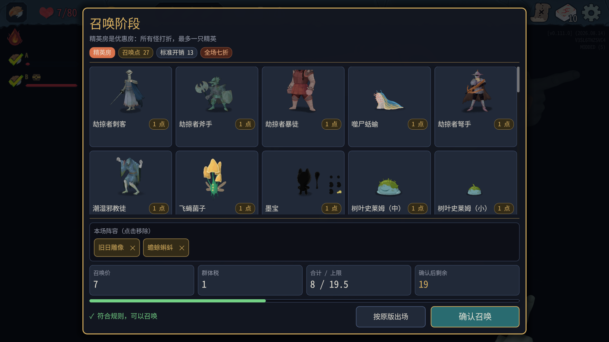
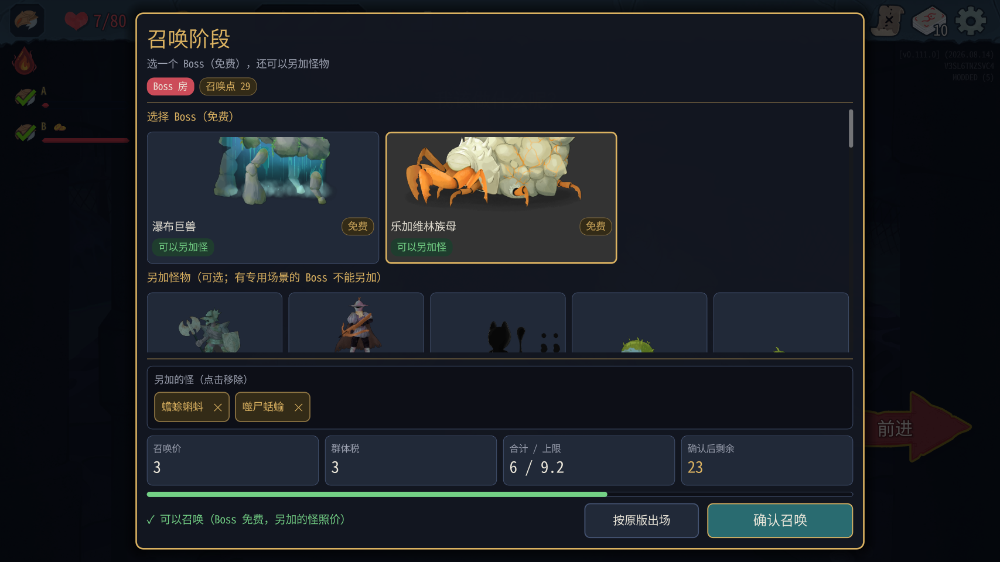
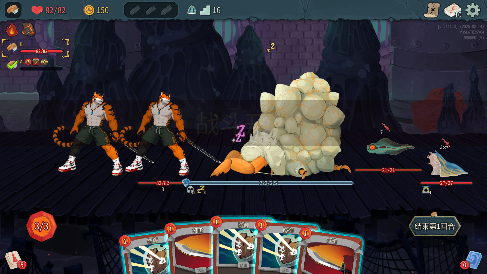
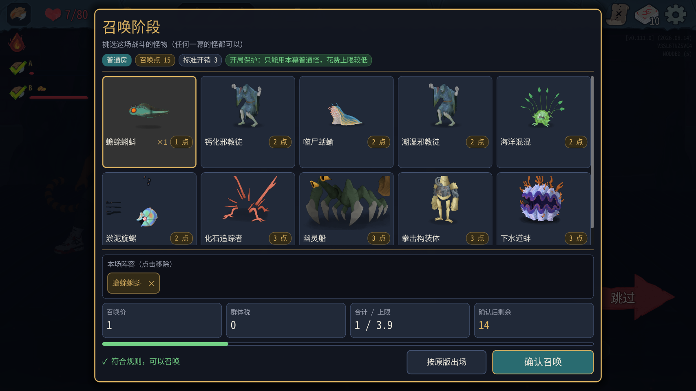
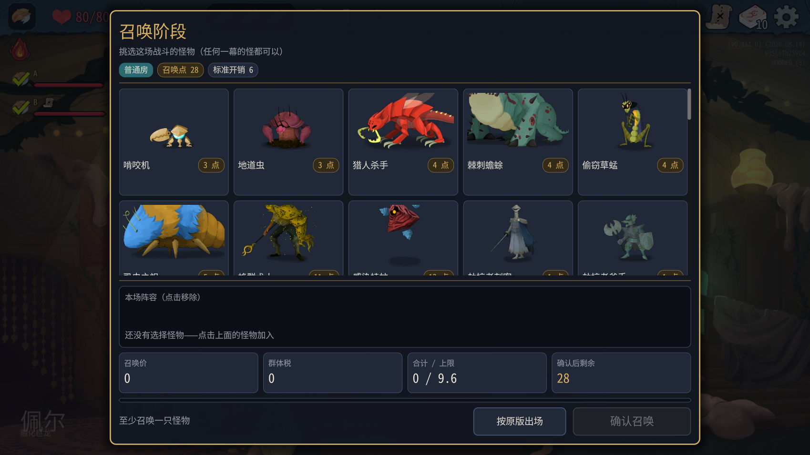
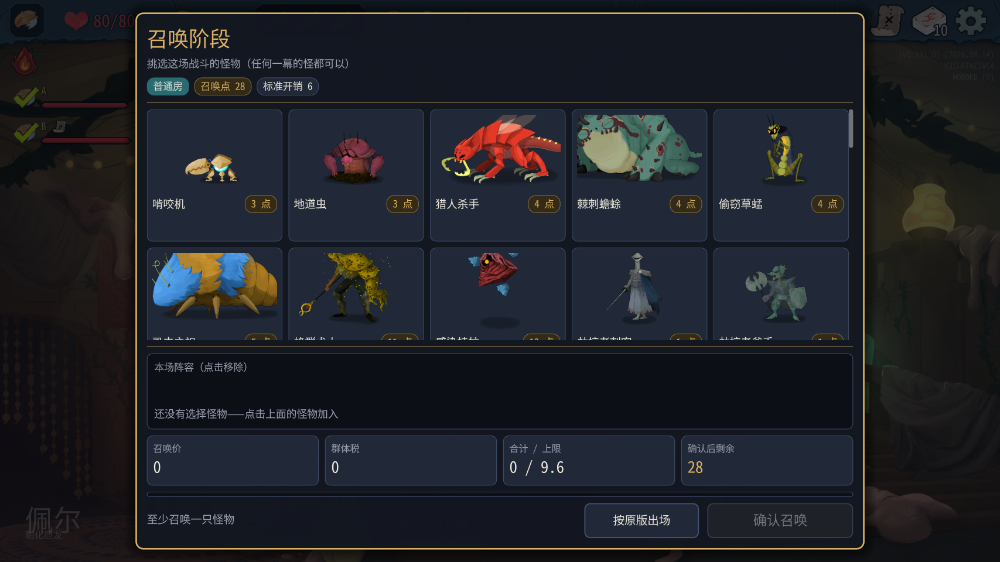

# 召唤阶段0.0.17实测结果

## 结论

**主要召唤流程通过；怪物预览仍裁切，部分项目未覆盖。** 使用阶段A测试接口自动推进第一幕到第二幕，战斗全部由控制台win结束，不验证自然难度/全部怪物AI。未修改代码。

代码81018be；游戏v0.111.0；本机A/B，塔主100001，爬塔玩家100002。81个测试全过（41+40），编译安装零警告零错误，manifest0.0.17。新局种子2220966056932320891，第一幕Underdocks。接口结果见[testing-mcp-result.md](testing-mcp-result.md)。

## 开局保护、按原版与跨幕

- 开局12点；前三场列表只含home_act=1且elite=false的普通怪；第三场按原版，第四場opening_protected=false，列表实际包含第二/第三幕怪和精英。
- 第一场standard_cost=3，spend_cap=3.9000000000000004，对应×1.3。选择HauntedShip+PunchConstruct总价7，返回OpeningProtectionCost、提示“开局保护：花费超过本场上限”，确认接口rejected_rule；随后单只CalcifiedCultist成功。
- 普通房按原版：第一幕余额20→17、标准开销3、实际扣3；第二幕余额28→22，标准6、扣6。日志已经写“塔主选择按原版出场”，没有误写超时。
- 跨一幕Chomper生命61→49，跨两幕TurretOperator41→25；两端tm_state的hp/max_hp与日志一致。每组实际确认两端enemies相同。

## 精英混搭和奖励

实际选BygoneEffigy+Toadpole，生成血量127、23，两端一致。载体BygoneEffigyElite，仍为RoomType.Elite。通过tm_reflect读取RewardsScreen._rewardsSet：GoldReward.Amount=38、RelicReward.Relic=Whetstone，另有药水和卡牌。**1精英+小怪及遗物奖励通过，金币奖励额38确认**；之后跳奖励，并未领取该金币/遗物，不把奖励生成等同已领取。



## Boss追加

本局候选全部可追加，完整日志原文：

```text
[10:07:20.785] INFO 召唤阶段：Boss 候选 WaterfallGiantBoss（可另加怪）、LagavulinMatriarchBoss（可另加怪）；所有 Boss：CeremonialBeastBoss=可、TheKinBoss=不可、VantomBoss=可、LagavulinMatriarchBoss=可、SoulFyshBoss=可、WaterfallGiantBoss=可、KaiserCrabBoss=不可、KnowledgeDemonBoss=可、TheInsatiableBoss=可、AeonglassBoss=可、QueenBoss=不可、TestSubjectBoss=可
```

选择LagavulinMatriarchBoss并追加Toadpole、CorpseSlug；报价怪物3+群体税3=6，上限9.2，余额29→23。最终收到清单Monsters非空，两端场上真实生成LagavulinMatriarch222/222、Toadpole21/21、CorpseSlug27/27；截图额外怪分别站在Boss右侧，无明显重叠或场外。**追加2只、扣款、生成、站位通过**。




不能追加的候选本局没有，未覆盖卡片变灰/不能点，也未覆盖墨影幻灵。不能用“所有Boss”列出的许可数据代替实际UI验证。

## 宝箱

只对B使用原版节点处理开宝箱、选择第一个遗物槽；A没有手点。塔主日志有自动开箱/跳金币/跳遗物，但**没有“塔主不播分遗物动画”行**。B调用OnRelease成功不等于获奖，之后读取Relics仍仅BurningBlood/LavaRock，未证明获得宝箱遗物。此项未完成，需专门工具识别有效槽位及获奖结果。

两端没有AnimateRelicAwards ERROR；由于没确认真正分配遗物，不能判动画修复已完整通过。后续已过事件/战斗，无StateDivergence。

```text
[10:02:01.347] INFO 测试3 宝箱：塔主跳过遗物
[10:02:02.831] INFO 测试3 宝箱：塔主不拿开箱金币，已跳过
[10:02:02.838] INFO 测试3 宝箱：塔主自动开箱（保证各端奖励编号一致）
```

## 界面

普通/精英/Boss全屏截图：底部阵容、花费、提示、按钮均可见，主列表独立滚动。第二幕普通面板窗口化1699×955及全屏1707×960也已截图检查，底部可见。尚未分别窗口化精英/Boss，不能宣称所有尺寸矩阵通过。





**预览裁切不通过**：Boss截图瀑布巨兽、乐加维林族母上部被形象区裁切；窗口化普通截图棘刺蟾蜍头部被裁；精英截图劫掠者暴徒头部被裁。截图可查，尚未逐一测其他高个子/特效怪。不要把中间列表滚到边缘时整张卡片正常裁切，与卡片内部模型头部裁切混为一谈。

## 收支日志与两端比较

每个成功tm_battle包含compare_logs=true；最终比较仍完全一致（清单/替换/生成/降血关键词，不是原始日志逐行）。全过程账本按日志逐次扣款和收入核对，初始12，第一幕基础5，第二幕基础6；上限截断与问号免扣单独记录。

```text
塔主账本：新的一局，召唤点 12
召唤阶段：确认 CalcifiedCultist，花费 2，剩余 10
召唤阶段：战斗收入 +5（基础 5，节约 0，战果 0），召唤点 15/30；玩家掉血 0，击倒 []，有奖励 []
召唤阶段：确认 Toadpole，花费 1，剩余 14
召唤阶段：战斗收入 +6（基础 5，节约 1，战果 0），召唤点 20/30；玩家掉血 0，击倒 []，有奖励 []
召唤阶段：塔主选择按原版出场，按原版出场，花费 3，剩余 17
召唤阶段：战斗收入 +5（基础 5，节约 0，战果 0），召唤点 22/30；玩家掉血 0，击倒 []，有奖励 []
召唤阶段：确认 Chomper，花费 6，剩余 16
召唤阶段：战斗收入 +5（基础 5，节约 0，战果 0），召唤点 21/30；玩家掉血 0，击倒 []，有奖励 []
召唤阶段：确认 TurretOperator，花费 5，剩余 16
召唤阶段：战斗收入 +5（基础 5，节约 0，战果 0），召唤点 21/30；玩家掉血 0，击倒 []，有奖励 []
召唤阶段：确认 Toadpole，花费 1，剩余 20
召唤阶段：战斗收入 +7（基础 5，节约 2，战果 0），召唤点 27/30；玩家掉血 0，击倒 []，有奖励 []
召唤阶段：确认 BygoneEffigy+Toadpole，花费 8，剩余 19
召唤阶段：战斗收入 +7（基础 5，节约 2，战果 0），召唤点 26/30；玩家掉血 0，击倒 []，有奖励 []
召唤阶段：确认 Toadpole，花费 1，剩余 25
召唤阶段：战斗收入 +5（基础 5，节约 2，战果 0，超上限作废 2），召唤点 30/30；玩家掉血 0，击倒 []，有奖励 []
召唤阶段：战斗收入 +0（基础 5，节约 0，战果 0，超上限作废 5），召唤点 30/30；玩家掉血 0，击倒 []，有奖励 []
召唤阶段：确认 BygoneEffigy+Toadpole，花费 8，剩余 22
召唤阶段：战斗收入 +7（基础 5，节约 2，战果 0），召唤点 29/30；玩家掉血 0，击倒 []，有奖励 []
召唤阶段：确认 LagavulinMatriarchBoss，花费 6，剩余 23
召唤阶段：战斗收入 +5（基础 5，节约 0，战果 0），召唤点 28/30；玩家掉血 0，击倒 []，有奖励 []
召唤阶段：塔主选择按原版出场，按原版出场，花费 6，剩余 22
召唤阶段：战斗收入 +6（基础 6，节约 0，战果 0），召唤点 28/45；玩家掉血 0，击倒 []，有奖励 []
```

## 完整异常统计

- A: TowerMaster ERROR=0, WARN=0; 游戏运行中[ERROR]=0, 所有ERROR行=17, WARN行=566; StateDivergence=0, Asset not cached=513。

### A所有ERROR原文及mod WARN

```text
ERROR: System.ObjectDisposedException: Cannot access a disposed object.
ERROR: System.ObjectDisposedException: Cannot access a disposed object.
ERROR: System.ObjectDisposedException: Cannot access a disposed object.
ERROR: System.ObjectDisposedException: Cannot access a disposed object.
ERROR: System.ObjectDisposedException: Cannot access a disposed object.
ERROR: 1 RID allocations of type 'N26RendererEnvironmentStorage11EnvironmentE' were leaked at exit.
ERROR: 5 shaders of type CanvasShaderRD were never freed
ERROR: 30 RID allocations of type 'N10RendererRD16ParticlesStorage9ParticlesE' were leaked at exit.
ERROR: 1 shaders of type ParticlesShaderRD were never freed
ERROR: 30 RID allocations of type 'N10RendererRD11MeshStorage4MeshE' were leaked at exit.
ERROR: 88 RID allocations of type 'N10RendererRD15MaterialStorage8MaterialE' were leaked at exit.
ERROR: 6 RID allocations of type 'N10RendererRD15MaterialStorage6ShaderE' were leaked at exit.
ERROR: 185 RID allocations of type 'N10RendererRD14TextureStorage7TextureE' were leaked at exit.
ERROR: 386 RID allocations of type 'PN18TextServerAdvanced22ShapedTextDataAdvancedE' were leaked at exit.
ERROR: 10 RID allocations of type 'PN18TextServerAdvanced12FontAdvancedE' were leaked at exit.
ERROR: 8 RID allocations of type 'PN18TextServerAdvanced27FontAdvancedLinkedVariationE' were leaked at exit.
ERROR: 233 resources still in use at exit (run with --verbose for details).
```

资源警告示例：

```text
[WARN] Asset not cached: res://scenes/debug/dev_console.tscn
[WARN] Asset not cached: res://scenes/cards/card.tscn
[WARN] Asset not cached: res://scenes/cards/holders/grid_card_holder.tscn
[WARN] Asset not cached: res://debug_audio/SOTE_Logo_Echoing_ShortTail.mp3
[WARN] Asset not cached: res://scenes/screens/multiplayer_submenu.tscn
[WARN] Asset not cached: res://scenes/ui/remote_lobby_player.tscn
[WARN] Asset not cached: res://scenes/screens/multiplayer_host_submenu.tscn
[WARN] Asset not cached: res://scenes/ui/multiplayer/remote_mouse_cursor.tscn
[WARN] Asset not cached: res://images/packed/run_history/attack_portrait.png
[WARN] Asset not cached: res://images/packed/run_history/attack_port
```
- B: TowerMaster ERROR=0, WARN=1; 游戏运行中[ERROR]=0, 所有ERROR行=5, WARN行=118; StateDivergence=0, Asset not cached=74。

### B所有ERROR原文及mod WARN

```text
[09:56:37.386] WARN 测试接口 /rewards/skip：System.InvalidOperationException: Tried to skip reward set for player 100002, but they are not currently viewing any reward set!
ERROR: System.ObjectDisposedException: Cannot access a disposed object.
ERROR: System.ObjectDisposedException: Cannot access a disposed object.
ERROR: 1 RID allocations of type 'N26RendererEnvironmentStorage11EnvironmentE' were leaked at exit.
ERROR: 1 RID allocations of type 'N10RendererRD14TextureStorage7TextureE' were leaked at exit.
ERROR: 2 resources still in use at exit (run with --verbose for details).
```

资源警告示例：

```text
[WARN] Asset not cached: res://scenes/debug/dev_console.tscn
[WARN] Asset not cached: res://scenes/cards/card.tscn
[WARN] Asset not cached: res://scenes/cards/holders/grid_card_holder.tscn
[WARN] Asset not cached: res://debug_audio/SOTE_Logo_Echoing_ShortTail.mp3
[WARN] Asset not cached: res://scenes/screens/multiplayer_submenu.tscn
[WARN] Asset not cached: res://scenes/ui/remote_lobby_player.tscn
[WARN] Asset not cached: res://images/packed/run_history/attack_portrait.png
[WARN] Asset not cached: res://images/packed/run_history/attack_portrait_shadow.png
[WARN] Asset not cached: res://images/ui/top_panel/character_icon_ironclad_outline.png
[WARN] Asset not cached: res://scenes/events/ancien
```

没有运行中游戏ERROR；退出阶段Godot泄漏ERROR不能无对照全归因于TowerMaster。唯一mod WARN是测试接口在奖励未出现时调用skip，后来重试成功。

## 未覆盖及限制

禁止追加Boss候选、宝箱真正获得遗物/塔主不播动画日志、窗口化精英/Boss未覆盖；MCP stdio注册未测，实际使用同一模块CLI/导入方式；所有战斗win，不给自然平衡结论。部分非战斗房通过联机地图投票继续，没有逐一验收商店/事件/休息UI完成条件。原始数据仅本机备份，不提交完整日志或游戏资源。
