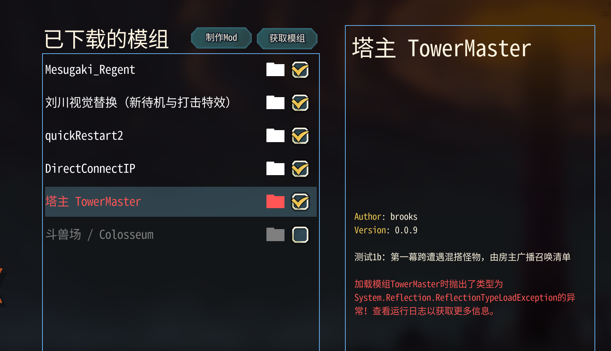

# 召唤阶段第一轮测试结果（mod 0.0.9）：启动加载失败

## 结论

**不通过，阻塞在启动加载阶段；召唤面板与战斗实测尚未开始。** 用户在已下载模组界面看到TowerMaster变红，异常为ReflectionTypeLoadException。双端游戏日志确认缺少可解析的TowerMaster.Core程序集；不是编译失败，也不是已确认的Godot控件错误。只报告原因与建议，未修改任何mod代码、安装布局或游戏文件。



依据本轮说明 `docs/summon-phase-plan.md`。测试代码HEAD `1e3125c`，分支 `claude/optimistic-rubin-hr3eit`，游戏v0.111.0。截图由用户提供；不是普通房/精英房面板截图，这两项尚未覆盖。

## 构建和安装验证

- 已拉取最新代码，构建前没有游戏进程。
- dotnet test：Core 39、mod 28，共67个，全部通过，无失败/跳过。
- 使用真实游戏GameDir编译并安装：成功，0警告、0错误；SummonPanel.cs没有编译报错。
- 安装目录：`C:\Users\kkk\Desktop\slaythespire\Slay the Spire 2\mods\TowerMaster`。
- 安装后的manifest版本为0.0.9，`summon_phase=true`。
- 已打开两个实例，但TowerMaster在两边均加载失败，未进入本轮召唤功能测试。

## 错误原文和范围

`game-A.log:53`起；`game-B.log:53`起的同一错误段一致：

```text
[ERROR] Exception thrown while loading mod TowerMaster: System.Reflection.ReflectionTypeLoadException: Unable to load one or more of the requested types.
Could not load file or assembly 'TowerMaster.Core, Version=1.0.0.0, Culture=neutral, PublicKeyToken=null'. 系统找不到指定的文件。
   at System.Reflection.RuntimeModule.GetDefinedTypes()
   at System.Reflection.RuntimeModule.GetTypes()
   at MegaCrit.Sts2.Core.Modding.ModManager.TryLoadMod(Mod mod)
System.IO.FileNotFoundException: Could not load file or assembly 'TowerMaster.Core, Version=1.0.0.0, Culture=neutral, PublicKeyToken=null'. 系统找不到指定的文件。
File name: 'TowerMaster.Core, Version=1.0.0.0, Culture=neutral, PublicKeyToken=null'
   at MegaCrit.Sts2.Core.Modding.ModManager.TryLoadMod(Mod mod)
   at MegaCrit.Sts2.Core.Modding.ModManager.Initialize(IModManagerFileIo fileIo, ModSettings settings, SemanticVersion gameVersion)
   at System.Runtime.CompilerServices.AsyncMethodBuilderCore.Start[TStateMachine](TStateMachine& stateMachine)
   at MegaCrit.Sts2.Core.Modding.ModManager.Initialize(IModManagerFileIo fileIo, ModSettings settings, SemanticVersion gameVersion)
   at MegaCrit.Sts2.Core.Helpers.OneTimeInitialization.ExecuteVeryEarly()
   at System.Runtime.CompilerServices.AsyncMethodBuilderCore.Start[TStateMachine](TStateMachine& stateMachine)
```

两端游戏日志还有 `Mod TowerMaster does not declare min game version. Assuming that it is supported.` WARN；它表示版本声明缺失，游戏仍尝试加载，不能当作此次阻塞原因。配置JSON被记录为“不像manifest，跳过”，属于正常配置文件处理。

本轮TowerMaster-A/B.log仍是上一轮02:20–02:25的0.0.7运行记录，没有被本次启动覆盖；新的game-A/B.log为03:02附近。不能使用旧mod日志宣称0.0.9探针、宝箱修复、召唤或账本正常。启动失败意味着ModEntry.Init尚未执行；截图显示加载失败与这个时序一致。

## 已确认的依赖与加载时序

1. **Core DLL在安装目录存在**：TowerMaster.Core.dll为50688字节，SHA256 `6CB4B98DFC0D864096FA99C1EC2930E7F98C75804CB164AF0E173906D49F84E7`；与 `mod/TowerMaster.Core/bin/Debug/net9.0/TowerMaster.Core.dll` 哈希一致。并非忘记复制DLL或安装了不同构建产物。
2. 游戏 `decompiled/sts2/MegaCrit.Sts2.Core.Modding/ModManager.cs:737–750` 的TryLoadMod只从mod路径加载 `<modId>.dll` 到游戏程序集的AssemblyLoadContext；这里没有自动遍历同目录Core DLL。
3. 同文件786行先调用 `assembly.GetTypes()`，再筛ModInitializerAttribute；793–794行才调用入口，入口实际查找/执行逻辑在873行起。日志的GetDefinedTypes/GetTypes栈正落在这个入口前枚举阶段。
4. `mod/TowerMaster/ModEntry.cs:18–22` 的Init在21行才注册AppDomain.AssemblyResolve，再初始化日志、调用Start。它能保护入口执行之后的延迟依赖，却无法处理入口执行之前的类型枚举。
5. 新版 `mod/TowerMaster/MasterLedger.cs:7` 的PendingBattle记录构造签名直接含Core.RoomKind；`mod/TowerMaster/SummonSession.cs:14–17`、41、55的字段、构造、属性又含SummonRules、RoomContext、SummonQuote等Core类型。尤其record会生成含RoomKind的成员签名，因此GetTypes阶段有提前解析Core的需求。

**根因判断：依赖解析注册时机晚于游戏枚举类型的时机。** Core文件存在，但当前运行时加载上下文没有在扫描TowerMaster类型时解析到它；新版直接暴露的Core类型引用让原先依赖“Init先注册、Start后加载”的方式不再足够。日志没有报告GodotSharp缺失，不能据此要求修改SummonPanel布局。

## 给Claude的修复方向（建议，未实施）

应让Core在ModManager.GetTypes之前可解析，或让入口程序集的类型枚举不需要Core。不要只把注册解析器移到Init更靠前的位置：Init整体仍晚于GetTypes。候选方案包括将Core合并进mod程序集，或采用无需Core的加载入口/模块初始化阶段预加载同目录依赖，再安排游戏可用的解析策略。选择方案时检查程序集身份、加载上下文以及Godot/Harmony初始化时序；模块初始化器、独立引导程序集和合并方案均未在本机验证，不能将建议当成已成功修法。

测试缺口也应补：现有67个测试通过但没有覆盖“新进程只加载TowerMaster.dll并由游戏枚举全部类型、入口尚未调用”的依赖场景。修复后仍须用实际游戏冷启动确认两端mod正常加载，然后继续完整实测。

## 尚未覆盖

| 项目 | 结论 |
| --- | --- |
| 普通/精英面板、中文、布局、点击、遮罩 | 未覆盖，mod未加载 |
| 前3场开局保护、超上限禁用 | 未覆盖 |
| 30秒超时、按原版出场 | 未覆盖 |
| 精英不同选择、Boss第二候选 | 未覆盖 |
| 每场召唤点花费/收入/余额、双端清单 | 未覆盖，没有本轮运行数据 |
| 宝箱默认焦点保护与正常离开 | 未覆盖，不能把上一轮bug当作已修复通过 |
| 账本保存、退出续玩恢复 | 未覆盖 |
| 塔主退场、自动选路、爬塔玩家等待画面 | 未覆盖 |
| StateDivergence | 本次两端启动日志未发现；尚未开始联机战斗，不构成同步验证通过 |

只提交本报告与用户截图，不提交原始日志全文、反编译代码或游戏资源。下一步交由Claude修复启动加载问题，再重新编译安装和测试。
