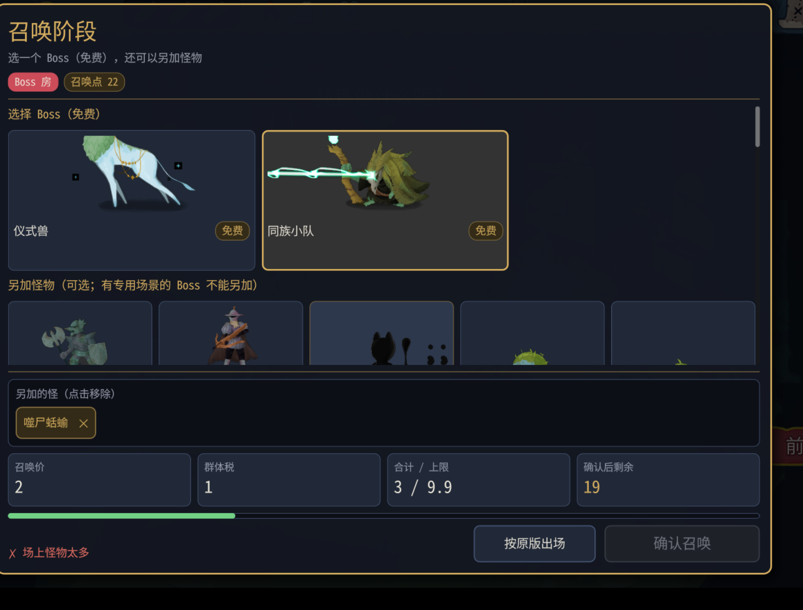

# 召唤阶段 0.0.16 测试结果

## 结论与环境

**部分通过，覆盖不足，发现塔主宝箱动画异常；已结束本轮测试，可交 Claude。** 用户不再补测，未覆盖项明确保留。只测试、调查，没有修改 mod 代码。

代码75008a3；游戏v0.111.0；本机双实例共用安装，塔主100001，爬塔玩家100002（不是两台实体电脑）。75个测试全过（41+34）；实际游戏编译安装零警告零错误，manifest=0.0.16。新局开局12点确认；打到第二幕。

## 用户画面观察

用户反馈“他不让我再加怪，其他都没啥问题”。这句话作为总体观察，不替代未逐项执行的验证。



- Boss 面板截图中标题、阵容、花费、规则提示和两个按钮都在画面内；比上一轮整体越界改善。普通、精英截图及窗口/全屏各一次未提供，未覆盖完整布局矩阵。
- 截图已选择同族小队和一只小怪，召唤点22，合计3/9.9，确认后剩余19；提示“场上怪物太多”，确认灰色。
- **数量限制有依据**：TheKinBoss本体3只（decompiled/sts2/MegaCrit.Sts2.Core.Models.Encounters/TheKinBoss.cs:41–50）；SummonRules.cs:106数量上限=MaxMonstersBase+爬塔人数，TowerMasterConfig.cs:54默认2，所以本轮上限3。Quote在SummonRules.cs:212按本体加另加清单总数检查。3+1超过3，不能判作点数不足。
- **专用场景提示需开发复核**：TheKinBoss.cs:13声明HasScene=true、:23声明3个命名槽位，但本次截图仅提示数量超限，没有“这个Boss有专用场景，不能另加怪物”。设计限制与运行时判断是否一致需Claude检查；这里不猜具体根因。
- 最终Boss清单Monsters=[]，只提交TheKinBoss；无专用场景Boss实际追加1–2只怪、生成站位及扣款仍未覆盖。墨影幻灵禁止追加未覆盖。
- 高个子/带特效预览用户未单独提供逐怪验证与截图，不能把“其他没问题”写成全部怪物通过。
- 用户未提供本轮详细平衡感受，保留上一轮反馈但不视为本轮结论。

## 两端清单、生成、降血

去时间戳后选取收到清单、替换、开始生成、混搭生成和降血行：塔主37行、爬塔玩家37行，逐行完全一致=True。

```text
测试1b #1：已替换 FuzzyWurmCrawlerWeak → CultistsNormal，清单=[Mawler]
测试1b #2：已替换 NibbitsWeak → CultistsNormal，清单=[VineShambler]
测试1b #3：已替换 RubyRaidersNormal → CultistsNormal，清单=[SpinyToad]
召唤：SpinyToad 水土不服，生命 117 → 94
测试1b #4：已替换 ByrdonisElite → BygoneEffigyElite，清单=[SlitheringStrangler, SnappingJaxfruit, PunchConstruct]
测试1b #5：已替换 SlimesNormal → CultistsNormal，清单=[AssassinRubyRaider]
召唤清单 #6：已替换 CeremonialBeastBoss → TheKinBoss
测试1b #7：已替换 BowlbugsWeak → CultistsNormal，清单=[TurretOperator, ScrollOfBiting]
召唤：TurretOperator 水土不服，生命 41 → 33
召唤：ScrollOfBiting 水土不服，生命 30 → 24
测试1b #8：已替换 ExoskeletonsWeak → CultistsNormal，清单=[HunterKiller, AxeRubyRaider]
测试1b #9：已替换 SlumberingBeetleNormal → CultistsNormal，清单=[Chomper]
```

降血117→94、41→33、30→24，均对应80%并取整；未另行得到画面血量的明确核对。第二幕TurretOperator/ScrollOfBiting开局日志分别33/33、24/24，与降血一致。

## 收支流水

按事件顺序列出原始摘要，问号战斗没有面板扣费，不能误当普通房点了按原版。新局12点；第一幕基础5，第二幕基础6。

```text
塔主账本：新的一局，召唤点 12
召唤阶段：确认 Mawler，花费 3，剩余 9
召唤阶段：战斗收入 +7（基础 5，节约 0，战果 2），召唤点 16/30；玩家掉血 25，击倒 []，有奖励 []
召唤阶段：确认 VineShambler，花费 3，剩余 13
召唤阶段：战斗收入 +7（基础 5，节约 0，战果 2），召唤点 20/30；玩家掉血 21，击倒 []，有奖励 []
召唤阶段：战斗收入 +5（基础 5，节约 0，战果 0），召唤点 25/30；玩家掉血 0，击倒 []，有奖励 []
召唤阶段：确认 SpinyToad，花费 7，剩余 18
召唤阶段：战斗收入 +5（基础 5，节约 0，战果 0），召唤点 23/30；玩家掉血 0，击倒 []，有奖励 []
召唤阶段：超时，按原版出场，花费 9，剩余 14
召唤阶段：战斗收入 +5（基础 5，节约 0，战果 0），召唤点 19/30；玩家掉血 0，击倒 []，有奖励 []
召唤阶段：确认 SlitheringStrangler+SnappingJaxfruit+PunchConstruct，花费 7，剩余 12
召唤阶段：战斗收入 +6（基础 5，节约 1，战果 0），召唤点 18/30；玩家掉血 0，击倒 []，有奖励 []
召唤阶段：确认 AssassinRubyRaider，花费 2，剩余 16
召唤阶段：战斗收入 +6（基础 5，节约 1，战果 0），召唤点 22/30；玩家掉血 0，击倒 []，有奖励 []
召唤阶段：确认 TheKinBoss，花费 0，剩余 22
召唤阶段：战斗收入 +5（基础 5，节约 0，战果 0），召唤点 27/30；玩家掉血 0，击倒 []，有奖励 []
召唤阶段：确认 TurretOperator+ScrollOfBiting，花费 8，剩余 19
召唤阶段：战斗收入 +6（基础 6，节约 0，战果 0），召唤点 25/45；玩家掉血 9，击倒 []，有奖励 []
召唤阶段：确认 HunterKiller+AxeRubyRaider，花费 6，剩余 19
召唤阶段：战斗收入 +6（基础 6，节约 0，战果 0），召唤点 25/45；玩家掉血 0，击倒 []，有奖励 []
召唤阶段：确认 Chomper，花费 3，剩余 22
```

核算：12−3+7=16；16−3+7=20；问号原版战+5=25；25−7+5=23；精英按原版23−9+5=19；混搭精英19−7+6=18；18−2+6=22；Boss22−0+5=27；第二幕27−8+6=25；25−6+6=25；最后25−3=22（退出前未结算）。算术均成立。

- 新局12点、第一幕基础收入5：通过。
- 普通房手动按原版扣标准开销：未覆盖。仅精英回退花费9（标准9）有证据。
- 精英回退日志文字是“超时”，从开面板到回退约2秒；0.0.16说明召唤不限时，需开发复核是否手动按原版共用了超时标签，不据此认定自动计时仍存在。
- 前3场保护列表、×1.3上限和超限提示没有截图或具体观察，未确认；第四场普通战实际生成跨幕SpinyToad，与前三场限制之后的行为相符。

## 精英奖励

本轮精英混搭清单为SlitheringStrangler+SnappingJaxfruit+PunchConstruct，载体BygoneEffigyElite；不把三只普通怪写成“1精英+小怪”。两边奖励组包含RelicReward，但指定组合仍未覆盖。

```text
[DEBUG] [RewardsSetSynchronizer] Beginning rewards set Id: 4 Owner: 100001 Rewards: MegaCrit.Sts2.Core.Rewards.GoldReward,MegaCrit.Sts2.Core.Rewards.RelicReward,MegaCrit.Sts2.Core.Rewards.CardReward
[DEBUG] [RewardsSetSynchronizer] Beginning rewards set Id: 5 Owner: 100002 Rewards: MegaCrit.Sts2.Core.Rewards.GoldReward,MegaCrit.Sts2.Core.Rewards.RelicReward,MegaCrit.Sts2.Core.Rewards.CardReward
[DEBUG] [RewardsSetSynchronizer] Beginning rewards set Id: 6 Owner: 100001 Rewards: MegaCrit.Sts2.Core.Rewards.GoldReward,MegaCrit.Sts2.Core.Rewards.RelicReward,MegaCrit.Sts2.Core.Rewards.CardReward
[DEBUG] [RewardsSetSynchronizer] Beginning rewards set Id: 7 Owner: 100002 Rewards: MegaCrit.Sts2.Core.Rewards.GoldReward,MegaCrit.Sts2.Core.Rewards.RelicReward,MegaCrit.Sts2.Core.Rewards.CardReward
```
金币：未拿到用户明确金额；上述奖励组日志只提供类型、不提供金币数，不能确认精英档金额。

## 异常统计及原文

- 塔主：TowerMaster ERROR 0、WARN 0；游戏StateDivergence 0；游戏ERROR行 16。
- 爬塔玩家：TowerMaster ERROR 0、WARN 0；游戏StateDivergence 0；游戏ERROR行 12。

塔主运行中有两次宝箱遗物动画报错，爬塔玩家未出现对应运行中ERROR；用户仍能继续进入后续房间。没有证明该异常可忽略或已修复。以下保留所有ERROR以及运行异常紧随的调用栈，未提交原始日志全文。

### 塔主

```text
[ERROR] System.InvalidOperationException: Sequence contains no matching element
   at System.Linq.ThrowHelper.ThrowNoMatchException()
   at System.Linq.Enumerable.First[TSource](IEnumerable`1 source, Func`2 predicate)
   at MegaCrit.Sts2.Core.Nodes.Screens.TreasureRoomRelic.NTreasureRoomRelicCollection.AnimateRelicAwards(List`1 results)
   at MegaCrit.Sts2.Core.Helpers.TaskHelper.LogTaskExceptions(Task task)
   at MegaCrit.Sts2.Core.Helpers.TaskHelper.LogTaskExceptions(Task task)
   at System.Runtime.CompilerServices.AsyncMethodBuilderCore.Start[TStateMachine](TStateMachine& stateMachine)
   at MegaCrit.Sts2.Core.Helpers.TaskHelper.LogTaskExceptions(Task task)
   at MegaCrit.Sts2.Core.Nodes.Screens.TreasureRoomRelic.NTreasureRoomRelicCollection.OnRelicsAwarded(List`1 results)
   at MegaCrit.Sts2.Core.Multiplayer.Game.TreasureRoomRelicSynchronizer.AwardRelics()
   at MegaCrit.Sts2.Core.Multiplayer.Game.TreasureRoomRelicSynchronizer.OnPicked_Patch1(TreasureRoomRelicSynchronizer this, Player player, Nullable`1 index)
   at MegaCrit.Sts2.Core.GameActions.PickRelicAction.ExecuteAction()
   at MegaCrit.Sts2.Core.GameActions.GameAction.Execute()
   at System.Runtime.CompilerServices.AsyncMethodBuilderCore.Start[TStateMachine](TStateMachine& stateMachine)
   at MegaCrit.Sts2.Core.GameActions.GameAction.Execute()
   at MegaCrit.Sts2.Core.GameActions.ActionExecutor.ExecuteActions()
   at System.Runtime.CompilerServices.AsyncMethodBuilderCore.Start[TStateMachine](TStateMachine& stateMachine)
   at MegaCrit.Sts2.Core.GameActions.ActionExecutor.ExecuteActions()
   at MegaCrit.Sts2.Core.GameActions.Multiplayer.ActionQueueSet.EnqueueWithoutSynchronizing(GameAction gameAction)
   at MegaCrit.Sts2.Core.GameActions.Multiplayer.ActionQueueSynchronizer.EnqueueAction(GameAction action, UInt64 actionOwnerId)
   at MegaCrit.Sts2.Core.GameActions.Multiplayer.ActionQueueSynchronizer.HandleRequestEnqueueActionMessage(RequestEnqueueActionMessage message, UInt64 senderId)
   at MegaCrit.Sts2.Core.Multiplayer.Game.RunLocationTargetedMessageBuffer.CallHandlersOfType(Type type, INetMessage message, UInt64 senderId)
   at MegaCrit.Sts2.Core.Multiplayer.Game.RunLocationTargetedMessageBuffer.HandleMessage[T](T message, UInt64 senderId)
   at MegaCrit.Sts2.Core.Multiplayer.NetMessageBus.<>c__DisplayClass15_0`1.<RegisterMessageHandler>b__0(INetMessage message, UInt64 senderId)
   at MegaCrit.Sts2.Core.Multiplayer.NetMessageBus.SendMessageToAllHandlers(INetMessage message, UInt64 senderId)
   at MegaCrit.Sts2.Core.Multiplayer.NetHostGameService.OnPacketReceived(UInt64 senderId, Byte[] packetBytes, NetTransferMode mode, Int32 channel)
   at DirectConnectIP.Network.DirectHost.HandlePacketReceived(ENetServiceData data)
   at DirectConnectIP.Network.DirectHost.Update()
   at MegaCrit.Sts2.Core.Multiplayer.NetHostGameService.Update()
   at Godot.Node.InvokeGodotClassMethod(godot_string_name& method, NativeVariantPtrArgs args, godot_variant& ret)
   at Godot.Control.InvokeGodotClassMethod(godot_string_name& method, NativeVariantPtrArgs args, godot_variant& ret)
   at MegaCrit.Sts2.Core.Nodes.NRun.InvokeGodotClassMethod(godot_string_name& method, NativeVariantPtrArgs args, godot_variant& ret)
   at Godot.Bridge.CSharpInstanceBridge.Call(IntPtr godotObjectGCHandle, godot_string_name* method, godot_variant** args, Int32 argCount, godot_variant_call_error* refCallError, godot_variant* ret)
[ERROR] System.InvalidOperationException: An attempt was made to transition a task to a final state when it had already completed.
   at System.Threading.Tasks.TaskCompletionSource.SetResult()
   at MegaCrit.Sts2.Core.Nodes.Screens.TreasureRoomRelic.NTreasureRoomRelicCollection.AnimateRelicAwards(List`1 results)
   at MegaCrit.Sts2.Core.Helpers.TaskHelper.LogTaskExceptions(Task task)
   at MegaCrit.Sts2.Core.Helpers.TaskHelper.LogTaskExceptions(Task task)
   at System.Runtime.CompilerServices.AsyncMethodBuilderCore.Start[TStateMachine](TStateMachine& stateMachine)
   at MegaCrit.Sts2.Core.Helpers.TaskHelper.LogTaskExceptions(Task task)
   at MegaCrit.Sts2.Core.Nodes.Screens.TreasureRoomRelic.NTreasureRoomRelicCollection.OnRelicsAwarded(List`1 results)
   at MegaCrit.Sts2.Core.Multiplayer.Game.TreasureRoomRelicSynchronizer.CompleteWithNoRelics()
   at MegaCrit.Sts2.Core.Nodes.Screens.TreasureRoomRelic.NTreasureRoomRelicCollection.<>c.<AnimIn>b__27_0()
   at Godot.Callable.<From>g__Trampoline|1_0(Object delegateObj, NativeVariantPtrArgs args, godot_variant& ret)
   at Godot.DelegateUtils.InvokeWithVariantArgs(IntPtr delegateGCHandle, Void* trampoline, godot_variant** args, Int32 argc, godot_variant* outRet)
[ERROR] System.InvalidOperationException: Sequence contains no matching element
   at System.Linq.ThrowHelper.ThrowNoMatchException()
   at System.Linq.Enumerable.First[TSource](IEnumerable`1 source, Func`2 predicate)
   at MegaCrit.Sts2.Core.Nodes.Screens.TreasureRoomRelic.NTreasureRoomRelicCollection.AnimateRelicAwards(List`1 results)
   at MegaCrit.Sts2.Core.Helpers.TaskHelper.LogTaskExceptions(Task task)
   at MegaCrit.Sts2.Core.Helpers.TaskHelper.LogTaskExceptions(Task task)
   at System.Runtime.CompilerServices.AsyncMethodBuilderCore.Start[TStateMachine](TStateMachine& stateMachine)
   at MegaCrit.Sts2.Core.Helpers.TaskHelper.LogTaskExceptions(Task task)
   at MegaCrit.Sts2.Core.Nodes.Screens.TreasureRoomRelic.NTreasureRoomRelicCollection.OnRelicsAwarded(List`1 results)
   at MegaCrit.Sts2.Core.Multiplayer.Game.TreasureRoomRelicSynchronizer.AwardRelics()
   at MegaCrit.Sts2.Core.Multiplayer.Game.TreasureRoomRelicSynchronizer.OnPicked_Patch1(TreasureRoomRelicSynchronizer this, Player player, Nullable`1 index)
   at MegaCrit.Sts2.Core.GameActions.PickRelicAction.ExecuteAction()
   at MegaCrit.Sts2.Core.GameActions.GameAction.Execute()
   at System.Runtime.CompilerServices.AsyncMethodBuilderCore.Start[TStateMachine](TStateMachine& stateMachine)
   at MegaCrit.Sts2.Core.GameActions.GameAction.Execute()
   at MegaCrit.Sts2.Core.GameActions.ActionExecutor.ExecuteActions()
   at System.Runtime.CompilerServices.AsyncMethodBuilderCore.Start[TStateMachine](TStateMachine& stateMachine)
   at MegaCrit.Sts2.Core.GameActions.ActionExecutor.ExecuteActions()
   at MegaCrit.Sts2.Core.GameActions.Multiplayer.ActionQueueSet.EnqueueWithoutSynchronizing(GameAction gameAction)
   at MegaCrit.Sts2.Core.GameActions.Multiplayer.ActionQueueSynchronizer.EnqueueAction(GameAction action, UInt64 actionOwnerId)
   at MegaCrit.Sts2.Core.GameActions.Multiplayer.ActionQueueSynchronizer.HandleRequestEnqueueActionMessage(RequestEnqueueActionMessage message, UInt64 senderId)
   at MegaCrit.Sts2.Core.Multiplayer.Game.RunLocationTargetedMessageBuffer.CallHandlersOfType(Type type, INetMessage message, UInt64 senderId)
   at MegaCrit.Sts2.Core.Multiplayer.Game.RunLocationTargetedMessageBuffer.HandleMessage[T](T message, UInt64 senderId)
   at MegaCrit.Sts2.Core.Multiplayer.NetMessageBus.<>c__DisplayClass15_0`1.<RegisterMessageHandler>b__0(INetMessage message, UInt64 senderId)
   at MegaCrit.Sts2.Core.Multiplayer.NetMessageBus.SendMessageToAllHandlers(INetMessage message, UInt64 senderId)
   at MegaCrit.Sts2.Core.Multiplayer.NetHostGameService.OnPacketReceived(UInt64 senderId, Byte[] packetBytes, NetTransferMode mode, Int32 channel)
   at DirectConnectIP.Network.DirectHost.HandlePacketReceived(ENetServiceData data)
   at DirectConnectIP.Network.DirectHost.Update()
   at MegaCrit.Sts2.Core.Multiplayer.NetHostGameService.Update()
   at Godot.Node.InvokeGodotClassMethod(godot_string_name& method, NativeVariantPtrArgs args, godot_variant& ret)
   at Godot.Control.InvokeGodotClassMethod(godot_string_name& method, NativeVariantPtrArgs args, godot_variant& ret)
   at MegaCrit.Sts2.Core.Nodes.NRun.InvokeGodotClassMethod(godot_string_name& method, NativeVariantPtrArgs args, godot_variant& ret)
   at Godot.Bridge.CSharpInstanceBridge.Call(IntPtr godotObjectGCHandle, godot_string_name* method, godot_variant** args, Int32 argCount, godot_variant_call_error* refCallError, godot_variant* ret)
[ERROR] System.InvalidOperationException: An attempt was made to transition a task to a final state when it had already completed.
   at System.Threading.Tasks.TaskCompletionSource.SetResult()
   at MegaCrit.Sts2.Core.Nodes.Screens.TreasureRoomRelic.NTreasureRoomRelicCollection.AnimateRelicAwards(List`1 results)
   at MegaCrit.Sts2.Core.Helpers.TaskHelper.LogTaskExceptions(Task task)
   at MegaCrit.Sts2.Core.Helpers.TaskHelper.LogTaskExceptions(Task task)
   at System.Runtime.CompilerServices.AsyncMethodBuilderCore.Start[TStateMachine](TStateMachine& stateMachine)
   at MegaCrit.Sts2.Core.Helpers.TaskHelper.LogTaskExceptions(Task task)
   at MegaCrit.Sts2.Core.Nodes.Screens.TreasureRoomRelic.NTreasureRoomRelicCollection.OnRelicsAwarded(List`1 results)
   at MegaCrit.Sts2.Core.Multiplayer.Game.TreasureRoomRelicSynchronizer.CompleteWithNoRelics()
   at MegaCrit.Sts2.Core.Nodes.Screens.TreasureRoomRelic.NTreasureRoomRelicCollection.<>c.<AnimIn>b__27_0()
   at Godot.Callable.<From>g__Trampoline|1_0(Object delegateObj, NativeVariantPtrArgs args, godot_variant& ret)
   at Godot.DelegateUtils.InvokeWithVariantArgs(IntPtr delegateGCHandle, Void* trampoline, godot_variant** args, Int32 argc, godot_variant* outRet)
ERROR: 1 RID allocations of type 'N26RendererEnvironmentStorage11EnvironmentE' were leaked at exit.
ERROR: 5 shaders of type CanvasShaderRD were never freed
ERROR: 25 RID allocations of type 'N10RendererRD16ParticlesStorage9ParticlesE' were leaked at exit.
ERROR: 1 shaders of type ParticlesShaderRD were never freed
ERROR: 25 RID allocations of type 'N10RendererRD11MeshStorage4MeshE' were leaked at exit.
ERROR: 73 RID allocations of type 'N10RendererRD15MaterialStorage8MaterialE' were leaked at exit.
ERROR: 6 RID allocations of type 'N10RendererRD15MaterialStorage6ShaderE' were leaked at exit.
ERROR: 188 RID allocations of type 'N10RendererRD14TextureStorage7TextureE' were leaked at exit.
ERROR: 334 RID allocations of type 'PN18TextServerAdvanced22ShapedTextDataAdvancedE' were leaked at exit.
ERROR: 10 RID allocations of type 'PN18TextServerAdvanced12FontAdvancedE' were leaked at exit.
ERROR: 8 RID allocations of type 'PN18TextServerAdvanced27FontAdvancedLinkedVariationE' were leaked at exit.
ERROR: 234 resources still in use at exit (run with --verbose for details).
```

### 爬塔玩家

```text
ERROR: 1 RID allocations of type 'N26RendererEnvironmentStorage11EnvironmentE' were leaked at exit.
ERROR: 5 shaders of type CanvasShaderRD were never freed
ERROR: 26 RID allocations of type 'N10RendererRD16ParticlesStorage9ParticlesE' were leaked at exit.
ERROR: 1 shaders of type ParticlesShaderRD were never freed
ERROR: 26 RID allocations of type 'N10RendererRD11MeshStorage4MeshE' were leaked at exit.
ERROR: 39 RID allocations of type 'N10RendererRD15MaterialStorage8MaterialE' were leaked at exit.
ERROR: 6 RID allocations of type 'N10RendererRD15MaterialStorage6ShaderE' were leaked at exit.
ERROR: 173 RID allocations of type 'N10RendererRD14TextureStorage7TextureE' were leaked at exit.
ERROR: 425 RID allocations of type 'PN18TextServerAdvanced22ShapedTextDataAdvancedE' were leaked at exit.
ERROR: 8 RID allocations of type 'PN18TextServerAdvanced12FontAdvancedE' were leaked at exit.
ERROR: 3 RID allocations of type 'PN18TextServerAdvanced27FontAdvancedLinkedVariationE' were leaked at exit.
ERROR: 218 resources still in use at exit (run with --verbose for details).
```

资源警告仍存在，各端统计及示例：

塔主 Asset not cached：608行；游戏WARN共660行（含其他mod警告）。

```text
[WARN] Asset not cached: res://scenes/debug/dev_console.tscn
[WARN] Asset not cached: res://scenes/cards/card.tscn
[WARN] Asset not cached: res://scenes/cards/holders/grid_card_holder.tscn
```

爬塔玩家 Asset not cached：133行；游戏WARN共177行（含其他mod警告）。

```text
[WARN] Asset not cached: res://scenes/debug/dev_console.tscn
[WARN] Asset not cached: res://scenes/cards/card.tscn
[WARN] Asset not cached: res://scenes/cards/holders/grid_card_holder.tscn
```

游戏退出阶段存在Godot资源/RID泄漏ERROR，以上已列原文；未经最小mod对照，不能全归因于TowerMaster。

## 完整战斗与未覆盖项

两端记录各5次win控制台执行，部分战斗自然进行了回合/掉血，但多场快速结束；不能作为完整平衡验收。前两场分别掉25、21血，只能说明实际出现压力，不代表完整难度结论。

未覆盖或未确认：普通/精英面板截图、窗口化与全屏对照、高个子逐怪预览、保护列表及超限提示、精英+小怪与金币数量、Boss成功追加、墨影幻灵禁止追加、普通房按原版扣费。用户已退出并明确不继续补测。

原始日志已备份在本机工作目录；只提交本报告和用户截图，无源码、完整日志或游戏资源。
