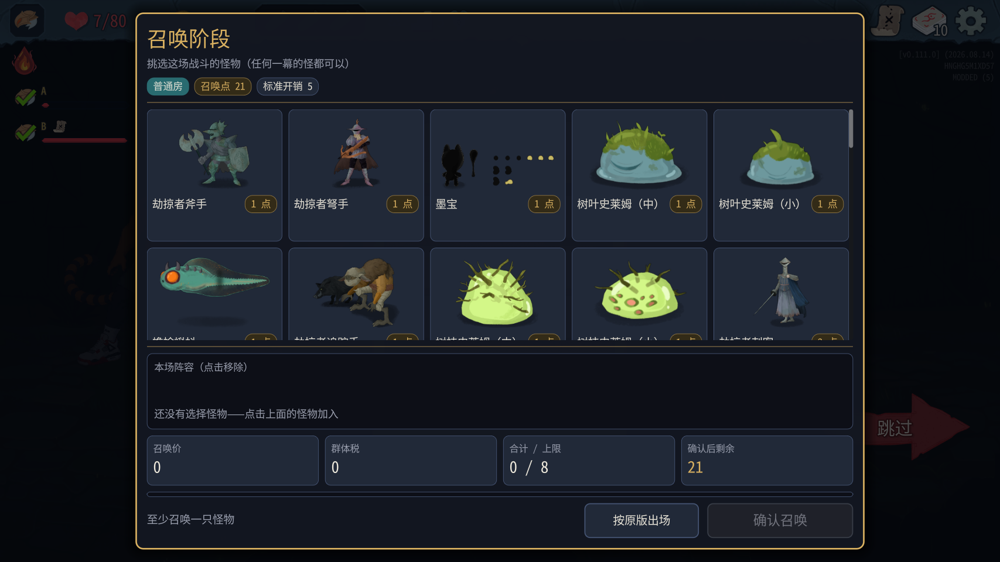
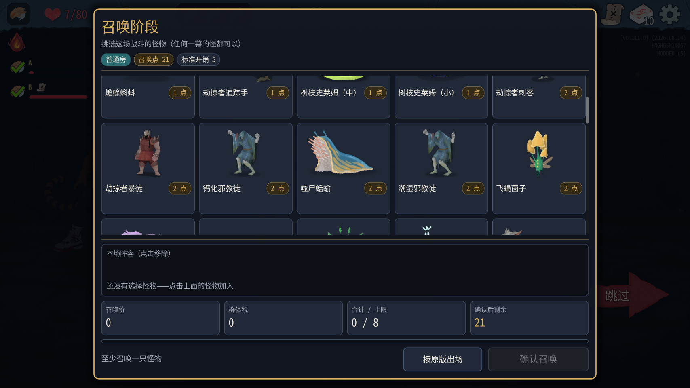
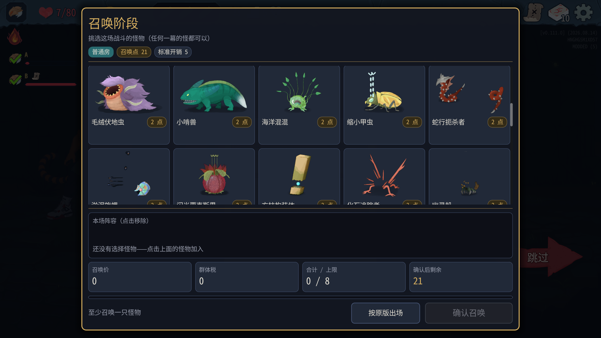
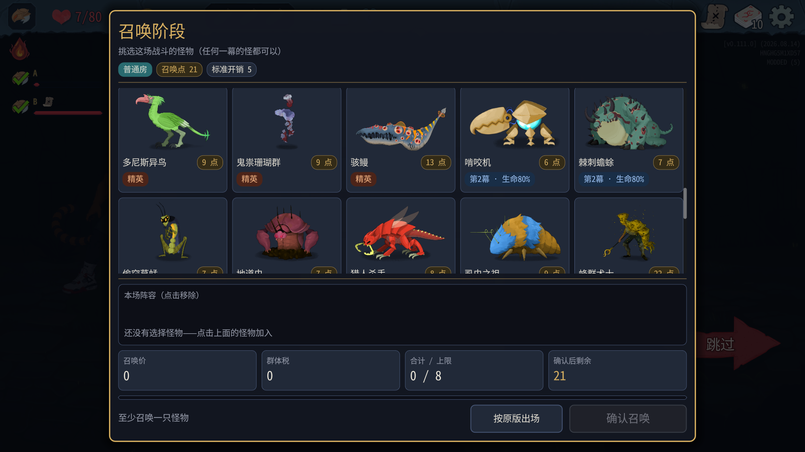
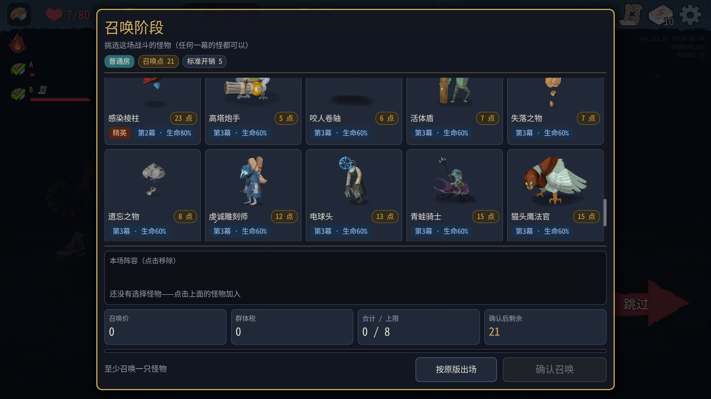
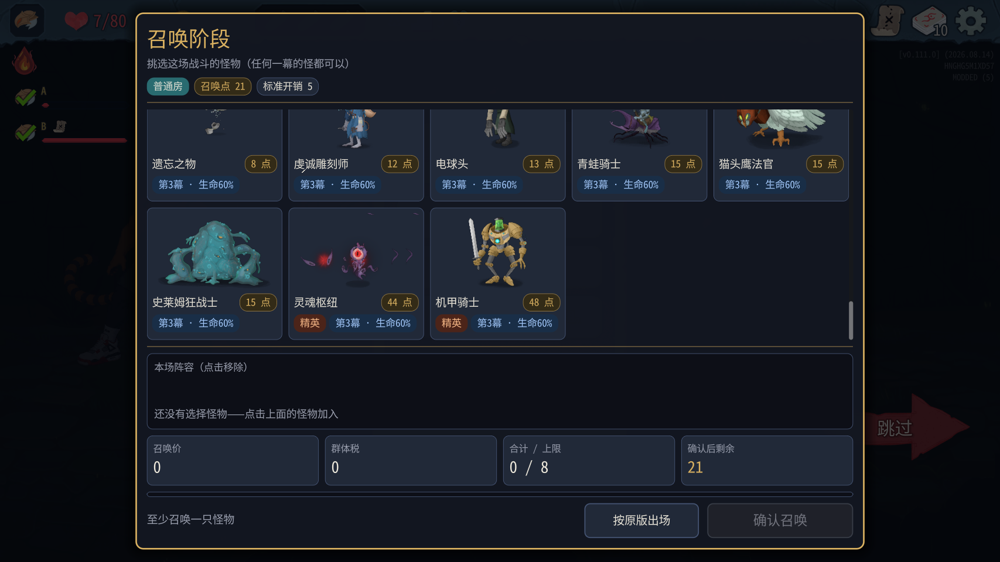
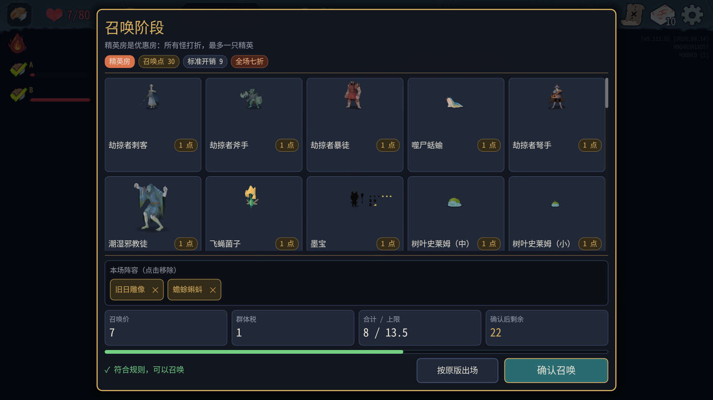
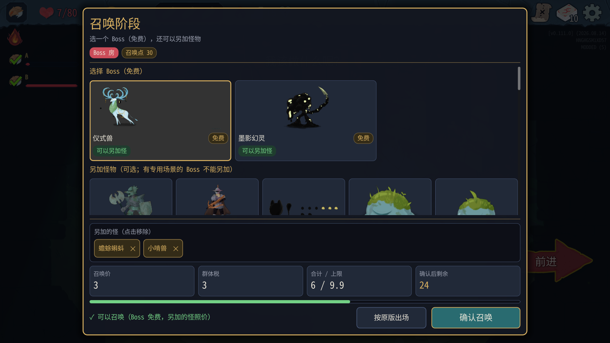
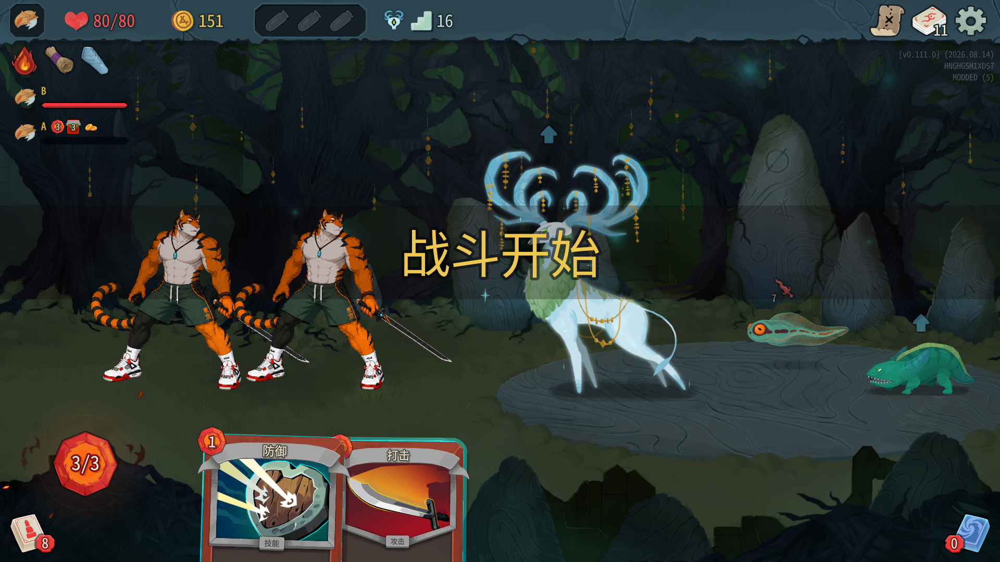

# 召唤阶段0.0.18实测结果

代码cb5d8d1；游戏v0.111.0；81个测试全过（41+40），真实编译安装零警告零错误，manifest0.0.18。双实例塔主100001、爬塔玩家100002；新局种子9103447049679435033。只测试，没有修改代码。

## 结论

宝箱实际领取、奖励读取/继续、事件接口、Boss追加和换幕通过；自动取景改善但部分预览仍偏小或碎片化。战斗全部win，不给自然平衡结论。

## 取景与布局

普通房在滚动位置0/400/800/1200/1600/2200/到底9999截7张图，覆盖大部分选项。精英和Boss也截图，但未分别把两个面板全部滚到底，因此不宣称所有候选逐项验收。

- 重点复测劫掠者暴徒、棘刺蟾蜍：本轮卡片内形象完整，不再裁头。
- 仪式兽：完整显示头角；本局候选没有瀑布巨兽、乐加维林族母，未覆盖这两只0.0.17被裁Boss；同族神官未覆盖。
- 幽灵船：gallery-800下排形象明显太小。
- 墨宝、淤泥旋螺、化石追踪者、遗忘之物显示分离部件/碎片状；是否模型原本开场状态或预览初始化未完成不确定，需开发对照完整战斗形象，不能仅凭截图断言缺资源。
- 没看到完全空白的完整卡片；列表上下边缘截断整张卡片是正常滚动裁剪，不算模型被裁。
- 底部阵容/统计/按钮始终可见。用户反馈打开瞬间“有一点点卡顿，能接受”。未测首次打开耗时专项，不能报毫秒卡顿结论。










## 宝箱

A不手点，B依次调用tm_treasure_open、tm_treasure、tm_treasure_pick(index=0)。箱内index0 Vambrace、index1 RegalPillow；B领取前my_relics=[BurningBlood,ArcaneScroll]，之后=[BurningBlood,ArcaneScroll,Vambrace]。A前后均[BurningBlood]。**真正新增臂甲通过，塔主遗物不变通过**。

启动和实际分配的塔主日志：

```text
[10:30:56.903] INFO 测试3：已拦截 Void MegaCrit.Sts2.Core.Nodes.Screens.TreasureRoomRelic.NTreasureRoomRelicCollection.OnRelicsAwarded(List<RelicPickingResult> results)
[10:43:19.965] INFO 测试3 宝箱：塔主不播分遗物动画
```

两端完整游戏日志没有AnimateRelicAwards ERROR，也没有StateDivergence；后来实际进入精英、事件及Boss，宝箱回归通过。

## 奖励与事件

普通战第一场奖励10金币；后续各场可读金额见下表。精英BygoneEffigy+Toadpole生成两端一致，奖励40金币+Anchor船锚（以及药水/卡牌）。读取成功不等同领取，随后用tm_rewards_proceed离开。Boss同样用tm_rewards_proceed，之后实际进入Hive第二幕MapRoom，换幕通过。

事件接口选项和执行：

1. 先古：奥术卷轴“获得一张随机稀有牌”、万花筒“获得2次来自其他角色的卡牌奖励”、寻龙尺“将1张探寻加入你的牌组”。选index0奥术卷轴，之后my_relics确有ArcaneScroll。
2. 问号事件：分享知识“从5张随机牌中选择1张加入你的牌组”；把它扯下来“失去5点生命值。获得一次无色卡牌奖励”。选index1，进入后续房间。
3. 问号事件：吃下“回复9生命。升级你牌组中的一张牌”；种植培育“给一张牌附魔：播种”。选index0；额外卡牌升级界面通过节点OnCardClicked及ConfirmSelection完成。

## Boss追加

本局仪式兽和墨影幻灵都标可追加。不能追加候选未出现，灰色卡片禁点未覆盖。选仪式兽+Toadpole+Nibbit，花费6，余额30→24；场上CeremonialBeast252、Toadpole21、Nibbit42，两端一致，无站位运行异常。



完整许可日志：

```text
[10:45:54.443] INFO 召唤阶段：Boss 候选 CeremonialBeastBoss（可另加怪）、VantomBoss（可另加怪）；所有 Boss：CeremonialBeastBoss=可、TheKinBoss=不可、VantomBoss=可、LagavulinMatriarchBoss=可、SoulFyshBoss=可、WaterfallGiantBoss=可、KaiserCrabBoss=不可、KnowledgeDemonBoss=可、TheInsatiableBoss=可、AeonglassBoss=可、QueenBoss=不可、TestSubjectBoss=可
```

## 各场已保存奖励

|用例|金币|遗物|
|---|---:|---|
|1 / Monster|10|无|
|2 / Monster|19|无|
|3 / Monster|18|无|
|4 / Monster|11|无|
|5 / Monster|11|无|
|6 / Elite|40|Anchor|
未保存到批量记录的手动接口战斗不补猜奖励数。

## 收支和两端比较

最终相关日志对比：35/35行，一致=True。每次成功tm_battle都执行compare_logs；手动流程最终一并对比。

```text
[10:33:02.577] INFO 塔主账本：新的一局，召唤点 12
[10:33:03.348] INFO 召唤阶段：确认 Nibbit，花费 2，剩余 10
[10:33:06.148] INFO 召唤阶段：战斗收入 +5（基础 5，节约 0，战果 0），召唤点 15/30；玩家掉血 0，击倒 []，有奖励 []
[10:34:46.400] INFO 召唤阶段：确认 Nibbit，花费 2，剩余 13
[10:34:49.055] INFO 召唤阶段：战斗收入 +5（基础 5，节约 0，战果 0），召唤点 18/30；玩家掉血 0，击倒 []，有奖励 []
[10:34:50.899] INFO 召唤阶段：确认 Nibbit，花费 2，剩余 16
[10:34:53.462] INFO 召唤阶段：战斗收入 +5（基础 5，节约 0，战果 0），召唤点 21/30；玩家掉血 0，击倒 []，有奖励 []
[10:36:31.463] INFO 召唤阶段：确认 Toadpole，花费 1，剩余 20
[10:36:34.055] INFO 召唤阶段：战斗收入 +7（基础 5，节约 2，战果 0），召唤点 27/30；玩家掉血 0，击倒 []，有奖励 []
[10:42:42.560] INFO 召唤阶段：确认 Toadpole，花费 1，剩余 26
[10:42:44.808] INFO 召唤阶段：战斗收入 +4（基础 5，节约 2，战果 0，超上限作废 3），召唤点 30/30；玩家掉血 0，击倒 []，有奖励 []
[10:43:49.932] INFO 召唤阶段：确认 BygoneEffigy+Toadpole，花费 8，剩余 22
[10:43:52.565] INFO 召唤阶段：战斗收入 +5（基础 5，节约 0，战果 0），召唤点 27/30；玩家掉血 0，击倒 []，有奖励 []
[10:44:44.962] INFO 召唤阶段：确认 Toadpole，花费 1，剩余 26
[10:44:47.214] INFO 召唤阶段：战斗收入 +4（基础 5，节约 2，战果 0，超上限作废 3），召唤点 30/30；玩家掉血 0，击倒 []，有奖励 []
[10:44:50.007] INFO 召唤阶段：确认 Toadpole，花费 1，剩余 29
[10:44:52.264] INFO 召唤阶段：战斗收入 +1（基础 5，节约 2，战果 0，超上限作废 6），召唤点 30/30；玩家掉血 0，击倒 []，有奖励 []
[10:47:02.681] INFO 召唤阶段：确认 CeremonialBeastBoss，花费 6，剩余 24
[10:47:05.614] INFO 召唤阶段：战斗收入 +5（基础 5，节约 0，战果 0），召唤点 29/30；玩家掉血 0，击倒 []，有奖励 []
```

## 异常统计及所有ERROR

A：mod ERROR=0、WARN=0；游戏运行[ERROR]=0，所有ERROR行=12，WARN行=462，Asset not cached=420，StateDivergence=0。

```text
ERROR: 1 RID allocations of type 'N26RendererEnvironmentStorage11EnvironmentE' were leaked at exit.
ERROR: 5 shaders of type CanvasShaderRD were never freed
ERROR: 30 RID allocations of type 'N10RendererRD16ParticlesStorage9ParticlesE' were leaked at exit.
ERROR: 1 shaders of type ParticlesShaderRD were never freed
ERROR: 30 RID allocations of type 'N10RendererRD11MeshStorage4MeshE' were leaked at exit.
ERROR: 88 RID allocations of type 'N10RendererRD15MaterialStorage8MaterialE' were leaked at exit.
ERROR: 6 RID allocations of type 'N10RendererRD15MaterialStorage6ShaderE' were leaked at exit.
ERROR: 186 RID allocations of type 'N10RendererRD14TextureStorage7TextureE' were leaked at exit.
ERROR: 383 RID allocations of type 'PN18TextServerAdvanced22ShapedTextDataAdvancedE' were leaked at exit.
ERROR: 10 RID allocations of type 'PN18TextServerAdvanced12FontAdvancedE' were leaked at exit.
ERROR: 8 RID allocations of type 'PN18TextServerAdvanced27FontAdvancedLinkedVariationE' were leaked at exit.
ERROR: 234 resources still in use at exit (run with --verbose for details).
```

B：mod ERROR=0、WARN=0；游戏运行[ERROR]=0，所有ERROR行=6，WARN行=83，Asset not cached=47，StateDivergence=0。

```text
ERROR: Cannot get path of node as it is not in a scene tree.
ERROR: Cannot get path of node as it is not in a scene tree.
ERROR: Cannot get path of node as it is not in a scene tree.
ERROR: System.ObjectDisposedException: Cannot access a disposed object.
ERROR: 1 RID allocations of type 'N26RendererEnvironmentStorage11EnvironmentE' were leaked at exit.
ERROR: 1 resources still in use at exit (run with --verbose for details).
```

退出阶段泄漏ERROR未经最小mod对照不全归因塔主。未覆盖自然战斗2–3场（可选项）、瀑布巨兽/乐加维林族母、禁加Boss、精英/Boss列表全滚动。原始日志只备份本机，不提交全文。
