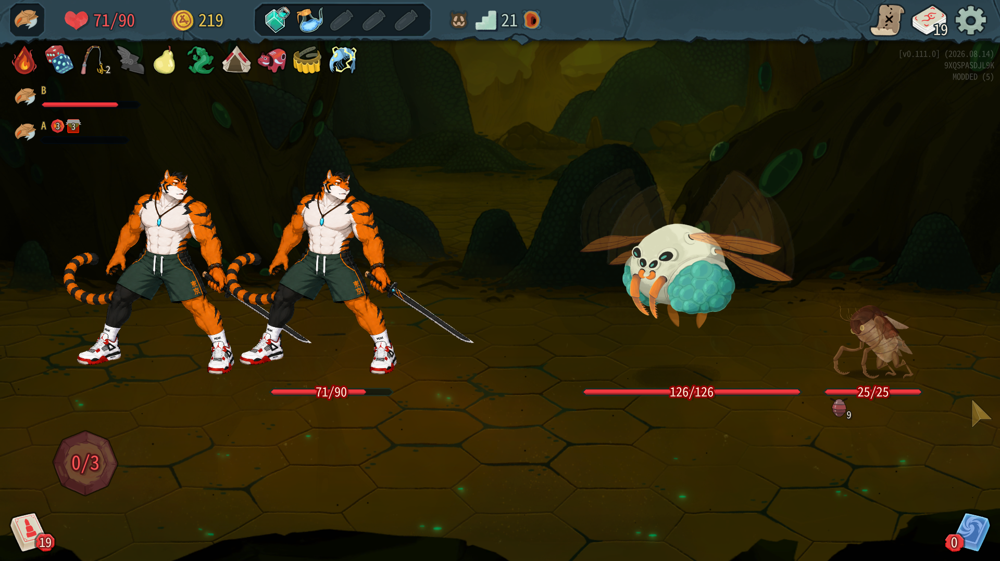

# 召唤阶段0.0.12测试结果：槽位兼容性与重连恢复问题

## 结论

**不通过，当前战斗无法开始，停止本轮验收并交Claude修复。** 本轮发现：Exoskeleton混搭缺少槽位导致首回合初始化抛异常；Boss召唤物需要场景槽位但EncounterSlots为空；用户报告重连后怪物恢复为原版阵容。只读调查，没有修改代码。

测试代码8b9ed7e，游戏v0.111.0，manifest0.0.12。69个测试全过（Core39、mod30）；真实游戏编译安装成功，0警告0错误。塔主=NetId100001，爬塔玩家=100002，报告按身份称呼。

## 重连对照

- 先在两个测试账号设置中停用全部mod，只启用DirectConnectIP，启动日志确认TowerMaster及其他mod跳过。
- 用户进入房间后完全关闭爬塔玩家进程；保存关闭前日志，重开100002，用户确认可以正常进入。**仅IP直连的这一次主动退出重连通过，无黑屏。** 不能因此排除其他状态下IP插件的重连缺陷。
- 对照结束两端退出，已恢复原mod设置（塔主及之前启用的外观/其他mod），启动0.0.12。用户随后反馈：重连会让怪物变回原版安排。恢复时还有其他mod，因此不是严格“IP+塔主二者”最小化对照；需保留这个限制。
- 本次塔主模式没有明确再反馈持续黑屏；发现的是阵容恢复错误，不能把它写成黑屏复现。
- 原始对照/故障日志在本机工作目录分阶段备份，不提交全文。

## 阻塞1：Exoskeleton槽位为空，战斗初始化失败



用户：进入这个房间后没牌，房间开始不了。截图是第21层，Ovicopter126/126与Exoskeleton25/25；爬塔玩家71/90，能量0/3，手牌为空，没有结束回合按钮。对应清单#7，Hive，SourceFloor20，种子18184632449158284757。

两端清单和生成均是Ovicopter+Exoskeleton，生成记录明确两者slot都是null。爬塔玩家端game-B.log:6469、房主端game-A.log:6049出现同样的首回合异常；不是只有客户端显示未刷新。

```text
[ERROR] System.InvalidOperationException: No valid next state found.
   at MegaCrit.Sts2.Core.MonsterMoves.MonsterMoveStateMachine.ConditionalBranchState.GetNextState(Creature _, Rng __)
   at MegaCrit.Sts2.Core.MonsterMoves.MonsterMoveStateMachine.MonsterMoveStateMachine.FindNextMoveState(IEnumerable`1 targets, Creature owner, Rng rng, Boolean logMove)
   at MegaCrit.Sts2.Core.MonsterMoves.MonsterMoveStateMachine.MonsterMoveStateMachine.RollMove(IEnumerable`1 targets, Creature owner, Rng rng)
   at MegaCrit.Sts2.Core.Models.MonsterModel.RollMove(IEnumerable`1 targets)
   at MegaCrit.Sts2.Core.Combat.CombatManager.AfterCreatureAdded(Creature creature, CombatState state)
   at MegaCrit.Sts2.Core.Combat.CombatManager.StartCombatInternal(CombatTurnState turnState)
```

**原因已定位**（以下反编译路径相对decompiled/sts2，仅转述）：

- MegaCrit.Sts2.Core.Models.Monsters/Exoskeleton.cs:52–74，GenerateMoveStateMachine的初始条件分支只接受Creature.SlotName为first、second、third、fourth；没有默认分支。
- MegaCrit.Sts2.Core.MonsterMoves.MonsterMoveStateMachine/ConditionalBranchState.cs:44–53，条件全部不满足时抛No valid next state found。
- mod/TowerMaster/Test1bMixedEncounter.cs:236–245，MixMonstersCore生成每只怪的(MonsterModel,string)二元组时统一把slot置null。
- 当前双端生成日志证实Exoskeleton槽位null，因此初始行动无法选择；错误发生在StartCombatInternal/AfterCreatureAdded，尚未发能量抽牌。

开发建议：跨遭遇候选需记录怪物的槽位/遭遇上下文要求，或针对具槽位依赖的怪物做兼容处理；不能假设所有怪物都支持null槽位。临时过滤此类怪物与正式适配的取舍由Claude决定，未实施。

## 阻塞2：Boss召唤物illusion缺少场景槽位

早于当前房间，两端还记录战斗循环死亡：

```text
[ERROR] Combat #5 turn loop died while its combat is in progress; the combat is stuck until the room is restarted: System.InvalidOperationException: Creature Creature 利齿之眼 has slot name 'illusion' but NCombatRoom.EncounterSlots is null.
```

后续重复异常为 `Creature Creature 利齿之眼 has slot name 'illusion' but NCombatRoom.EncounterSlots is null.`。对应VantomBoss附近日志，用户仍继续到后面房间，但不能把这个Boss判正常通过。

源码定位：MegaCrit.Sts2.Core.Nodes.Rooms/NCombatRoom.cs:344–361，槽位容器依赖房间视觉Encounter.CreateScene结果；没有场景槽位容器却加入有名slot生物会抛错。此处证明运行时视觉上下文不满足召唤物要求；为何选中Boss的视觉/Encounter没有建立槽位还需Claude继续检查实际替换与载体房间的一致性，不能只删slot名规避而忽略布局/机制。

## 重连后恢复原版怪物

用户明确观察重连后房间怪物变回原版。塔主日志07:49:48与07:50:53有“没有收到召唤清单（读档、重连？），按原版遭遇VineShamblerNormal”的WARN。这些WARN支持清单恢复路径缺失的方向，但没有完整UI前后截图/独立断线时刻探针，不能逐一断定两条WARN都对应同一次恢复。

mod/TowerMaster/Test1bMixedEncounter.cs:207起，BeforeGenerate依靠Encounter对象缓存或本地持久化清单重新绑定，再Validate；这只覆盖生成钩子，重连房间重建、规范遭遇、序列/楼层缓存匹配和已有MonstersWithSlots恢复需要一并检查。**最终根因尚未确诊，不自动修。**

## 宝箱及覆盖

- 新的一局有两个“塔主自动开箱”记录（07:46:36、07:47:23），可以确认自动开箱补丁实际触发。
- 应继续对照RewardsSet Id/Owner全序列和每端恢复边界；本次多次重连/战斗异常使全程验收中止，未宣称全部编号序列一致。
- 用户尚未提供本轮普通、精英、Boss召唤面板截图和外观意见；此次保存的是卡住截图，不能代替三张面板截图。
- “按原版出场”两次日志有扣费3和7；超时尚无证据。流水原文见下方，余额为0时的原版放行也需遵循实际扣到0规则。
- 本轮现有日志StateDivergence有无以本次扫描计数为准，列在下方；战斗异常本身已足够判不通过。

## 召唤点流水及全部TowerMaster ERROR/WARN摘录

以下保留本次塔主阶段开始/扣费/收入/账本行，便于Claude复查，未将原始日志全文提交。初始化10点；异常终场#7扣6后剩0，没有胜利收入，不能补记胜利。完整逐场验收因故障中止。

```text
[07:45:11.461] INFO 塔主账本：新的一局，召唤点 10
[07:45:11.473] INFO 召唤阶段：Monster 房，幕 Overgrowth，召唤点 10，标准开销 3（开局保护），扣住移动
[07:45:23.069] INFO 召唤阶段：确认 TwigSlimeM+TwigSlimeS，花费 3，剩余 7
[07:45:38.266] INFO 召唤阶段：战斗收入 +4（基础 4，节约 0，战果 0），召唤点 11/30；玩家掉血 5，击倒 []，有奖励 []
[07:45:47.959] INFO 召唤阶段：Monster 房，幕 Overgrowth，召唤点 11，标准开销 3（开局保护），扣住移动
[07:46:11.393] INFO 召唤阶段：放弃，按原版出场，花费 3，剩余 8
[07:46:28.561] INFO 召唤阶段：战斗收入 +4（基础 4，节约 0，战果 0），召唤点 12/30；玩家掉血 0，击倒 []，有奖励 []
[07:46:43.737] INFO 召唤阶段：Monster 房，幕 Overgrowth，召唤点 12，标准开销 3（开局保护），扣住移动
[07:46:57.610] INFO 召唤阶段：确认 TwigSlimeM+TwigSlimeS，花费 3，剩余 9
[07:47:09.941] INFO 召唤阶段：战斗收入 +4（基础 4，节约 0，战果 0），召唤点 13/30；玩家掉血 5，击倒 []，有奖励 []
[07:47:32.047] INFO 召唤阶段：Elite 房，幕 Overgrowth，召唤点 13，标准开销 9，扣住移动
[07:47:43.857] INFO 召唤阶段：确认 PhrogParasiteElite，花费 11，剩余 2
[07:48:50.348] INFO 召唤阶段：战斗收入 +8（基础 4，节约 0，战果 4），召唤点 10/30；玩家掉血 48，击倒 []，有奖励 []
[07:49:08.239] INFO 召唤阶段：Monster 房，幕 Overgrowth，召唤点 10，标准开销 5，扣住移动
[07:49:13.183] INFO 召唤阶段：确认 Fogmog+Mawler，花费 7，剩余 3
[07:50:55.090] INFO 召唤阶段：战斗收入 +4（基础 4，节约 0，战果 0），召唤点 7/30；玩家掉血 0，击倒 []，有奖励 []
[07:50:59.338] INFO 召唤阶段：Elite 房，幕 Overgrowth，召唤点 7，标准开销 9，扣住移动
[07:51:05.698] INFO 召唤阶段：放弃，按原版出场，花费 7，剩余 0
[07:51:13.667] INFO 召唤阶段：战斗收入 +5（基础 4，节约 1，战果 0），召唤点 5/30；玩家掉血 0，击倒 []，有奖励 []
[07:51:22.929] INFO 召唤阶段：Boss 房，幕 Overgrowth，召唤点 5，标准开销 0，扣住移动
[07:51:27.523] INFO 召唤阶段：确认 VantomBoss，花费 0，剩余 5
[07:51:36.118] INFO 召唤阶段：战斗收入 +4（基础 4，节约 0，战果 0），召唤点 9/30；玩家掉血 0，击倒 []，有奖励 []
[07:51:47.529] INFO 塔主账本：进入第 2 幕，上限 45
[07:51:47.530] INFO 召唤阶段：Monster 房，幕 Hive，召唤点 9，标准开销 6，扣住移动
[07:51:53.233] INFO 召唤阶段：确认 LouseProgenitor+Chomper，花费 9，剩余 0
[07:52:11.337] INFO 召唤阶段：战斗收入 +6（基础 5，节约 0，战果 1），召唤点 6/45；玩家掉血 14，击倒 []，有奖励 []
[07:52:22.362] INFO 召唤阶段：Monster 房，幕 Hive，召唤点 6，标准开销 6，扣住移动
[07:52:29.904] INFO 召唤阶段：确认 Ovicopter+Exoskeleton，花费 6，剩余 0
```

所有TowerMaster ERROR/WARN：

```text
--- 塔主 ---
[07:46:12.016] WARN 测试1b：进普通房前没有收到召唤清单（读档、重连？），这一场按原版遭遇 NibbitsWeak
[07:49:48.804] WARN 测试1b：进普通房前没有收到召唤清单（读档、重连？），这一场按原版遭遇 VineShamblerNormal
[07:50:53.252] WARN 测试1b：进普通房前没有收到召唤清单（读档、重连？），这一场按原版遭遇 VineShamblerNormal
[07:54:53.360] WARN 测试1b：进普通房前没有收到召唤清单（读档、重连？），这一场按原版遭遇 ExoskeletonsWeak
--- 爬塔玩家 ---
[07:46:12.004] WARN 测试1b：进普通房前没有收到召唤清单（读档、重连？），这一场按原版遭遇 NibbitsWeak
[07:49:48.826] WARN 测试1b：进普通房前没有收到召唤清单（读档、重连？），这一场按原版遭遇 VineShamblerNormal
[07:50:53.272] WARN 测试1b：进普通房前没有收到召唤清单（读档、重连？），这一场按原版遭遇 VineShamblerNormal
[07:54:53.379] WARN 测试1b：进普通房前没有收到召唤清单（读档、重连？），这一场按原版遭遇 ExoskeletonsWeak
```

塔主游戏日志StateDivergence文本命中：0。

爬塔玩家游戏日志StateDivergence文本命中：0。

本轮报告完成后可交Claude修复；不继续推进卡住房间，不提交原始日志或反编译方法体。
