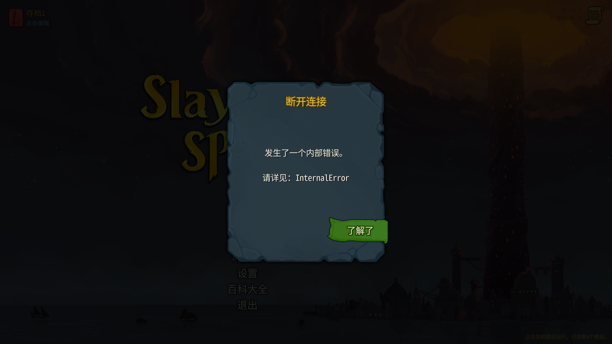

# 0.0.30 塔主真实牌测试结果（2026-10-07）

代码2732409；103/103测试通过（Core47，TowerMaster56），编译安装0警告0错误。manifest=0.0.30，川换皮禁用，助手独立建房、加入、新开局。本轮没有修改mod代码。

## 配置与启动确认：通过

先前0.0.29失败时安装目录临时关闭过master_cards；本轮安装重新覆盖为仓库新文件，没有保留或覆盖本地自定义配置。启动前安装文件与仓库文件SHA256完全一致：

`CE7D223D1626984CFD04F2F8E54D0CF4819EC3B6BDEB2B783F4866E23D169301`

安装配置master_cards=true、master_turn=true。两端共享同一安装目录，启动读取同一份文件。

塔主日志原文：

```text
[09:09:21.899] INFO 塔主牌（原版手牌出牌）：设置 master_cards=True
[09:09:21.936] INFO 塔主牌：已生成 54 种卡牌类型（TowerMasterBlock1 …），等 ModelDb.Init 收录
[09:10:14.244] INFO 塔主牌：本地化表 cards 补了 108 条（例 TOWER_MASTER_BLOCK1.title）
```

爬塔玩家日志原文：

```text
[09:09:21.669] INFO 塔主牌（原版手牌出牌）：设置 master_cards=True
[09:09:21.718] INFO 塔主牌：已生成 54 种卡牌类型（TowerMasterBlock1 …），等 ModelDb.Init 收录
```

爬塔玩家未找到108条本地化补表日志，不能认定两端该项均通过。两端 /master/deck 注册结果 registered=true、types=54、fail_reason=null。

## 新局失败：阻塞，不通过

IP直连建房/加入成功，身份塔主100001、爬塔玩家100002。开始新局后，地图生成阶段两端均空引用，爬塔玩家InternalError退回主菜单；塔主仍保留in_run=true，但楼层0、coord=null、room=null，画面黑屏。用户看到“A黑屏、B Error”与此一致。

两端关键错误堆栈：

```text
[ERROR] Exception starting multiplayer run : System.NullReferenceException: Object reference not set to an instance of an object.
   at MegaCrit.Sts2.Core.Runs.RunState.Contains(AbstractModel model)
   at MegaCrit.Sts2.Core.Runs.RunState.IterateHookListeners(ICombatState childCombatState)+MoveNext()
   at MegaCrit.Sts2.Core.Hooks.Hook.ModifyGeneratedMap(IRunState runState, ActMap map, Int32 actIndex)
   at MegaCrit.Sts2.Core.Runs.RunManager.GenerateMap()
   at MegaCrit.Sts2.Core.Runs.RunManager.SetActInternal(Int32 actIndex)
   at MegaCrit.Sts2.Core.Runs.RunManager.EnterAct(Int32 currentActIndex, Boolean doTransition)
```

没有进入塔主回合，因此“原版手牌没开启”红字、手牌visible原值、节点mouse_filter/disabled、拖牌、接口打牌、限制与整轮结束全部未覆盖。这不是设置没开或注册失败静默降级：设置True和类型登记都有原文，fail_reason也为null。

## 实际定位：塔主9张新牌均没有Owner

在塔主尚保留的失败RunState中，仅反射读取：

`state.Players[0].Deck.Cards[0..8].Owner` 的9个结果全部null。

同一RunState的 `state.Players[1].Deck.Cards[0].Owner` 是NetId100002的Player，IsActiveForHooks=true。

/master/deck 可读到塔主9张：加固×2、治疗、激励、战吼、虚弱、易伤、脆弱、晕眩；爬塔玩家仍原版10张（打击×5、防御×4、痛击）。这是失败状态下的数据检查，不是可正常游玩的牌组验收。

只读源码依据（路径相对仓库）：

- `decompiled/sts2/MegaCrit.Sts2.Core.Runs/RunState.cs:367`，`IterateHookListeners(ICombatState?): IEnumerable<AbstractModel>` 收集玩家Deck卡；:495 `Contains(AbstractModel): bool`，:525读取 `cardModel.Owner.IsActiveForHooks`，Owner为空便空引用。
- 同文件:188 `CreateShared(...)` 创建RunState，:193–197遍历当时的Deck经 `AddCard(CardModel,Player): void` 注册；:259–263明确设置card.Owner。:244 `CreateCard(CardModel,Player): CardModel` 克隆后也通过AddCard注册。
- `mod/TowerMaster/MasterDeck.cs:34` 的AfterNewRun在原版SetUpNewMultiplayer之后替换；:79 Replace仅ToMutable、Deck.Clear、PopulateDeck，没有给新卡调用RunState.AddCard或设置Owner。
- `decompiled/sts2/MegaCrit.Sts2.Core.Entities.Players/Player.cs:567` 私有PopulateDeck仅加入卡堆；`decompiled/sts2/MegaCrit.Sts2.Core.Entities.Cards/CardPile.cs:67` AddInternal也没有设置Owner。

因此实际9个null、异常位置和替换流程形成一致证据：原版CreateShared已注册旧牌，之后新牌仅入Deck未注册归属。请Claude补齐真实卡牌生命周期，并考虑旧牌从RunState全卡注册集合移除；只补界面或默认开关不能解决。测试助手没有自行修复。

## 截图及后续边界




截图是接口截取的当时画面，不代替错误日志。原版牌组按钮、挑陷阱入Deck、第二幕升级、读档牌组、战斗手牌、效果/限制/同步、3场以上真实卡模式：未覆盖，等待新局阻塞修复。

两端本轮TowerMaster ERROR/WARN为0，但游戏日志有上述异常；不能仅看mod日志就判通过。未进入战斗，没有StateDivergence，不能据此证明真实出牌同步正常。

两端已正常退出。按用户前一轮失败恢复预案，仅将安装目录配置master_cards恢复false（仓库文件仍true），供恢复普通测试；下轮安装必须再次覆盖为仓库新配置并验证哈希。重复订阅关闭卡模式的2场+读档1场结果见ui-029-result.md，收入、回合重复已通过，信号解绑错误尚未完全消失。
