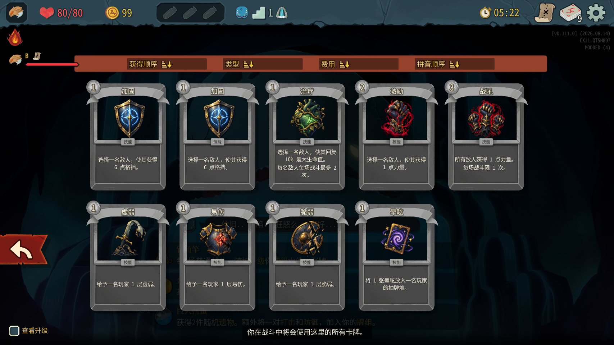
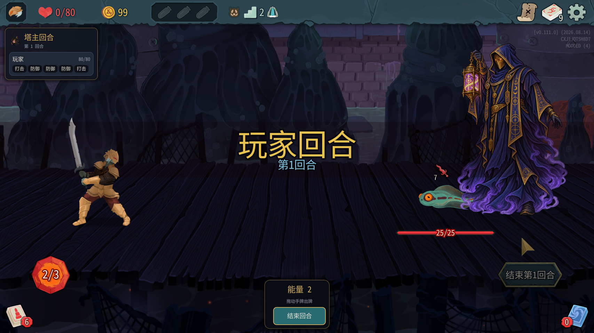
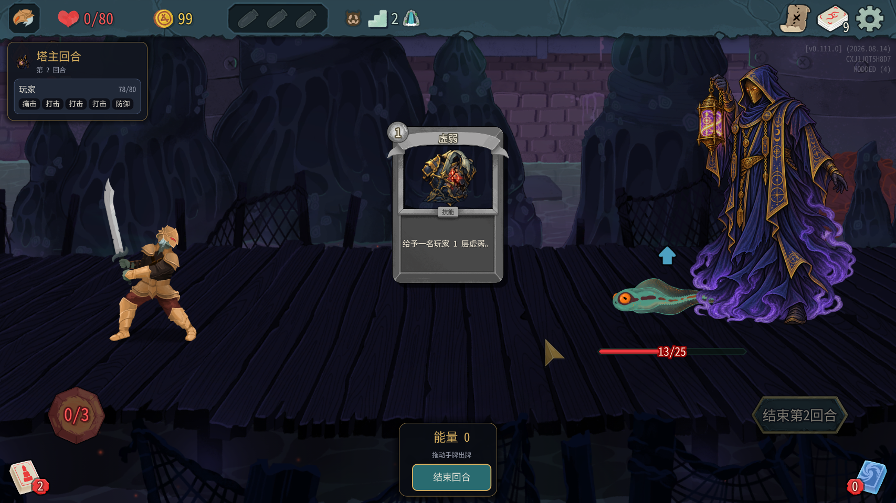

# 0.0.31 实测结果（2026-10-07）

代码b448014；本机双测试实例，塔主100001、爬塔玩家100002。103/103测试通过（Core47，TowerMaster56），编译安装0警告0错误，manifest=0.0.31。全程助手操作，没有机器人或win，没有修改mod代码。

用户自己玩的进程22320未关闭、未发送操作；测试仅通过47101/47102连接独立实例，结束时也只经这两个接口正常退出。最后确认22320仍在运行。禁用川换皮沿用测试环境设置，本轮未修改用户游戏进程。

## 新安装配置与启动：通过

安装后再次以仓库towermaster.test.json覆盖安装文件；两者SHA256均为：

`CE7D223D1626984CFD04F2F8E54D0CF4819EC3B6BDEB2B783F4866E23D169301`

master_cards=true、master_turn=true，本轮结束后保持true，没有回退false。两端共享同一安装目录。

塔主启动与开局原文：

```text
[09:20:33.969] INFO 塔主牌（原版手牌出牌）：设置 master_cards=True
[09:20:34.019] INFO 塔主牌：已生成 54 种卡牌类型（TowerMasterBlock1 …），等 ModelDb.Init 收录
[09:21:46.479] INFO 塔主牌组：新的一局，换成 9 张：加固、加固、治疗、激励、战吼、虚弱、易伤、脆弱、晕眩
[09:21:50.642] INFO 塔主牌：本地化表 cards 补了 108 条（例 TOWER_MASTER_BLOCK1.title）
```

两端均登记54种并开启True。新局可以进入先古之民、地图和普通战，没有RunState.Contains空引用，之前Owner缺失的开局阻塞已通过回归。本轮不再需要失败时的Owner逐张检查。

## 牌组：通过本轮覆盖

原版顶栏牌组按钮（NTopBarDeckButton.OnRelease）打开后显示9张塔主牌：加固×2、治疗、激励、战吼、虚弱、易伤、脆弱、晕眩。标题、完整说明、费用1/2/3与mod卡图可见，见截图；不是自绘牌组面板。爬塔玩家仍原版10张。

首次挑空陷阱后，/master/deck中塔主10张，增加TowerMasterTrapBluff1。两场后正常存档回菜单、同进程加载，/master/deck的完整返回与读档前完全相同。未进入第二幕，升级牌组未覆盖。



## 战斗原版手牌：存在阻塞性问题

第一场种子5090139151888786570，第一幕暗港，召唤单只蟾蜍蝌蚪。原文：

```text
[09:31:22.645] INFO 塔主手牌：陷阱牌移出战斗牌堆 1 张
[09:31:22.654] INFO 塔主手牌：原版抽牌跳过了塔主，改为直接从抽牌堆拿
[09:31:22.655] INFO 塔主回合 #3 第1回合：塔主能量 2，手牌 4 张（抽牌堆 5，弃牌堆 0）
[09:31:22.662] INFO 塔主回合 #3 第1回合：原版手牌界面 /root/Game/RootSceneContainer/Run/RoomContainer/CombatRoom/CombatUi/Hand visible=True modulate=(1, 1, 1, 1)
```

/master/hand结果：active=true，energy=2，手牌加固、易伤、治疗、激励，各can_play=true，draw_pile=5、discard_pile=0。B手牌接口paused_by_master_turn=true。

### 1. 数据有手牌，界面没有卡牌节点：不通过

塔主截图底部没有手牌。场景树只有NPlayerHand，没有NHandCardHolder、NCard或NCardPlay；节点Visible=true、MouseFilter=Ignore、_isDisabled=false，日志原visible=True。也就是说不只是把Hand隐藏了，而是根本没有实体卡牌节点可拖。MouseFilter=Ignore单独不能判为原因，因为正常手牌容器也可能由子节点收输入。

没有可见卡可抓取，因此原版鼠标拖牌未能执行；没有用鼠标拖空白区域伪造一次拖牌成功。改用/master/play验证规则路径。





只读线索：mod/TowerMaster/MasterHand.cs:279 ManualDraw、:291 MovePile只用CardPile.RemoveInternal/AddInternal换数据堆；原版视觉创建/加入流程在decompiled/sts2/MegaCrit.Sts2.Core.Commands/CardPileCmd.cs:660–674的Hand分支调用handNode.Add(cardNode)。仅显示已有NPlayerHand不会自动创建NCard。应由Claude补完整原版发牌视觉流程，不是再做卡牌面板。

### 2. 接口接受出牌、扣能量，但效果不执行：不通过

第一回合：

- /master/play index=0 monster=0，加固played=true；energy2→1，手牌4→3。
- /master/play index=0 player=100002，易伤played=true；energy1→0，手牌3→2。
- 怪物格挡仍0，两端B的Powers均无易伤。
- 能量0时再打激励返回played=false、can_play="false:None"，能量不足拒绝有效。

第二回合虚弱也played=true，但B Powers仍空。反射只读看到塔主PlayPile留着加固、易伤、虚弱三张已支付的牌，没有进入正常结算后的弃牌流程。

核心依据：decompiled/sts2/MegaCrit.Sts2.Core.Models/CardModel.cs:1487 `OnPlayWrapper(PlayerChoiceContext,Creature?,bool,ResourceInfo,bool): Task`，:1517–1519在GeneratePlayCount后遇Owner.Creature.IsDead就返回，:1562才调用OnPlay。因此只放开CanPlay/IsValidTarget不够；塔主仍死着，卡牌效果入口会被原版提前返回。:1564及后续也有死者返回，开发时须核对完整生命周期而不是只修最前一处。测试助手未自行绕过或修改此判断。

### 3. 第二张减益：不通过；其它次数上限未覆盖

第二场第1回合：易伤对B played=true，紧接同玩家脆弱played=true，能量2→0；B仍没有这两个状态。第二张并未被拒，符合效果不执行因而没有Record的现象，但不能据此认定完整的限制实现可用。

力量上限、第二次战吼因加力量/战吼效果本身被死亡提前返回，且本次普通房能量不足以打3费战吼，未建立有效前置状态，未覆盖。不能把能量不足的拒绝当成次数/力量上限拒绝。

### 4. 专用结束有效，原版结束无效

专用/threat/end后active=false、hand=[]，B paused=false，下回合energy=1、重新4张。三场观察到的手牌均为行动牌，没有空陷阱。

但第三场塔主使用原版/combat/end_turn，返回enqueued=EndPlayerTurnAction、turn=1；执行后active仍true，energy仍2、hand仍4张，B paused=true。之后必须用/threat/end才清手牌恢复B。因此“原版结束回合结束塔主先手”未通过。

源码调查：MasterHand.Apply只挂CanPlay、IsValidTarget；当前MasterHand/ThreatPhase未找到EndPlayerTurnAction执行层转换为塔主先手结束的挂点。专用按钮/接口与原版结束动作是不同路径，不能把前者通过当作后者通过。

每次结束还有相同WARN，两端各6次：

```text
[09:35:19.706] WARN 塔主手牌：原版弃牌失败（Method 'CardPileCmd.Discard' not found.），直接移到弃牌堆
```

mod/TowerMaster/MasterHand.cs:268查CardPileCmd.Discard，但原版接口在decompiled/sts2/MegaCrit.Sts2.Core.Commands/CardCmd.cs:122/:127：`Discard(PlayerChoiceContext,CardModel): Task` / `Discard(PlayerChoiceContext,IEnumerable<CardModel>): Task`。回退数据移动使清空表面有效，不代表正常视觉与卡牌钩子弃牌成功。

## 三场自然战斗与同步

没有win或机器人；按实际手牌/意图，通过tm_play、tm_end_turn出牌，塔主通过专用接口结束阶段。两场后读档再打第三场。每场单只Toadpole，仅作生命周期检查，不作平衡结论。

| 场次 | 楼层 | 怪物生命 | 回合 | B战前→战后 |
|---|---:|---:|---:|---|
| 1 | 2 | 25 | 2 | 80→80 |
| 2 | 3 | 25 | 2 | 80→80 |
| 3（读档后） | 5 | 22 | 2 | 72→76 |

第3场之前事件扣8生命，故战前72，不计作战斗损失。三场整轮、怪物回合和自然胜利都正常，前提是用专用结束而非原版结束。每场胜利只有一条收入，余额17、22、27，没有重复回合WARN。

两端19条动作摘要去时间戳后完全相同，StateDivergence/State divergence detected均0。摘要只在mod自定义动作后记录，真实PlayCardAction出牌不一定新增摘要；额外读数确认效果两边同样没有发生。因此同步一致不等于功能有效。

## 同进程同一格投票及游戏错误

第一额外新局7454974490840056216从(3,0)投(3,1)，有跟投并打开选陷阱。随后同进程另开新局408964289831618460尝试相同(3,1)，测试脚本未重新核对该新地图是否包含这格，导致以下游戏错误：

```text
The given key 'MapCoord (3, 1)' was not present in the dictionary.
at MegaCrit.Sts2.Core.Nodes.Screens.Map.NMapScreen.OnPlayerVoteChangedInternal(...)
```

这是测试助手传了新地图不存在的目标所造成，不能归为自动跟投mod回归失败。第二次同格的有效测试未完成，结论未覆盖，需后续使用两局都可达的相同坐标。源码Reset已清投票缓存但不代替实测。

完整本轮游戏日志统计：两端disconnect a nonexistent connection=0，p_child is null=0；两端mod ERROR=0、WARN=6（上述弃牌错误）；塔主游戏另有无效投票导致的动作异常/队列Executing错误，必须与实际mod问题区分。退出时Godot资源诊断不作为本轮出牌成功证据。

## 交接

优先修：原版手牌节点创建；死亡牌主OnPlayWrapper生命周期；原版EndPlayerTurnAction先手结束；弃牌命令类型。修后重测真实拖牌、效果/次数限制、有效同格跟投。牌组、开局和存档已通过本轮样本，但真实战斗出牌总体不通过。第二幕升级等未覆盖，不宣称全部完成。
