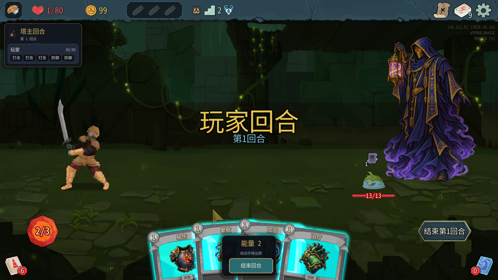
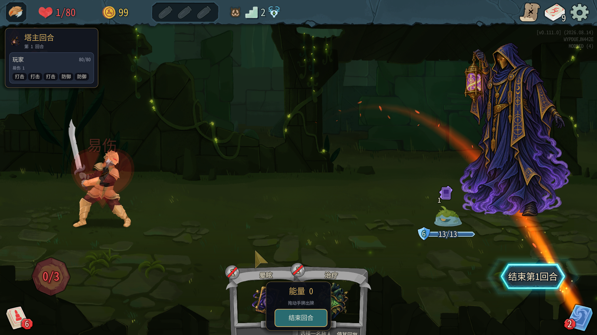
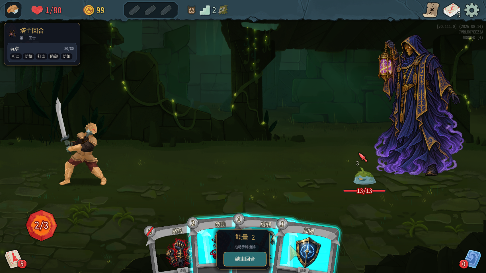

# 0.0.32 测试结果（2026-10-07）

代码10cead6，103/103测试通过（Core47，TowerMaster56）；编译安装0警告0错误，manifest=0.0.32。安装后再次用仓库towermaster.test.json覆盖安装文件，SHA256完全相同：

`CE7D223D1626984CFD04F2F8E54D0CF4819EC3B6BDEB2B783F4866E23D169301`

master_cards=true、master_turn=true，川换皮未启用。只使用测试A/B端口47101/47102；未操作、关闭用户自己的游戏。本轮没有改mod代码。

## 执行边界

对话中间发生助手服务连接错误，用户要求重新启动测试游戏。原测试实例当时已不可连接；重启独立A/B后新开局，完成下列三场自然战斗和同格投票。未跑机器人，未用win。

实际鼠标拖牌尝试连接窗口输入工具时，工具返回：

```text
Computer Use native pipe is unavailable: failed to connect native pipe: 系统找不到指定的文件。 (os error 2)
```

因此实际鼠标拖牌未覆盖；不是mod“拖不动”。遵照对照要求，以tm_master_play完成加固、易伤等功能测试。接口测试不能代替真实鼠标交互验收。其它操作通过游戏测试MCP完成，不要求用户参与。

## 逐项结论

| 项目 | 结果 | 实测 |
|---|---|---|
| 第1回合2能量、4张原版手牌 | 通过 | 接口active=true、energy=2、hand四张；截图可见原版卡框；场景树4个NHandCardHolder及其NCard |
| 不再手动搬牌抽牌 | 通过 | 重启后三场日志两端均0条“原版抽牌跳过了塔主” |
| 加固、易伤生效与扣费 | 接口通过，鼠标未覆盖 | 重启前0.0.32会话：加固后两端格挡6；易伤后两端B有VulnerablePower，energy2→1→0 |
| 弃牌、PlayPile | 通过接口样本 | 加固/易伤均进入DiscardPile，PlayPile为空；不再扣能量但无效果 |
| 激励 | 通过一次效果 | 重启后第二场加1力量，两端都有StrengthPower |
| 能量不足 | 通过 | energy=0再打治疗played=false；普通战1能量时2费激励can_play=false |
| 同玩家第二次减益 | 未覆盖 | 3场第1回合未抽到可在2能量下测试的两张减益；第2回合仅1能量，不能用“没能量”的拒绝当作次数规则通过 |
| 力量超过上限2 | 未覆盖 | 只成功加过1力量；未建立同一只怪已有2力量且有足够能量再打激励的有效条件 |
| 第二次战吼 | 未覆盖 | 未进入精英/Boss；普通房第1回合仅2能量，不能打3费战吼 |
| 原版结束回合 | 通过接口动作路径 | tm_end_turn入队EndPlayerTurnAction，日志有指定转换行；hand=[]、active=false，B恢复出牌 |
| 弃牌WARN | 通过回归 | 两端“原版弃牌失败”0条 |
| 下一回合1能量、4张 | 通过 | 前两场第2回合均energy=1、hand四张 |
| 塔主阶段外生命0 | 通过 | 原版结束动作后tm_state塔主hp=0、alive=false；B行动及敌人阶段正常 |
| 陷阱不入手牌 | 通过本样本 | 挑空陷阱后牌组10张；三场观测的手牌全为行动牌，没有空陷阱 |
| 3场整轮及胜利 | 通过本样本 | 2/2/1回合自然胜利，无卡死；小怪样本不能作平衡结论 |
| 同格投票跟进 | 通过 | 两个相邻新局各先读地图，均存在(1,1)，B投票后均打开塔主选陷阱 |
| 面板遮挡 | 不通过外观 | 中央自建能量/结束面板遮住手牌，用户要求删除，见下文 |

“塔主阶段外hp=0”限定战斗中结束先手以后，不包括胜利后原版隐藏复活（战后可看到hp=7）；不能把战后复活误写为敌人回合塔主仍活着。

## 原版手牌与效果证据

重启前第一场截图和只读节点查询：手牌容器
`/root/Game/RootSceneContainer/Run/RoomContainer/CombatRoom/CombatUi/Hand`，其CardHolderContainer有易伤、晕眩、加固、治疗4个NHandCardHolder，均visible=true。与0.0.31“没有任何手牌节点”不同。



同次对照：先tm_master_play加固monster=0，再易伤player=100002；两端格挡6、B有VulnerablePower，塔主PlayPile=[]，DiscardPile为两张已打出的牌，能量0。原版EndPlayerTurnAction后余下手牌弃掉，DiscardPile共4，B paused=false，塔主生命0。读数来自两端分别反射只读查询，不是只看塔主端推断。



重启后种子5533543360216676526，第一场加固与脆弱对照：两端格挡6，两端B都有FrailPower；能量0时治疗拒绝。第二场激励两端都有StrengthPower。实际状态数值与同步未出现不同步。

原文（日志时间为原文件时间）：

```text
[21:34:00.156] INFO 塔主回合 #3 第1回合：塔主能量 2，手牌 4 张（抽牌堆 5，弃牌堆 0）
[21:34:35.280] INFO 塔主手牌：原版结束回合 → 结束塔主先手
[21:34:39.008] INFO 塔主回合 #5 第2回合：塔主能量 1，手牌 4 张（抽牌堆 1，弃牌堆 4）
```

## 三场自然战斗与两端日志

重启后同局第一幕密林，均召唤单只LeafSlimeS：

| 场次 | 楼层 | 怪物初始血量 | 回合 | 塔主本场操作 |
|---|---:|---:|---:|---|
| 1 | 2 | 12 | 2 | 加固、脆弱；原版结束动作 |
| 2 | 3 | 15 | 2 | 激励；原版结束动作 |
| 3 | 4 | 11 | 1 | 脆弱；原版结束动作 |

B按真实手牌打痛击、打击、防御，自然取胜，战后生命均80。塔主回合中hp=1，原版结束后hp=0；未观察到敌人攻击塔主。无伤小怪不代表强度平衡。

三场完成时两端17条动作摘要完全一致。额外新局跟投与开战后的完整比较见末尾统计。全部TowerMaster日志两端ERROR=0、WARN=0，没有StateDivergence或State divergence detected；没有手动抽牌、弃牌失败WARN。原始全文不提交。

## 有效的同格投票补测

三场完成后，同进程新局7942531890115112711：先读map_options，列表包含(1,1)，B投(1,1)，塔主打开draft。

紧接同进程新局13985214133040245108：再次读map_options，明确包含(1,1)，B仍投(1,1)，塔主再次打开draft，wallet=12、battles=0。随后正常确认、进入战斗证明投票后流程可继续；该额外战斗没有计入已自然完成的三场。

没有沿用上一轮未经检查的无效坐标；本项通过有效样本。

## 用户外观意见（原话）

> 这个挡住手牌了 能量不用显示的吧，结束回合也不应该放在这里

需求交给Claude：删除手牌中央自建面板里的重复能量显示和结束回合按钮，沿用原版左下能量与右侧结束回合按钮。修复应保持原版手牌的悬停、拖牌空间，不再另建一块盖住手牌的面板。



## 交接与未覆盖

本轮观察到的0.0.31三项主要功能故障已恢复：原版手牌节点、出牌效果、原版结束动作。实际鼠标拖拽因本机窗口输入服务不可用未执行，3项次数/上限仍未覆盖，不能判定全部验收通过。请Claude优先处理遮挡面板；次数限制需要可稳定建立相应手牌与能量的测试场景。

测试A/B已正常退出，未操作用户自己的实例。只提交报告与测试截图，没有mod代码、原始日志、反编译源码或游戏资源。

完整重启会话动作摘要：塔主20行、爬塔玩家20行，逐行比较结果：True。

## 用户补充实测（2026-10-07）

用户原话：“鼠标拖牌我试过 可以用”。因此鼠标拖牌补记为**用户手动验证可用**；助手自身因窗口输入工具不可用未执行鼠标操作。用户未细分加固/易伤各自的拖牌目标，不把这条补充扩展为每张牌、每种目标均已验证。前文“鼠标未覆盖”指助手测试范围，以本补充作为最终验收记录。第二次减益、力量上限及第二次战吼仍未覆盖；中央面板遮挡反馈仍保留。
