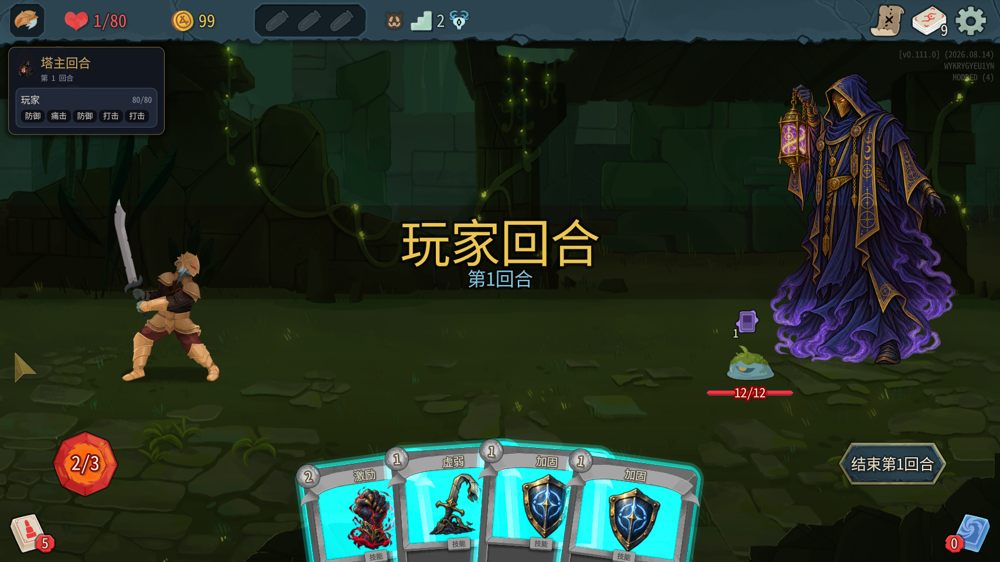
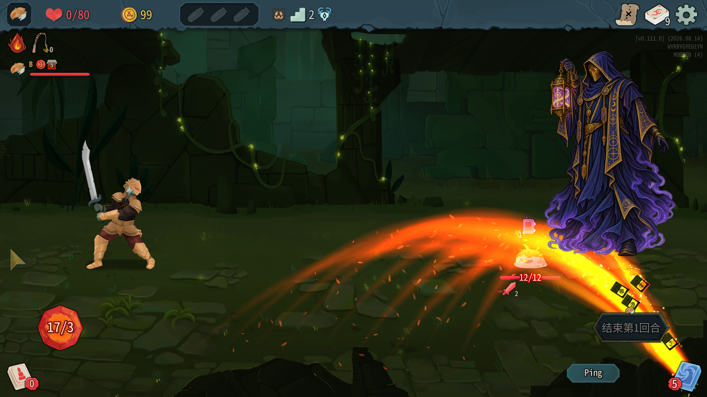
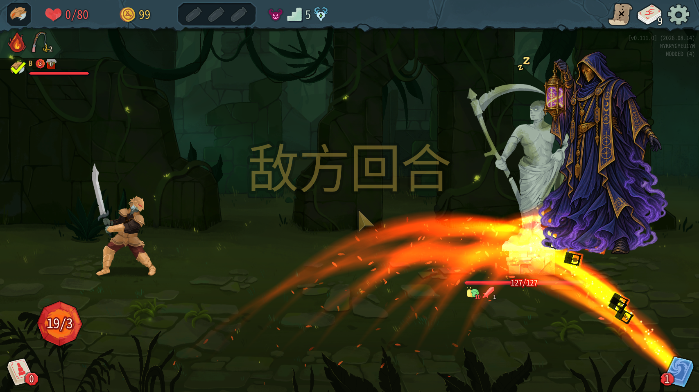
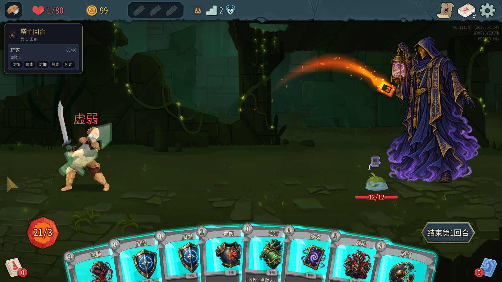
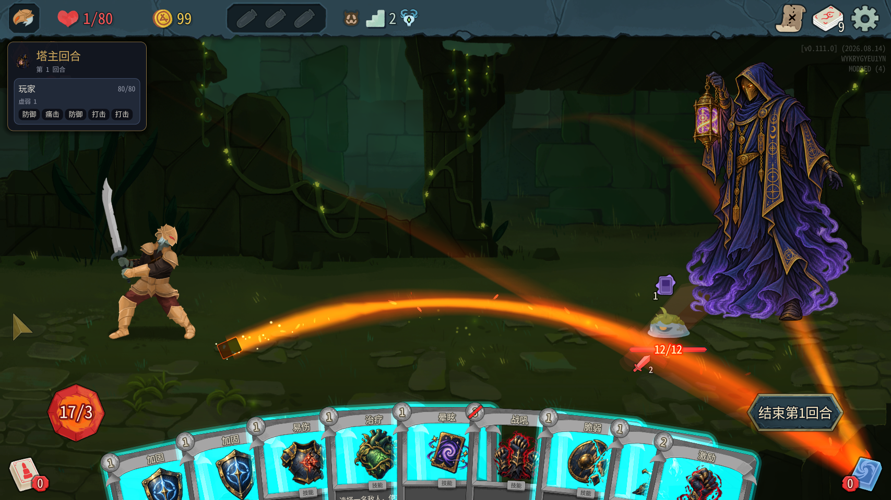
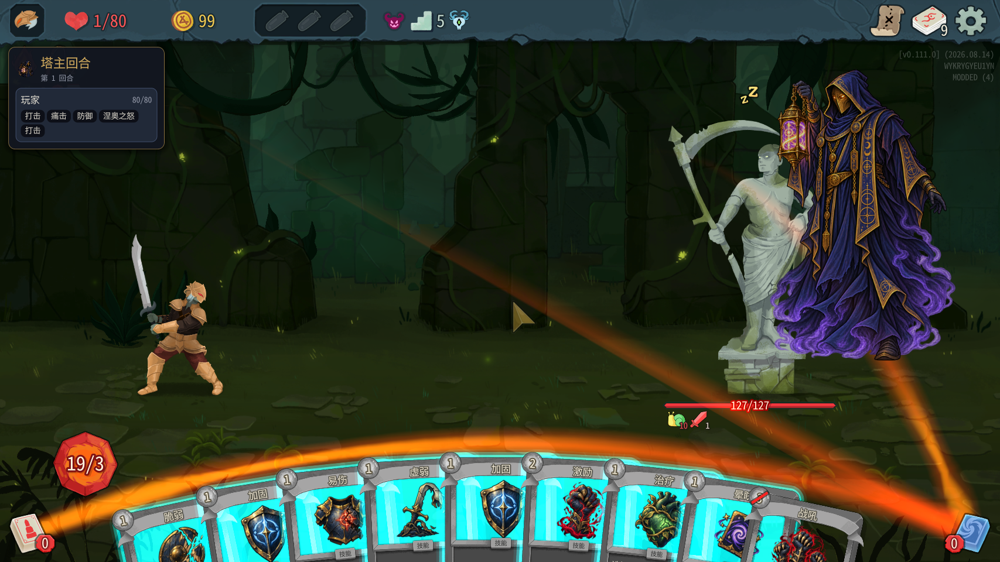

# 0.0.33 测试结果（2026-10-07）

代码3059aa5，本机测试A/B（塔主100001、爬塔玩家100002）。103/103测试通过（47+56），编译安装0警告0错误，manifest=0.0.33。安装后以仓库towermaster.test.json覆盖安装目录；两份SHA256均为CE7D223D1626984CFD04F2F8E54D0CF4819EC3B6BDEB2B783F4866E23D169301。master_cards=true，川换皮未启用。本轮未改mod代码，未使用win、机器人，未关闭或操作用户自己的游戏。

## 外观及原版结束回合

中央自建能量/结束面板已经消失，四张原版手牌可见，左下原版能量显示2，右下原版“结束第1回合”可见。

```text
[21:52:41.594] INFO 塔主回合 #2 第1回合：原版结束回合按钮已显示（状态 Enabled）
```

使用tm_end_turn（原版EndPlayerTurnAction路径）后，塔主hand=[]、active=false，B paused_by_master_turn=false，塔主生命0。下一回合恢复默认1能量、4张。第一场使用控制台加能量以后显示17/3，是辅助测试数值，不是默认值变化。



B出牌阶段，塔主屏幕右下按钮仍可见，但变暗并带小玩家标记，下面出现Ping按钮；塔主没有手牌。只记录实际外观，未凭截图认定一定可点击或完全禁用（本轮反射查询State未取到有效枚举）。



确认combat.CurrentSide=Enemy时截图，右下结束按钮已隐藏，塔主生命0。



实际鼠标输入工具在上一轮连接原生服务失败，本轮沿用用户允许的tm_end_turn替代路径。没有执行鼠标点击/拖拽，不把接口结果扩展成真实鼠标验收。

## 辅助命令及测试条件

用户允许必要时控制台加能量。第一场塔主第1回合执行原版联机控制台 `energy 20`（默认2→22）、`draw 5`（4→9张行动牌）；为重新抽到已弃的激励，之后执行 `draw 2`、`draw 1`。命令是游戏原版网络命令，两端执行；没有直接修改次数记录或力量上限。

测试牌组、能量足够时，以下被拒样本仍保留手牌与能量，可排除“没有能量”的干扰。辅助命令和截图中的超默认能量仅用于功能测试，不能作为平衡数据。

## 三条限制

### 1. 同一玩家第二张减益：通过接口路径

先虚弱对100002：played=true，energy22→21。随后对同一100002打脆弱：played=false，energy仍21，脆弱仍在手牌。接口can_play仍true，因为此限制按目标判断，不能只用牌的通用can_play判断是否能作用该玩家。



真实鼠标拖到目标的红色反馈未覆盖；截图不宣称出现了拖拽红色提示。

### 2. 同一怪力量上限2：通过接口路径

第一场LeafSlimeS，激励成功两次，经联机控制台回抽同一张激励；两端StrengthPower.Amount=2。再次打激励played=false，能量仍足够，卡仍留手牌。can_play仍true，同样是目标层限制。



### 3. 精英第二次战吼：通过独立样本

完成两场普通战以后，原版联机控制台 `room Elite` 进入额外精英测试房间（CurrentRoom.RoomType=Elite，敌人BygoneEffigy）。地图坐标仍属于之前的普通点，塔主默认能量仍2，因此辅助执行energy20、draw5，不把它当正常选路进入精英房的默认能量测试。

第一次精英样本中有其它行动造成力量已到2，第二次战吼拒绝可能同时受力量上限影响；为排除干扰，再经room Elite进入新的精英测试房，重新清本场记录，仅打一次战吼，再draw1回抽。

独立样本：第一次战吼played=true，第二次played=false、can_play="false:None"；只读MasterHand._strengthAll=1，两端敌人有力量，未先打激励。截图战吼费用处显示红色斜杠禁用标识、卡框不再青色发光，足够能量下仍被拒。



第二次战吼的截图证明原版静态禁用标识；实际鼠标拖不出去/瞬间发红未执行，不能将静态角标等同完整拖拽反馈。

## 正常战斗结束回归

种子16334566246232457140，第一幕密林：

| 场次 | 进入方式 | 怪物 | 回合 | 结果 |
|---|---|---|---:|---|
| 1 | 正常地图投票 | LeafSlimeS 12血 | 2 | B按手牌出牌自然胜利，塔主使用了辅助能量/抽牌测试 |
| 2 | 正常地图投票 | LeafSlimeS 11血 | 1 | 不加能量、正常出牌自然胜利 |

两场均正常结束，B战后80血；两场胜利收入各一条，召唤点17、22，无重复订阅现象。第一场塔主回合外生命0；胜利后原版隐藏复活至7血，与既有设定一致。

额外两次room Elite仅用于第二次战吼限制，不计入两场自然胜利；未用win结束它们，测试完成后正常退出A/B。

## 日志与异常

两端完整13条“动作摘要”去时间戳后逐行一致；StateDivergence、State divergence detected均0。效果数值双端一致（力量上限2、战吼力量、弱化状态）。

TowerMaster统计：塔主ERROR2/WARN0，爬塔玩家ERROR2/WARN0。两次ERROR均在辅助room Elite跳转、没有召唤清单时出现生成前校验回退：

```text
[21:57:10.768] ERROR 测试1b：生成前校验失败，这一场按载体遭遇原本的怪物
[22:00:07.117] ERROR 测试1b：生成前校验失败，这一场按载体遭遇原本的怪物
```

爬塔玩家同内容时间21:57:10.739、22:00:07.109。实际生成原版精英，两端一致。这是调试跳房路径触发的回退，不能写“所有ERROR为0”，也没有证明正常选路精英路径有同一故障。

测试调用曾在胜利动画尚未完成时提前请求rewards/proceed，接口返回invalid_phase；随后等待并通过真实出牌完成战斗。该调用错误不作为mod战斗结束失败。

## 总结与范围

中央遮挡移除、原版结束动作、两场正常胜利、三条规则的接口拒绝均通过本轮样本。鼠标拖拽的瞬间红色/目标反馈、正常选路精英的默认能量未覆盖。B阶段按钮仍可见但变暗，敌方阶段隐藏，外观已截图供开发者判断是否还需调整。

A/B由测试助手正常退出以读取完整日志，并非崩溃；用户自己的进程未被操作。本报告只提交摘要、少量原文与截图，不提交原始日志全文、反编译源码或游戏资源。
