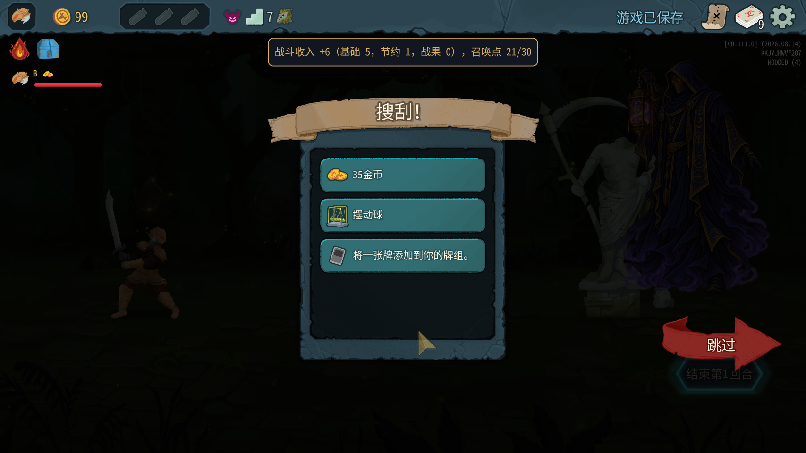
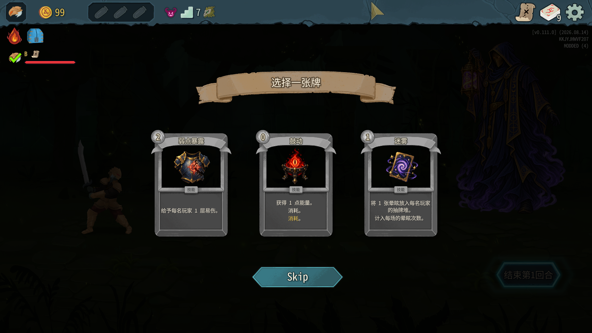
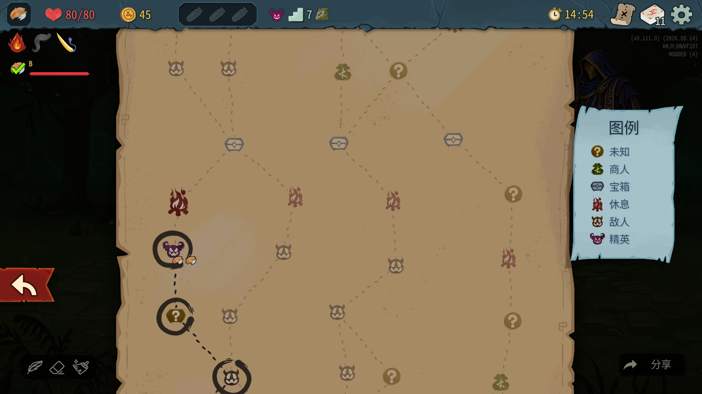
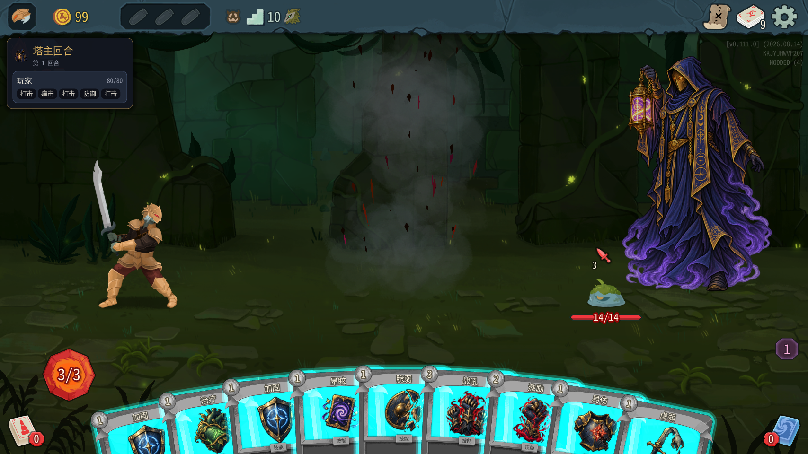
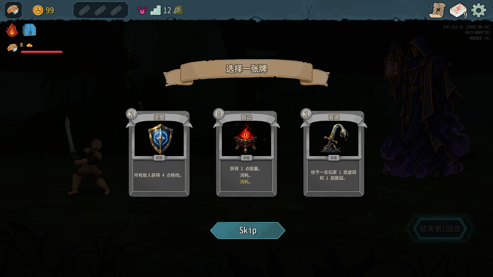

# 0.0.34 实测结果（2026-10-07）

代码528c006，104/104测试通过（Core47、TowerMaster57）；编译安装0警告0错误，manifest=0.0.34。安装后以仓库towermaster.test.json覆盖安装目录，两份SHA256均为CE7D223D1626984CFD04F2F8E54D0CF4819EC3B6BDEB2B783F4866E23D169301。master_cards=true，川换皮禁用。只操作测试A/B（塔主100001、爬塔玩家100002），没有修改mod代码，没有操作用户自己的游戏。

## 总体结论

**奖励自然弹出流程不通过：两次正常地图精英战后，塔主3选1都被随后出现的原版普通奖励界面覆盖，卡住塔主队列与B前进。** 通过原版界面栈兜底移除遮挡层后，选牌、入牌组、跳过、鼓动效果、存档保留及同场不重复奖励均通过样本。不能把兜底后的结果写成无需干预的完整通过。

## 启动及隐藏生命

两端均75种类型、150条本地化，新局正常进入地图。

```text
[22:13:40.220] INFO 塔主牌：已生成 75 种卡牌类型（TowerMasterBlock1 …），等 ModelDb.Init 收录
[22:15:59.855] INFO 塔主牌：本地化表 cards 补了 150 条（例 TOWER_MASTER_BLOCK1.title）
[22:16:00.242] INFO 塔主回合 #2 第1回合：隐藏塔主顶栏生命
```

爬塔玩家同内容时间分别22:13:40.176、22:15:59.799。塔主后续战斗截图左上原版顶栏没有生命数字，B的玩家生命条保留，隐藏通过。

## 路线与实际战斗

种子17252615864607071703，第一幕密林。所有移动通过合法map_options与tm_map_vote：

(0,1)普通 → (0,2)事件 → (0,3)事件 → (1,4)普通 → (0,5)问号宝箱 → **(0,6)精英** → (0,7)休息 → (1,8)宝箱 → (0,9)普通 → (0,10)问号商店 → **(0,11)精英**。

没有room/fight/travel命令，没有win、机器人。三场普通房各选单只LeafSlimeS，两场精英各选单只BygoneEffigy（127血），都用真实卡牌打赢。

为集中验收奖励，精英战对B使用原版联机控制台energy30及draw辅助：第一场draw5、draw7，第二场draw6、draw7，然后依据手牌打痛击、打击、灰烬打击击杀。两场精英均第一回合胜利；该节奏用了额外能量和回抽，不能作为自然难度或平衡结论。塔主新牌测试另用draw6。未改任何默认配置数值。

## 第一次精英奖励：被覆盖，兜底后选牌成功

第一精英位于(0,6)，总楼层7、账本第3场。

```text
[22:21:39.264] INFO 塔主牌：第 3 场（Elite）奖励候选 expose_all、surge、daze_all
```

候选对应弱点暴露、鼓动、迷雾。胜利后A没有看到3选1，tm_cards visible=false，牌组9张；A实际显示普通战斗奖励界面，B显示自己的战斗奖励。B按继续、投下一步后仍停在精英房。

只读反射NOverlayStack.Instance._overlays显示顺序：

1. NChooseACardSelectionScreen（塔主奖励）
2. NRewardsScreen（随后加入、当前顶层）

选择界面Visible=false，仍在场景和栈里，不是未生成。游戏日志奖励动作进入GatheringPlayerChoice；塔主跟投被排在它后面，无法执行：

```text
[VERYDEBUG] [GameAction] Action TowerMasterSummonGameAction gathering player choice
[VERYDEBUG] [ActionQueueSet] Action TowerMasterSummonGameAction at front of player queue 100001 is waiting for player choice
```

这时没有“塔主奖励选牌失败”异常、没有StateDivergence，但B实质不能前进。不能因为日志没有ERROR就判通过。



助手关闭覆盖层的兜底（未改代码）：

- 调用 `NOverlayStack.Instance.Remove(IOverlayScreen)`，参数为A当前NRewardsScreen。
- 调用A `NMapScreen.Close(false)`，关闭之前按继续自动打开的地图。

仅点rewards_proceed会打开地图但保留普通奖励层，仍不能显示选牌；上述正常界面栈关闭操作才使底层选牌显示。正常玩家不应需要该兜底，仍作为mod故障报告。



B没有塔主候选牌；按自己的继续之后看到地图，等待塔主选择完成、跟投执行，截图如下。不是专门绘制的“等待塔主”界面。



### tm_cards的接口缺口

即使选择界面Visible=true，tm_cards仍返回visible=false。原因：mod/TowerMaster/TestBridge.cs:877 CardScreen要求OnCardClicked单参数和_cards；原版NChooseACardSelectionScreen用SelectHolder，没该方法。

因此使用原版节点路径兜底：

`NChooseACardSelectionScreen.SelectHolder(NCardHolder)`（private，decompiled/sts2/MegaCrit.Sts2.Core.Nodes.Screens.CardSelection/NChooseACardSelectionScreen.cs:251），参数为CardRow下鼓动的NGridCardHolder。与原版卡牌Pressed事件同一处理入口；不调用不存在的ConfirmSelection。

选中鼓动后两端日志：

```text
[22:30:07.804] INFO 塔主回合 #8 第1回合：塔主奖励 选了 鼓动
```

B同内容22:30:07.819。tm_master_deck塔主9→10张，新增TowerMasterSurge1（act:surge@1），两端摘要均塔主k10，B仍k11。选完后之前排队的地图跟投恢复，正常进入休息处。

## 新牌鼓动：通过

下一场普通战自然初始4张手牌里已经有鼓动；为了观察完整牌堆另外调用A draw6（无需注入新牌）。接口打出鼓动，0费，能量2→3；两端PlayerCombatState.Energy均3，两端ExhaustPile均有TowerMasterSurge1。PlayPile没有残留，符合“+1能量后消耗”。



只实际获得鼓动。坚壁、复苏、衰竭、迷雾、弱点暴露、筹谋未获得，战斗效果未覆盖，不用类型已注册代替实测。候选界面可看见其中部分，不代表效果已测试。

外观小问题：鼓动卡说明同时出现灰色“消耗。”和金色“消耗。”两行，疑似说明与关键词自动追加重复；见3选1截图，建议开发者检查文案。

## 第二精英：跳过后牌组不变

正常沿地图进入(0,11)，总楼层12、账本第5场。候选坚壁、鼓动、衰竭；同样被NRewardsScreen盖住，稳定复现两次。使用同一兜底移除遮挡、关闭地图后调用原版：

`NChooseACardSelectionScreen.OnSkipButtonReleased(NButton)`（private，同文件:285），参数null，走Skip按钮的同一处理入口。

```text
[22:34:24.899] INFO 塔主回合 #14 第1回合：塔主奖励 跳过
```

B同内容22:34:24.907；前后tm_master_deck完整JSON一致，仍10张含鼓动。



## 存档读档：通过样本

在第二精英奖励跳过、尚未离开该房间时，两端回主菜单后同进程加载多人存档。种子、精英坐标(0,11)保持一致；牌组完整JSON与读档前相同，鼓动仍在。

A界面栈只有NRewardsScreen，没有NChooseACardSelectionScreen；该场没有新增奖励候选/再次选牌动作。同场不重复奖励通过。读档加载的普通战斗奖励界面不等于塔主3选1重复。

## 覆盖问题的只读源码依据

- mod/TowerMaster/SummonPhase.cs:398 在战斗胜利订阅回调中调用MasterRewards.AfterWin；MasterRewards.cs:29–35立刻发送reward指令。
- decompiled/sts2/MegaCrit.Sts2.Core.Combat/CombatManager.cs:1015触发CombatWon，:1017恢复ActionExecutor，奖励动作可在原版胜利后奖励界面生成之前执行。
- decompiled/sts2/MegaCrit.Sts2.Core.Commands/CardSelectCmd.cs:194 `FromChooseACardScreen(PlayerChoiceContext,IReadOnlyList<CardModel>,Player,bool): Task<CardModel?>`，:224显示原版选择界面。
- decompiled/sts2/MegaCrit.Sts2.Core.Nodes.Screens.CardSelection/NChooseACardSelectionScreen.cs:147 `ShowScreen(IReadOnlyList<CardModel>,bool)`，:157 Push到覆盖栈。
- decompiled/sts2/MegaCrit.Sts2.Core.Nodes.Screens.Overlays/NOverlayStack.cs:113 `Push(IOverlayScreen)`先隐藏当前顶层，再添加新层。后来的NRewardsScreen会盖住已打开的选牌。
- decompiled/sts2/MegaCrit.Sts2.Core.Rooms/CombatRoom.cs:233 `OfferRoomEndRewards(): Task`生成并Offer原版奖励；NRewardsScreen.cs:225/231 `ShowScreen(...)`随后Push。

实测栈顺序与此时机竞争吻合。建议Claude调整塔主奖励显示时机/普通奖励层处理，避免覆盖和排队软锁；测试助手未修改实现。

## 日志统计与交接

两端完整19条动作摘要去时间戳后一致；选鼓动后两端k10相同，跳过后保持k10。TowerMaster两端ERROR0、WARN0，游戏日志无[ERROR]异常、无StateDivergence/State divergence detected。退出时Godot资源诊断不等同本轮无覆盖故障。

主要问题无需异常即可复现：选牌在下层等待，跟投在其后等待。奖励选择/跳过及保存已经通过兜底验证，但自然弹出与无需干预前进未通过；tm_cards支持也缺失。

两端在提前说明后正常退出；只提交本报告和截图，不提交原始日志、反编译源码或游戏资源。可交给Claude处理覆盖软锁和接口缺口，再重测无需兜底的完整流程。
