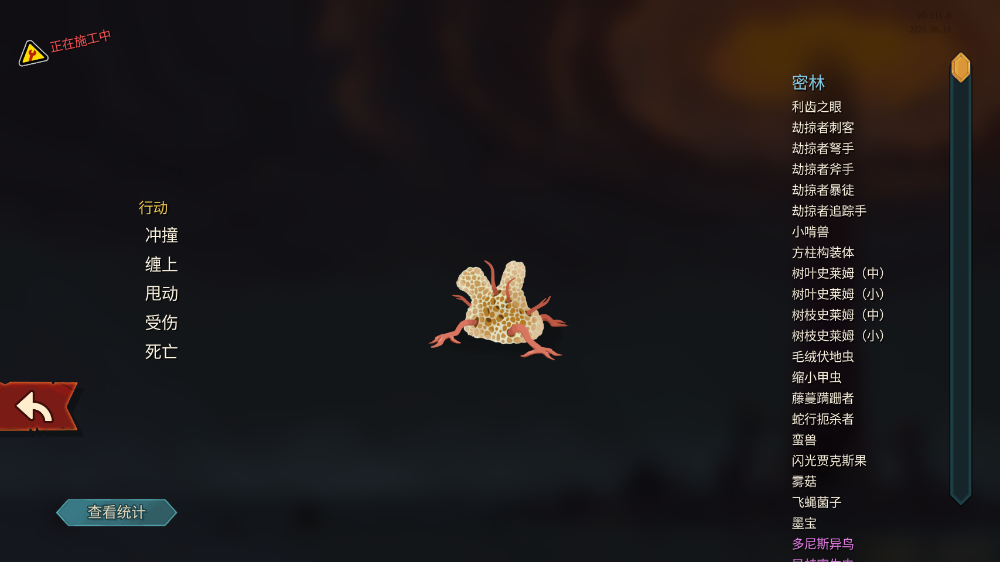
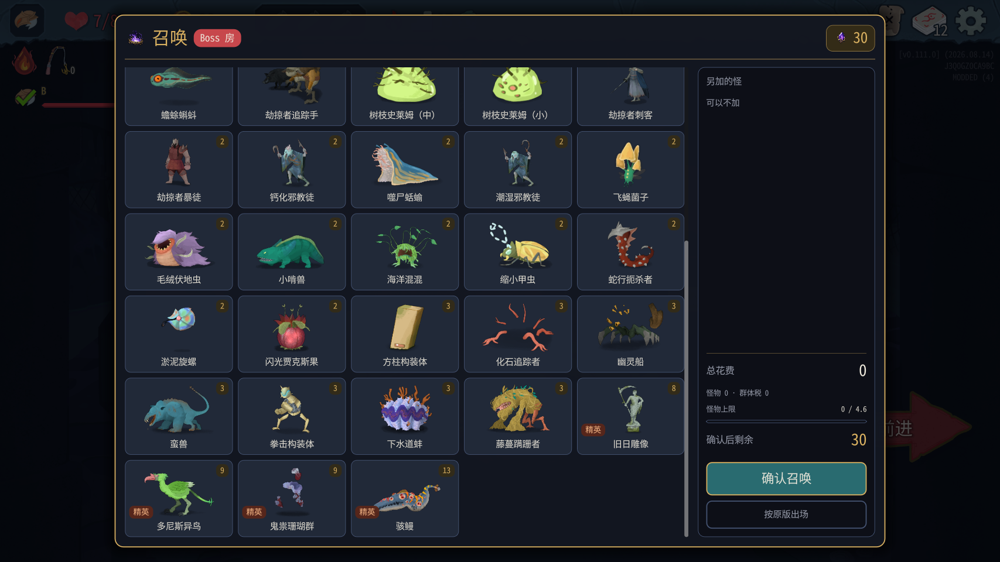
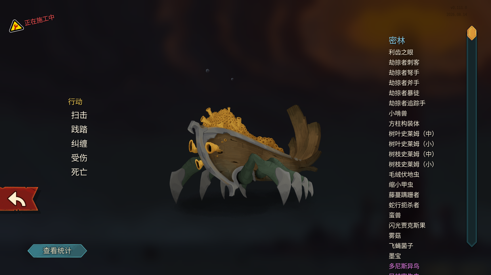
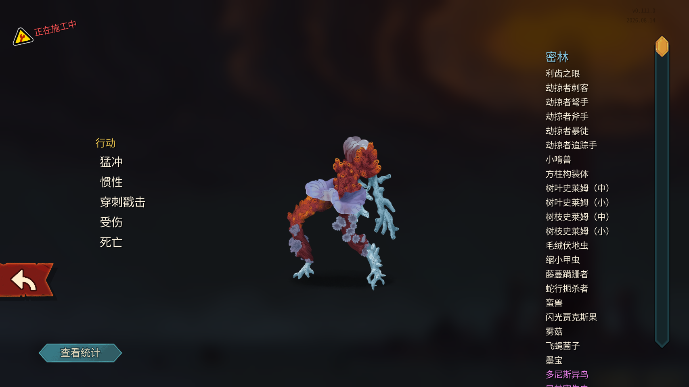
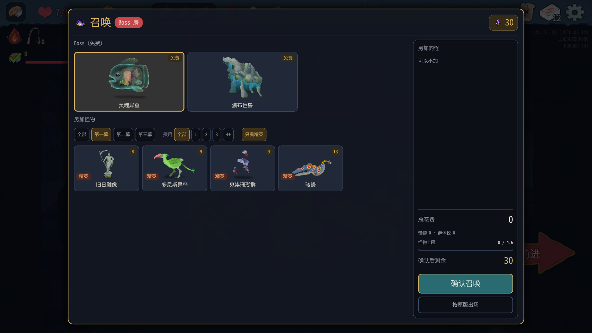
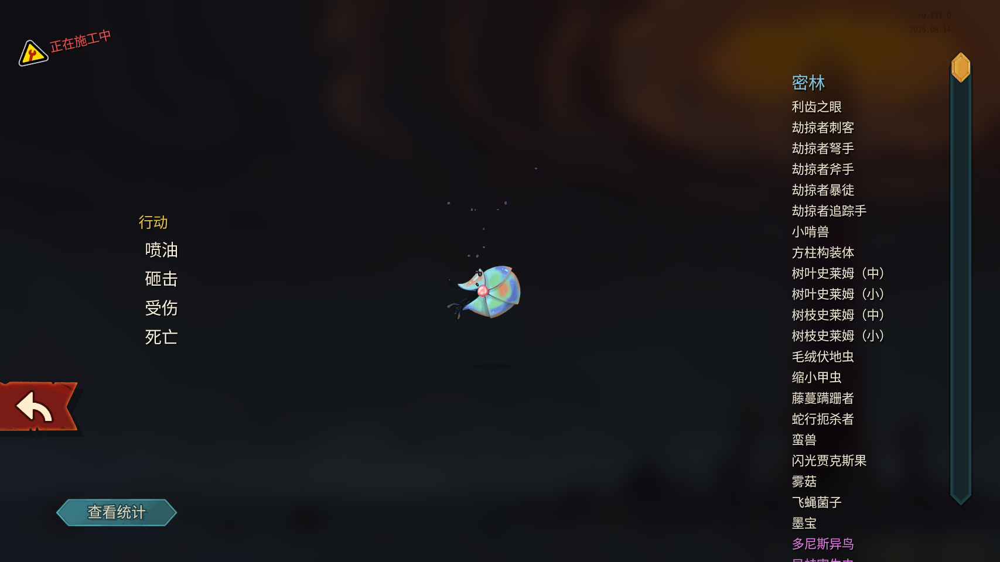
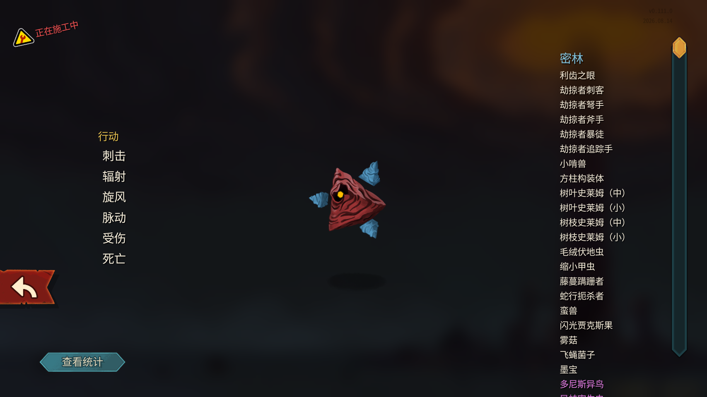
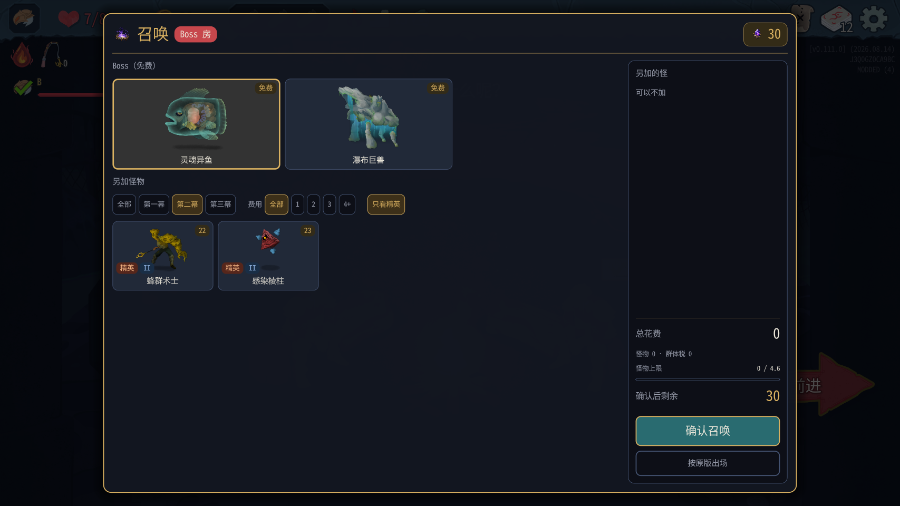
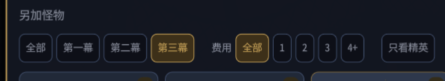

# 0.0.40 测试报告

2026-10-08；分支 `claude/optimistic-rubin-hr3eit`，代码 `0530d29`。只测试、只读定位，未修改 mod 代码。游戏 v0.111.0。测试实例 A=100001 房主/塔主（PID 18172）、B=100002 爬塔玩家（PID 19052）；端口 47101/47102。两端已正常返回主菜单并退出。用户自己的 PID 11288 一直保留，未操作。测试画面为原版铁甲战士，川换皮没有加载。

## 结论和交接重点

| 项目 | 结论 | 实测 |
|---|---|---|
| 编译、安装 | 通过 | 105 测试（47+58），安装构建 0 警告/0 错误；manifest、两端 ping 均 0.0.40 |
| 配置覆盖 | 通过 | 仓库配置覆盖安装配置，SHA256 一致，master_cards=true |
| 默认分页延迟切换 | 通过（本轮 53 个候选） | 保持默认第一幕等待，再切第二幕/第三幕/精英，不再普遍缩成小点；空图日志 0 |
| 淤泥旋螺、缩小甲虫 | 通过 | 本体可辨认且完整；不再被竖排粒子撑大取景 |
| 化石追踪者、幽灵船、鬼祟珊瑚群 | **不通过** | 原版图鉴完整，召唤预览仍是分散部件，详见并排对照 |
| 感染棱柱 | 通过 | 原版也有核心周围悬浮蓝色晶体；不应把这些晶体当缺陷 |
| 黏液大礼包 | 通过 | 两端 B 弃牌堆由空变为 2 张 Slimed |
| 荆棘丛、金身 | 通过 | 两端 SoulFysh 均 Thorns=3、Artifact=1 |
| 摇人 | 通过 | 两端增加 LeafSlimeS，能用正常攻击打死；第二次 played=false；普通战正常胜利 |
| 内讧 | **不通过** | 扣 1 能量后抛反射参数类型异常，没有伤害，也没有给其他怪力量 |
| 惊喜盲盒 | 部分覆盖 | 六次结果序列两端一致：3、1、3、1、1、4；实测格挡、玩家抽牌、塔主能量；第 2 种虚弱未随机到 |
| 同步 | 通过（覆盖范围内） | 两端 27/27 动作摘要逐行相同，StateDivergence=0 |
| 筛选按钮悬停外观 | **用户报告待修** | 已收录用户原话和截图；未独立鼠标复现 |

配置 SHA256（两份）：`CE7D223D1626984CFD04F2F8E54D0CF4819EC3B6BDEB2B783F4866E23D169301`。

全程只通过 MCP/测试接口及原版菜单回调操作，没有 computer use，没有 room/fight/win。未给 B 增加能量、抽牌或生命。盲盒第 3 种效果自然使 B 多抽牌，这不是控制台辅助。本轮用于功能验收，不作为平衡样本。

## 1. 预览：默认等待，再切页

先读上轮存档，种子 `17101550717777027434`，地图投票走休息处 (0,14) → Boss (3,15)。召唤面板有 53 个怪物候选（第一幕 33、第二幕 8、第三幕 12，含精英）。打开后保持默认第一幕至少 4 秒，没有提前切“全部”。随后每次切幕等待约 3 秒，滚动到顶部/中间/底部，并切各幕“只看精英”。

默认页和各页证据：

- [默认 Boss 面板](screenshots/ui040-default-boss.png)
- [第一幕顶部](screenshots/ui040-act1-top.png)、[中部](screenshots/ui040-act1-middle.png)、[底部](screenshots/ui040-act1-bottom.png)、[精英](screenshots/ui040-act1-elite.png)
- [第二幕](screenshots/ui040-act2-bottom.png)、[精英](screenshots/ui040-act2-elite.png)
- [第三幕](screenshots/ui040-act3-bottom.png)、[精英](screenshots/ui040-act3-elite.png)

| 上轮列出的怪 | 0.0.39 | 0.0.40 默认等待后切页 |
|---|---|---|
| 劫掠者刺客、斧手、弩手、暴徒 | 已改善 | 头/身体完整，保持 |
| 墨宝、蛇行扼杀者、旧日雕像 | 已改善 | 主体完整，保持 |
| 淤泥旋螺 | 主体难辨，竖排粒子 | 完整彩色螺壳及身体可见，明显改善 |
| 缩小甲虫 | 身体完整但有白粒子柱 | 主体完整，不再有粒子柱 |
| 化石追踪者 | 散件 | 仍缺蜂窝状主体，仅见红色肢体，未修复 |
| 幽灵船 | 散件 | 仍缺完整船身，只有腿、木片、黄色小块，未修复 |
| 鬼祟珊瑚群 | 散件 | 仍是几团悬浮零件，未修复 |
| 棘刺蟾蜍、猎人杀手、虱虫之祖、蜂群术士 | 隐藏页定格后过小 | 主体和头完整，默认切页也恢复正常大小 |
| 感染棱柱 | 隐藏页过小 | 红色核心、蓝色晶体都可见；形态符合图鉴 |
| 啃咬机、偷窃草蜢、地道虫 | 隐藏页过小 | 可辨认且完整 |
| 活体盾、虔诚雕刻师、电球头 | 隐藏页过小 | 头、身体/盾完整可见 |
| 失落之物、遗忘之物、猫头鹰法官、史莱姆狂战士 | 隐藏页过小 | 主体完整，未见上半身裁掉 |
| 灵魂枢纽、机甲骑士、高塔炮手、咬人卷轴、青蛙骑士 | 隐藏页过小 | 可识别，身体/头部没有原来的裁切 |

其余第一幕候选同样滚动观察，未新增明显空白卡或缺头。结论限于此次实际 53 个候选及 2 个 Boss 候选，不外推所有未出现的游戏模型。两端日志“什么都没画出来”=0；“套皮肤/启动动画失败”=0；没有预览 WARN。日志没有产生可逐怪统计的“取景缩小/校正”行，不能补造次数。

## 2. 原版图鉴并排对照

联机开局前，在测试 A 的主菜单通过原版 `bestiary` 控制台命令打开图鉴，再调用原版 `NBestiary.SelectMonster(NBestiaryEntry)` 选择目标节点，等待动画后截图。五个节点查询 `IsDiscovered` 都为 true；测试曾重复调用 setter 写 true，值没有变化，没有改发现进度或游戏文件。以下是实际原版图鉴页面，不是自行搭建模型的替代截图。

| 怪物 | 原版图鉴 | 召唤面板 | 判定 |
|---|---|---|---|
| 化石追踪者 |  |  | 原版有蜂窝状躯干，预览只有肢体；缺陷 |
| 幽灵船 |  |  | 原版船体连贯，预览船身缺失/木片分散；缺陷 |
| 鬼祟珊瑚群 |  |  | 原版珊瑚拼成完整人形，预览零件分散；缺陷 |
| 淤泥旋螺 |  |  | 两边主体一致，预览去掉粒子，符合本轮设计 |
| 感染棱柱 |  |  | 两边都有红色核心和悬浮蓝晶，符合原版 |

只读复核原版路径，供 Claude 继续定位（没有提交源码）：

- `decompiled/sts2/MegaCrit.Sts2.Core.DevConsole.ConsoleCommands/BestiaryConsoleCmd.cs:17`：`CmdResult Process(Player? issuingPlayer, string[] args)` 打开原版 Compendium，再 OpenBestiary。
- `decompiled/sts2/MegaCrit.Sts2.Core.Nodes.Screens.Bestiary/NBestiary.cs:730`：`void SelectMonster(NBestiaryEntry entry)` 选择/复用布局，并调用 Setup。
- `decompiled/sts2/MegaCrit.Sts2.Core.Nodes.Screens.Bestiary/NBestiaryLayoutDefault.cs:63`：`List<BestiaryMonsterMove> Setup(BestiaryEntry entry, Tween tween)`。先复制可变模型、赋 RNG、SetUpForCombat，再建 Creature（NullCombatState）和 NCreature，加入场景，SetupForBestiary，按 Hitbox 调位置。
- `decompiled/sts2/MegaCrit.Sts2.Core.Nodes.Combat/NCreature.cs:257`：`void _Ready()` 建外观；约 310 行生成动画器、311 行套皮肤；`SetupForBestiary()` 在 999 行隐藏血条/意图。
- `decompiled/sts2/MegaCrit.Sts2.Core.Models.Monsters/FossilStalker.cs:95`、`HauntedShip.cs:85`、`SkulkingColony.cs:104`：各自 `CreatureAnimator GenerateAnimator(MegaSprite controller)`。
- 本轮 `mod/TowerMaster/SummonPanel.cs:604` 附近直接创建模型外观，621 行通过 Ready 回调进入 `SetUpLikeCombat(Node2D visuals, object model, string monsterId)`（657 行），其中再启动动画、套皮肤。它没有走完整的图鉴 Creature/NCreature 初始化路径。**两条路径有差别是事实；哪一步导致三只怪散件仍未确定，不能直接认定就是 SetUpForCombat。**

## 3. 娱乐牌效果

第一段使用上轮保存局，`tm_master_grant` 分别加入 slime_gift、thorns、artifact、call_help、infight、gamble；下一场是正常地图投票进入的 Boss 房，SoulFysh + Toadpole。为抽到牌，对塔主用了三次 `draw 20`。第一回合自然能量 3；测试先用了内讧/金身/荆棘丛，之后为补测摇人及黏液大礼包，仅给塔主临时 `energy 2`、`energy 1` 各一次。**B 没有得到控制台辅助**。该 Boss 战只测效果和第二次摇人限制，没有打完；已明确区别于后面的普通战胜利。

| 卡牌 | 观察结果 |
|---|---|
| 黏液大礼包 | B 弃牌堆原来为空，打出后 A/B 都有 2 个 `Slimed`；动作摘要里两端 B 弃牌数 x2。不是仅看接口 played=true |
| 金身 | A/B 都有 ArtifactPower，Amount=1 |
| 荆棘丛 | A/B 都有 ThornsPower，Amount=3 |
| 内讧 | 接口返回 played=true、能量 3→2，但两边 SoulFysh 都仍 211 血，Toadpole 力量仍 0；实际效果失败，详见错误段 |
| 摇人 | Boss 场两端敌人数 2→3，新增 LeafSlimeS 13/13；B 正常使用三张打击击杀，怪被移除，战斗继续。第 2 回合塔主有 2 能量，再用摇人返回 `played:false, can_play:"false:None"`，未新增敌人，排除了单纯能量不足导致的拒绝 |
| 惊喜盲盒 | 第一段一次第 3 种，两端 B 手牌 5→6；第二段测到其他结果，见下 |

[Boss 效果画面](screenshots/ui040-boss-effects.png)、[摇人后新增小怪](screenshots/ui040-call-help.png)。

为补齐“摇人后正常胜利”和多次盲盒，新开独立测试局 `18173480071960807789`，沿地图投票进入 (1,1) 普通房。通过 grant 加 1 张摇人、5 张盲盒；只召唤 Toadpole，摇人增加 LeafSlimeS（14 血）。塔主仅一次 `draw 20`；这一局没有能量控制台辅助。空陷阱选择正常确认后进入召唤。

- 第 1 回合打摇人和 3 张盲盒，结果 1、3、1；两只怪各得到 10 格挡，B 多抽 1 张牌。
- 第 2 回合再打 2 张盲盒，结果 1、4；两只怪各 +5 格挡；塔主能量 1→3。
- B 正常出痛击/打击，先击杀召来的史莱姆，再打原怪；第 3 回合战斗胜利，进入原版奖励界面，`in_progress=false`，没有卡住。胜利后 B 63/80；这个带定向授牌和额外盲盒的功能样本不作平衡结论。
- 本轮两端盲盒日志序列都为 **3、1、3、1、1、4**；第 2 种“每名玩家虚弱”未随机到，记未覆盖。
- A 端截图看到了具体结果提示：[第 1 回合](screenshots/ui040-gamble-toast.png)、[第 2 回合](screenshots/ui040-gamble-round2.png)。B 的效果和结果日志核对一致，但没截到 B 提示出现瞬间，B 提示外观记未覆盖。
- **附带界面问题**：连续很快打多张盲盒时，提示框相互重叠，见上述两张截图；可能需要排队显示或替换上一条。此次是测试快速连续出牌场景，不认定普通慢速操作也会出现。

## 4. 内讧失败：错误原文和定位

两端同一张牌均出现一次，堆栈一致。A 原文：

```text
[05:14:02.017] ERROR 塔主牌：内讧 效果失败
System.ArgumentException: Object of type 'MegaCrit.Sts2.Core.Entities.Creatures.Creature' cannot be converted to type 'System.Collections.Generic.IEnumerable`1[MegaCrit.Sts2.Core.Entities.Creatures.Creature]'.
   at System.RuntimeType.CheckValue(Object& value, Binder binder, CultureInfo culture, BindingFlags invokeAttr)
   at System.Reflection.MethodBaseInvoker.InvokeWithManyArgs(Object obj, BindingFlags invokeAttr, Binder binder, Object[] parameters, CultureInfo culture)
   at System.Reflection.RuntimeMethodInfo.Invoke(Object obj, Object[] parameters)
   at System.Reflection.MethodBase.Invoke(Object obj, Object[] parameters)
   at TowerMaster.ThreatPhase.Damage(Object context, Object target, Decimal amount)
   at TowerMaster.MasterCards.Play(Object self, Object context, Object cardPlay)
```

只读定位：

- `mod/TowerMaster/MasterCards.cs:417` 的内讧分支先调用 Damage，再给其他存活怪加力量；伤害抛错会直接跳到外围 catch，因此两个效果都没执行。
- `mod/TowerMaster/ThreatPhase.cs:577`：`Task Damage(object context, object target, decimal amount)`。579 行仅按“5 个参数、第三参数 decimal”找原版重载；没有区分第二参数是单体 Creature 还是集合。
- 原版 `decompiled/sts2/MegaCrit.Sts2.Core.Commands/CreatureCmd.cs:99` 有 `Task<IEnumerable<DamageResult>> Damage(PlayerChoiceContext choiceContext, IEnumerable<Creature> targets, decimal amount, ValueProp props, Creature dealer)`；109 行还有参数数目和第三参数相同、第二参数为 `Creature target` 的单体重载。
- 现有筛选可匹配集合重载，实际传入单体 Creature，和异常完全吻合。需要 Claude 修正重载匹配并回归内讧；测试助手未改代码。

接口 `played=true` 只说明原版打牌动作接受了牌，不能代表效果成功，本项没有据此误判为通过。

## 5. 用户新增反馈：筛选按钮悬停异常

用户原话：

> 记录一个问题，这里的组件按钮在鼠标悬停上方时会出现外观上的异样



位置是召唤面板“另加怪物”下的幕分页/费用/只看精英按钮区域。按用户报告列为待修 UI 问题；当前只有这一张用户截图，未独立鼠标复现，未猜测具体渲染原因或影响功能。请 Claude 检查 normal/hover/pressed/selected 的外观组合。

## 6. 同步和日志统计

整个测试进程跨“继续旧局 → 新开局”，27 条动作摘要两端逐行完全相同（去时间戳），差异 0。两端游戏日志 `StateDivergence` 都为 0。示例：

```text
INFO 动作摘要 #28 threat:end｜层16 回合1/Player 敌[SoulFysh:211/211b0{Artifact1,Thorns3} Toadpole:21/21b0 LeafSlimeS:13/13b0] 玩家[100001:0/80b0 g99 k18 e0 h0 d3 x15 100002:72/80b0 g145 k13 e3 h6 d7 x2]
```

| 时间范围 | A TowerMaster ERROR/WARN | B TowerMaster ERROR/WARN | A 游戏 ERROR/WARNING | B 游戏 ERROR/WARNING |
|---|---|---|---|---|
| 完成普通战、退出前 | 1 / 0 | 1 / 0 | 0 / 1 | 0 / 1 |
| 正常退出后完整日志 | 1 / 0 | 1 / 0 | 12 / 5 | 13 / 5 |

TowerMaster 的 ERROR 均为上述内讧；没有“找不到”、预览失败等其他 WARN/ERROR。游戏启动 WARNING 为 `PSO caching is not implemented yet in the Direct3D 12 driver.`。退出新增的是资源泄漏/释放诊断；B 另外有 `Invalid Task ID`。不能把退出异常抹成零，也没有证据将它们直接归因于本轮某张牌。

退出错误摘要见下（仅 ERROR/WARNING 行，不提交日志全文）。原始日志只保留本机。此前 0.0.39 的 `NMultiplayerPlayerState.TweenLocationIconIn` disposed texture 异常本轮未复现。


### A 退出诊断

```text
WARNING: PSO caching is not implemented yet in the Direct3D 12 driver.
WARNING: 718 RIDs of type "CanvasItem" were leaked.
ERROR: 1 RID allocations of type 'N26RendererEnvironmentStorage11EnvironmentE' were leaked at exit.
ERROR: 5 shaders of type CanvasShaderRD were never freed
ERROR: 19 RID allocations of type 'N10RendererRD16ParticlesStorage9ParticlesE' were leaked at exit.
ERROR: 1 shaders of type ParticlesShaderRD were never freed
ERROR: 19 RID allocations of type 'N10RendererRD11MeshStorage4MeshE' were leaked at exit.
ERROR: 48 RID allocations of type 'N10RendererRD15MaterialStorage8MaterialE' were leaked at exit.
ERROR: 6 RID allocations of type 'N10RendererRD15MaterialStorage6ShaderE' were leaked at exit.
ERROR: 179 RID allocations of type 'N10RendererRD14TextureStorage7TextureE' were leaked at exit.
WARNING: 89 RIDs of type "UniformBuffer" were leaked.
WARNING: 354 RIDs of type "Texture" were leaked.
ERROR: 264 RID allocations of type 'PN18TextServerAdvanced22ShapedTextDataAdvancedE' were leaked at exit.
ERROR: 10 RID allocations of type 'PN18TextServerAdvanced12FontAdvancedE' were leaked at exit.
ERROR: 8 RID allocations of type 'PN18TextServerAdvanced27FontAdvancedLinkedVariationE' were leaked at exit.
WARNING: ObjectDB instances leaked at exit (run with --verbose for details).
ERROR: 229 resources still in use at exit (run with --verbose for details).
```

### B 退出诊断

```text
WARNING: PSO caching is not implemented yet in the Direct3D 12 driver.
ERROR: Invalid Task ID
WARNING: 752 RIDs of type "CanvasItem" were leaked.
ERROR: 1 RID allocations of type 'N26RendererEnvironmentStorage11EnvironmentE' were leaked at exit.
ERROR: 5 shaders of type CanvasShaderRD were never freed
ERROR: 20 RID allocations of type 'N10RendererRD16ParticlesStorage9ParticlesE' were leaked at exit.
ERROR: 1 shaders of type ParticlesShaderRD were never freed
ERROR: 20 RID allocations of type 'N10RendererRD11MeshStorage4MeshE' were leaked at exit.
ERROR: 65 RID allocations of type 'N10RendererRD15MaterialStorage8MaterialE' were leaked at exit.
ERROR: 6 RID allocations of type 'N10RendererRD15MaterialStorage6ShaderE' were leaked at exit.
ERROR: 182 RID allocations of type 'N10RendererRD14TextureStorage7TextureE' were leaked at exit.
WARNING: 123 RIDs of type "UniformBuffer" were leaked.
WARNING: 356 RIDs of type "Texture" were leaked.
ERROR: 250 RID allocations of type 'PN18TextServerAdvanced22ShapedTextDataAdvancedE' were leaked at exit.
ERROR: 10 RID allocations of type 'PN18TextServerAdvanced12FontAdvancedE' were leaked at exit.
ERROR: 7 RID allocations of type 'PN18TextServerAdvanced27FontAdvancedLinkedVariationE' were leaked at exit.
WARNING: ObjectDB instances leaked at exit (run with --verbose for details).
ERROR: 229 resources still in use at exit (run with --verbose for details).
```
