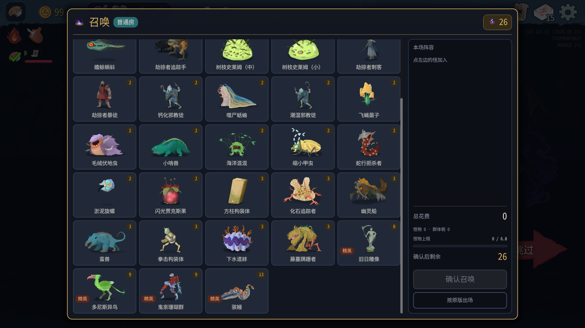
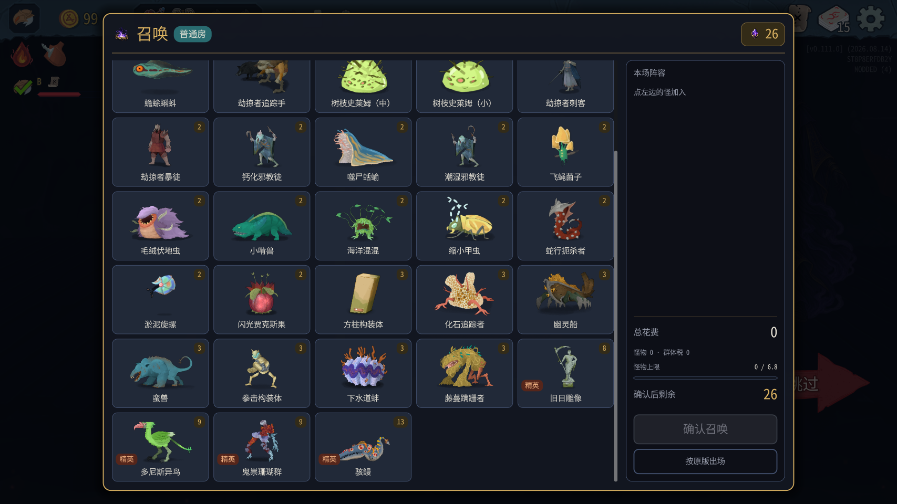
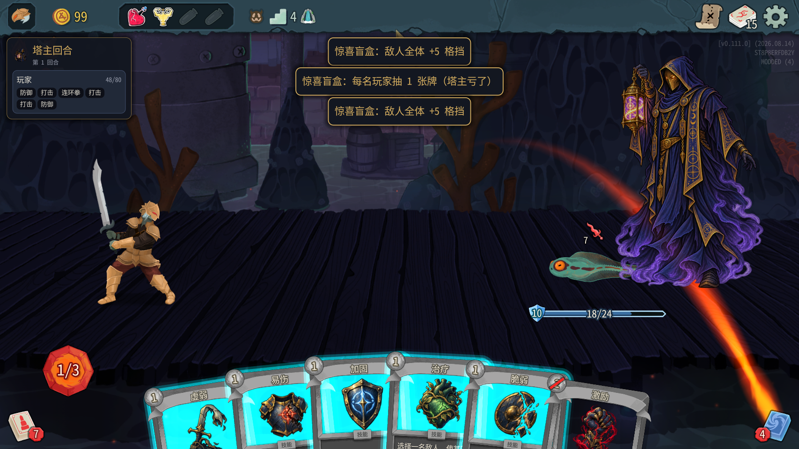
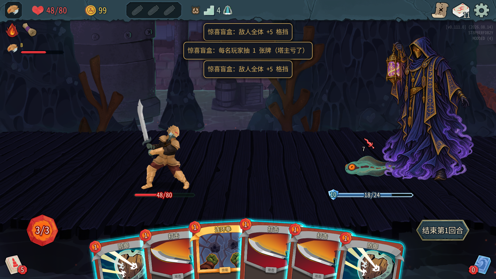
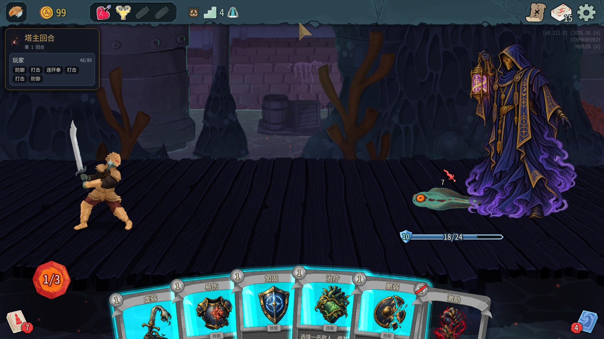
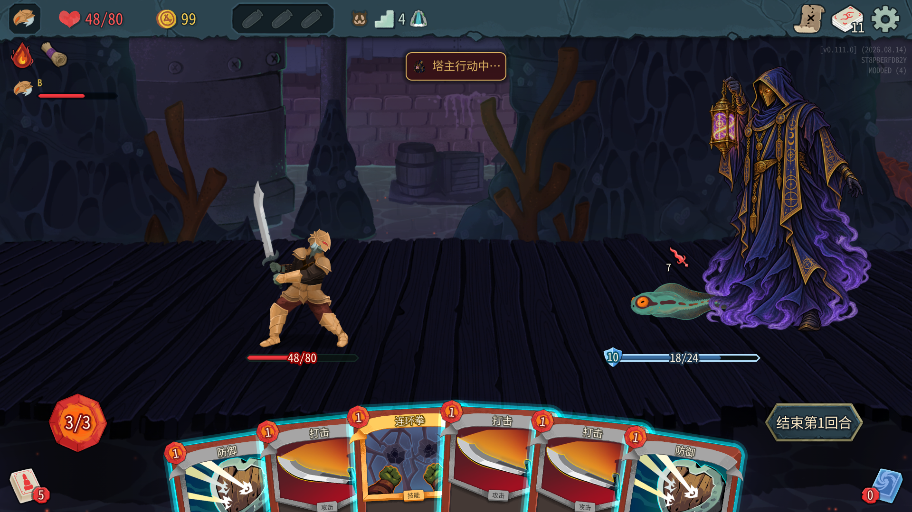

# 0.0.41 测试结果

测试日期：2026-10-08。代码：`3c6d50c`，分支 `claude/optimistic-rubin-hr3eit`。仅测试和只读检查，没有修改 mod 代码；本报告不作平衡结论。

## 安装与范围

- 编译成功，0 warning / 0 error；实际测试 **106 个通过（47 + 59）**。
- 两个测试实例共用安装目录，manifest 均为 **0.0.41**，A=100001 房主/塔主，B=100002 爬塔玩家。川换皮禁用；没有操作用户自己的游戏进程。
- 仓库与安装后的 `towermaster.test.json` SHA256 相同：`CE7D223D1626984CFD04F2F8E54D0CF4819EC3B6BDEB2B783F4866E23D169301`；master_cards=true。
- 继续测试存档，种子 18173480071960807789；经地图投票依次进入 (0,2)、(0,3)、(0,4) 普通战并正常胜利。没有 room/fight/win，没有给 B 加能量、抽牌或回血。使用 tm_master_grant 添加两张内讧，塔主用 draw 20 辅助抽到测试牌；B 通过 tm_play / tm_end_turn 正常出牌。
- 结束后两个测试实例正常退出。不是新局开局验收。

## 结论

|项目|结论|说明|
|---|---|---|
|三幕普通/精英预览|通过，附轻微视觉备注|53 个候选主体可辨且完整，未见空视口、缺头或额外血条/意图/选中框；缩小甲虫上方仍有白色粒子|
|三只原图鉴对照怪|通过|蜂窝躯干、船身、珊瑚人形均恢复完整|
|内讧|通过（第一幕）|多敌人与单敌人都扣 6；其他存活敌人 +1 力量；第二/三幕 8/10 未覆盖|
|按钮真实悬停|部分通过|19/20 个选中/未选中状态验证真实悬停；只看精英的选中悬停未确认|
|三张盲盒提示|通过|两端三条上下排列，6.5 秒后均消失；结果 2 虚弱覆盖|
|正常战斗/奖励/同步|通过|三场胜利，动作摘要 23/23 逐行一致，StateDivergence 两端 0|
|同一面板 Close→Show 压力调用|不通过|旧按钮已释放异常；随后回菜单清理出现一次 process_frame 断开异常。此为额外接口压力复现，非普通选怪点击流程|

## 选怪预览证据

默认分页先等 4.5 秒，之后按第一、第二、第三幕与只看精英逐页截图，每组都有顶/中/底。短列表滚动会钳制到同一位置，重复画面是预期。截图中列表滚动边缘的半张卡不是怪物自身取景裁切。

- 第 1 幕普通及精英：[top](screenshots/ui041-act1-top.png) / [middle](screenshots/ui041-act1-middle.png) / [bottom](screenshots/ui041-act1-bottom.png)。
- 第 1 幕只看精英：[top](screenshots/ui041-act1-elite-top.png) / [middle](screenshots/ui041-act1-elite-middle.png) / [bottom](screenshots/ui041-act1-elite-bottom.png)。
- 第 2 幕普通及精英：[top](screenshots/ui041-act2-top.png) / [middle](screenshots/ui041-act2-middle.png) / [bottom](screenshots/ui041-act2-bottom.png)。
- 第 2 幕只看精英：[top](screenshots/ui041-act2-elite-top.png) / [middle](screenshots/ui041-act2-elite-middle.png) / [bottom](screenshots/ui041-act2-elite-bottom.png)。
- 第 3 幕普通及精英：[top](screenshots/ui041-act3-top.png) / [middle](screenshots/ui041-act3-middle.png) / [bottom](screenshots/ui041-act3-bottom.png)。
- 第 3 幕只看精英：[top](screenshots/ui041-act3-elite-top.png) / [middle](screenshots/ui041-act3-elite-middle.png) / [bottom](screenshots/ui041-act3-elite-bottom.png)。

默认等待截图：[默认分页](screenshots/ui041-default-after-wait.png)。原图鉴对照：

|怪物|0.0.40 原版图鉴|0.0.41 召唤预览|判断|
|---|---|---|---|
|化石追踪者|||蜂窝躯干、触肢完整|
|幽灵船||同上本轮图，右侧船体|船身完整|
|鬼祟珊瑚群|||珊瑚人形完整|

逐只复核（本轮所有 53 个候选；下列“正常”表示在完整卡片可见时主体完整、未见散件/缺头/整个视口空白；不是逐帧动画或性能测试）：

|候选类型|结果|
|---|---|
|AssassinRubyRaider|正常|
|AxeRubyRaider|正常|
|BruteRubyRaider|正常|
|BygoneEffigy|正常|
|Byrdonis|正常|
|CalcifiedCultist|正常|
|Chomper|正常|
|CorpseSlug|正常|
|CrossbowRubyRaider|正常|
|CubexConstruct|正常|
|DampCultist|正常|
|DevotedSculptor|正常|
|Entomancer|正常|
|Flyconid|正常|
|FossilStalker|正常|
|FrogKnight|正常|
|FuzzyWurmCrawler|正常|
|GlobeHead|正常|
|HauntedShip|正常|
|HunterKiller|正常|
|InfestedPrism|正常|
|Inklet|正常|
|LeafSlimeM|正常|
|LeafSlimeS|正常|
|LivingShield|正常|
|LouseProgenitor|正常|
|Mawler|正常|
|MechaKnight|正常|
|Nibbit|正常|
|OwlMagistrate|正常|
|PunchConstruct|正常|
|ScrollOfBiting|正常|
|Seapunk|正常|
|SewerClam|正常|
|ShrinkerBeetle|主体正常；上方白色粒子仍可见，建议核对是否应隐藏|
|SkulkingColony|正常|
|SlimedBerserker|正常|
|SlitheringStrangler|正常|
|SludgeSpinner|正常|
|SnappingJaxfruit|正常|
|SoulNexus|正常|
|SpinyToad|正常|
|TerrorEel|正常|
|TheForgotten|正常|
|TheLost|正常|
|ThievingHopper|正常|
|Toadpole|正常|
|TrackerRubyRaider|正常|
|Tunneler|正常|
|TurretOperator|正常|
|TwigSlimeM|正常|
|TwigSlimeS|正常|
|VineShambler|正常|

劫掠者系列、旧日雕像、淤泥旋螺、感染棱柱、棘刺蟾蜍没有发现上轮裁切退步。感染棱柱的悬浮蓝色晶体属于原图鉴造型，不能按散件缺陷计。缩小甲虫白色粒子另记视觉备注，没有裁掉头部。

本轮正常开新面板、选怪关闭并进战斗可继续，没有崩溃。没有采 FPS 或帧耗时，不能给出“无明显卡顿”的定量结论。额外重复显示同一实例失败，见异常节。

### 预览日志统计

|日志文本|A|B|
|---|---:|---:|
|按原版图鉴建 NCreature 失败|0|0|
|图鉴式初始化后半段失败|0|0|
|什么都没画出来|0|0|
|取景|1|0|

B 不创建房主选怪面板，因此 B 的零条数不代表独立预览验收。唯一取景原文：

```text
[06:12:33.198] INFO 召唤面板：Toadpole 取景 缩小 0 次、校正 1 次，范围 (20, 22), (99, 62)
```

没有建 NCreature 或初始化失败日志，所以没有对应失败堆栈。

## 内讧

- 多敌人：Toadpole 21/21 → 15/21；另一只 23/23 保持生命且获得 Strength1。两端一致。[截图](screenshots/ui041-infight-multiple.png)
- 单敌人：Toadpole 24/24 → 18/24；无其他目标也能完成。两端一致。[截图](screenshots/ui041-infight-single.png)
- 两端没有“内讧 效果失败”。本轮只验第一幕伤害 6；第二、三幕 8/10 未覆盖。

## 筛选按钮真实悬停

通过 MCP 调用 DisplayServer.WindowMoveToForeground 与 Input.WarpMouse，按 GetViewportTransform 把逻辑坐标转成窗口坐标，再读取按钮 IsHovered、GetGlobalMousePosition 和 GetGlobalRect。没有用 MouseEntered 信号冒充鼠标悬停。

- 幕筛选 4 个、费用筛选 5 个：选中和未选中共 18 个状态均 IsHovered=true，前后矩形一致；选中悬停保持金色，未选中不变形。
- 只看精英未选中：真实悬停确认，矩形一致。
- 只看精英已选中：两次定位后 IsHovered=false，未确认真正悬停，故此状态记未覆盖。截图不能作为通过证据。
- 所有 20 次采样矩形均不变，但不能据此替代最后一个状态的真实悬停验收。

代表截图：[选中第三幕](screenshots/ui041-hover-act-3-selected.png)、[未选中第三幕](screenshots/ui041-hover-act-3-unselected.png)、[选中费用](screenshots/ui041-hover-cost-2-selected.png)、[未选中精英](screenshots/ui041-hover-elite-0-unselected.png)。其余逐项图片以 ui041-hover-act / cost 前缀保存。

## 惊喜盲盒

一回合快速连打三张，第三张执行完成后 0.8 秒截图：两端三条提示上下排开，没有互相重叠；6.5 秒后全部消失。

|阶段|A|B|
|---|---|---|
|三条可见|||
|全部消失|||

两端结果序列同为 1、3、1、1、3、1、2。最后结果 2 为“每名玩家 1 层虚弱”；B 的 Weak1 在两端动作摘要一致。塔主额外 draw 辅助抽到盲盒，没有给 B 人为抽牌（结果 3 本身会抽牌）。[A 虚弱提示](screenshots/ui041-gamble-weak-A.png)、[B 虚弱提示](screenshots/ui041-gamble-weak-B.png)。

## 战斗回归与同步

三场均按地图进入、正常出牌至胜利，塔主结束先手后 B 能恢复出牌，奖励界面可见。三场分别进行了 3、3、2 个玩家回合（以动作摘要的回合开始为准）。[普通战奖励](screenshots/ui041-normal-rewards.png)、[最后一场奖励](screenshots/ui041-final-rewards.png)。

当前日志含回菜单读档前后两个摘要序号区间；保留原顺序整体比较，不按编号合并。两端 **23/23 行完全一致**，无差异；StateDivergence **A=0，B=0**。摘录：

```text
INFO 动作摘要 #14 threat:end｜层3 回合1/Player 敌[Toadpole:15/21b10 Toadpole:23/23b10{Strength1}] 玩家[100001:0/80b0 g99 k17 e1 h0 d7 x10 100002:63/80b0 g99 k11 e3 h6 d5 x0]
INFO 动作摘要 #48 threat:end｜层4 回合1/Player 敌[Toadpole:18/24b10] 玩家[100001:0/80b0 g99 k17 e1 h0 d3 x14 100002:48/80b0 g99 k11 e3 h6 d5 x0{Weak1}]
INFO 动作摘要 #15 threat:end｜层5 回合2/Player 敌[Toadpole:6/23b0{Vulnerable1}] 玩家[100001:0/80b0 g99 k17 e1 h0 d9 x8 100002:38/80b0 g99 k11 e3 h5 d1 x5]
```

## 异常与只读定位

### 同一面板关闭后重显示

额外压力调用（并非正常可点的关闭按钮）：对 `type:TowerMaster.SummonPhase|_openUi` 调 Close，等待 0.4 秒，再调 Show。第一次重显示即失败，因此没有完成计划的多次同实例循环。

A TowerMaster 唯一 WARN，原文及堆栈：

```text
[06:33:06.660] WARN 测试接口 /reflect：System.ObjectDisposedException: Cannot access a disposed object.
Object name: 'Godot.Button'.
   at Godot.Control.AddThemeStyleboxOverride(StringName name, StyleBox stylebox)
   at TowerMaster.SummonPanel.ApplyFilter()
   at TowerMaster.SummonPanel.BuildOptions(VBoxContainer box, Single width)
   at TowerMaster.SummonPanel.Show()
   at System.RuntimeMethodHandle.InvokeMethod(Object target, Void** arguments, Signature sig, Boolean isConstructor)
   at System.Reflection.MethodBaseInvoker.InvokeWithNoArgs(Object obj, BindingFlags invokeAttr)
```

只读定位：`mod/TowerMaster/SummonPanel.cs` 的 `_filterButtons`（约 199 行）保存按钮，BuildOptions/筛选按钮注册继续追加；ApplyFilter（约 236 行起）遍历旧按钮改样式；Close（约 117 行）释放层后未清空该列表。重复 Show 接触已释放按钮，与堆栈一致。建议 Claude 检查是否允许复用，或明确让 Close 后实例不可重开；未改代码。

随后正常回主菜单恢复时 A 游戏日志出现 process_frame 断开错误。失败 Show 未走到订阅 ProcessFrame 的末尾，但 Close 再尝试取消订阅，是本次可疑关联；以下是相关原文堆栈摘录：

```text
ERROR: Attempt to disconnect a nonexistent connection from '<SceneTree#33051116995>'. Signal: 'process_frame', callable: 'Delegate::Invoke'.
   at: _disconnect (core/object/object.cpp:1621)
   C# backtrace (most recent call first):
       [0] void Godot.SceneTree.remove_ProcessFrame(System.Action)
       [1] void TowerMaster.SummonPanel.Close()
       [2] void TowerMaster.SummonPhase.ResetRun()
       [3] void TowerMaster.RunLifecycle.Reset(System.Reflection.MethodBase)
       [4] void <unknown>.MegaCrit.Sts2.Core.Runs.RunManager.CleanUp_Patch1(MegaCrit.Sts2.Core.Runs.RunManager, bool)
       [5] void MegaCrit.Sts2.Core.Nodes.NGame+<ReturnToMainMenu>d__141.MoveNext()
       [6] void System.Runtime.CompilerServices.AsyncTaskMethodBuilder`1+AsyncStateMachineBox`1.ExecutionContextCallback(object)
       [7] void System.Threading.ExecutionContext.RunInternal(System.Threading.ExecutionContext, System.Threading.ContextCallback, object)
       [8] void System.Runtime.CompilerServices.AsyncTaskMethodBuilder`1+AsyncStateMachineBox`1.MoveNext(System.Threading.Thread)
       [9] void System.Runtime.CompilerServices.AsyncTaskMethodBuilder`1+AsyncStateMachineBox`1.MoveNext()
       [10] void System.Threading.Tasks.AwaitTaskContinuation.RunCallback(System.Threading.ContextCallback, object, System.Threading.Tasks.Task&)
       [11] void System.Threading.Tasks.Task.RunContinuations(object)
       [12] void System.Runtime.CompilerServices.AsyncTaskMethodBuilder.SetResult()
       [13] void MegaCrit.Sts2.Core.Assets.PreloadManager+<LoadCommonAndMainMenuAssets>d__9.MoveNext()
       [14] void System.Runtime.CompilerServices.AsyncTaskMethodBuilder`1+AsyncStateMachineBox`1.ExecutionContextCallback(object)
       [15] void System.Threading.ExecutionContext.RunInternal(System.Threading.ExecutionContext, System.Threading.ContextCallback, object)
       [16] void System.Runtime.CompilerServices.AsyncTaskMethodBuilder`1+AsyncStateMachineBox`1.MoveNext(System.Threading.Thread)
       [17] void System.Runtime.CompilerServices.AsyncTaskMethodBuilder`1+AsyncStateMachineBox`1.MoveNext()
       [18] void System.Threading.Tasks.AwaitTaskContinuation.RunCallback(System.Threading.ContextCallback, object, System.Threading.Tasks.Task&)
       [19] void System.Threading.Tasks.Task.RunContinuations(object)
       [20] void System.Runtime.CompilerServices.AsyncTaskMethodBuilder`1.SetResult(TResult)
       [21] void MegaCrit.Sts2.Core.Assets.PreloadManager+<LoadAssetSets>d__19.MoveNext()
       [22] void System.Runtime.CompilerServices.AsyncTaskMethodBuilder`1+AsyncStateMachineBox`1.ExecutionContextCallback(object)
       [23] void System.Threading.ExecutionContext.RunInternal(System.Threading.ExecutionContext, System.Threading.ContextCallback, object)
       [24] void System.Runtime.CompilerServices.AsyncTaskMethodBuilder`1+AsyncStateMachineBox`1.MoveNext(System.Threading.Thread)
       [25] void System.Runtime.CompilerServices.AsyncTaskMethodBuilder`1+AsyncStateMachineBox`1.MoveNext()
       [26] void Godot.GodotSynchronizationContext.ExecutePendingContinuations()
       [27] void Godot.Bridge.ScriptManagerBridge.FrameCallback()
[DEBUG] [ActionExecutor] Action queue changed, beginning ExecuteActions
```

经正常回菜单→多人读档→下一格恢复，新面板能正常打开、确认并完成战斗。读档前后塔主 17 张牌相同，召唤点 26 / 场数 3 相同。[恢复后新面板](screenshots/ui041-fresh-panel-after-reload.png)。此异常没有复现为普通跨房流程崩溃。

### 日志总计

测试实例退出前：TowerMaster A ERROR=0 / WARN=1，B ERROR=0 / WARN=0。游戏 A ERROR=1（上述压力调用恢复清理），B ERROR=0；各有一条 PSO 缓存 WARNING。退出后 TowerMaster 计数不变。TowerMaster 的全部 WARN/ERROR 已原文列出，无省略。

游戏正常退出还报告资源未释放，和运行期异常分列；本轮没有对比无 mod 退出基线，不能判定均由本次修改导致。以下列出两端游戏所有 ERROR/WARNING 首行（不提交完整原始日志）：

**A（ERROR 11 / WARNING 2，含退出期）**

```text
WARNING: PSO caching is not implemented yet in the Direct3D 12 driver.
ERROR: Attempt to disconnect a nonexistent connection from '<SceneTree#33051116995>'. Signal: 'process_frame', callable: 'Delegate::Invoke'.
WARNING: 3323 RIDs of type "CanvasItem" were leaked.
ERROR: 1 RID allocations of type 'N26RendererEnvironmentStorage11EnvironmentE' were leaked at exit.
ERROR: 12 shaders of type CanvasShaderRD were never freed
ERROR: 65 RID allocations of type 'N10RendererRD16ParticlesStorage9ParticlesE' were leaked at exit.
ERROR: 1 shaders of type ParticlesShaderRD were never freed
ERROR: 3 RID allocations of type 'N10RendererRD11MeshStorage9MultiMeshE' were leaked at exit.
ERROR: 69 RID allocations of type 'N10RendererRD11MeshStorage4MeshE' were leaked at exit.
ERROR: 129 RID allocations of type 'N10RendererRD15MaterialStorage8MaterialE' were leaked at exit.
ERROR: 13 RID allocations of type 'N10RendererRD15MaterialStorage6ShaderE' were leaked at exit.
ERROR: 367 RID allocations of type 'N10RendererRD14TextureStorage7TextureE' were leaked at exit.
ERROR: 55 RID allocations of type 'N10RendererRD14TextureStorage13CanvasTextureE' were leaked at exit.
```

**B（ERROR 12 / WARNING 5，含退出期）**

```text
WARNING: PSO caching is not implemented yet in the Direct3D 12 driver.
WARNING: 638 RIDs of type "CanvasItem" were leaked.
ERROR: 1 RID allocations of type 'N26RendererEnvironmentStorage11EnvironmentE' were leaked at exit.
ERROR: 5 shaders of type CanvasShaderRD were never freed
ERROR: 17 RID allocations of type 'N10RendererRD16ParticlesStorage9ParticlesE' were leaked at exit.
ERROR: 1 shaders of type ParticlesShaderRD were never freed
ERROR: 17 RID allocations of type 'N10RendererRD11MeshStorage4MeshE' were leaked at exit.
ERROR: 58 RID allocations of type 'N10RendererRD15MaterialStorage8MaterialE' were leaked at exit.
ERROR: 6 RID allocations of type 'N10RendererRD15MaterialStorage6ShaderE' were leaked at exit.
ERROR: 31 RID allocations of type 'N10RendererRD14TextureStorage7TextureE' were leaked at exit.
WARNING: 109 RIDs of type "UniformBuffer" were leaked.
WARNING: 54 RIDs of type "Texture" were leaked.
ERROR: 204 RID allocations of type 'PN18TextServerAdvanced22ShapedTextDataAdvancedE' were leaked at exit.
ERROR: 3 RID allocations of type 'PN18TextServerAdvanced12FontAdvancedE' were leaked at exit.
ERROR: 4 RID allocations of type 'PN18TextServerAdvanced27FontAdvancedLinkedVariationE' were leaked at exit.
WARNING: ObjectDB instances leaked at exit (run with --verbose for details).
ERROR: 66 resources still in use at exit (run with --verbose for details).
```

本轮未覆盖：第二/三幕内讧伤害、只看精英选中状态真实悬停、量化打开卡顿。未提交 mod 源码修改、原始日志、反编译源码或游戏资源。
