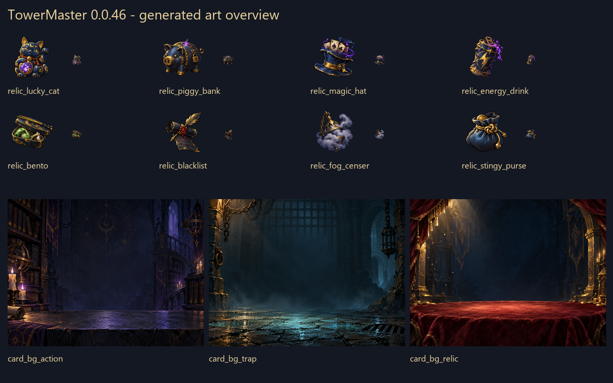
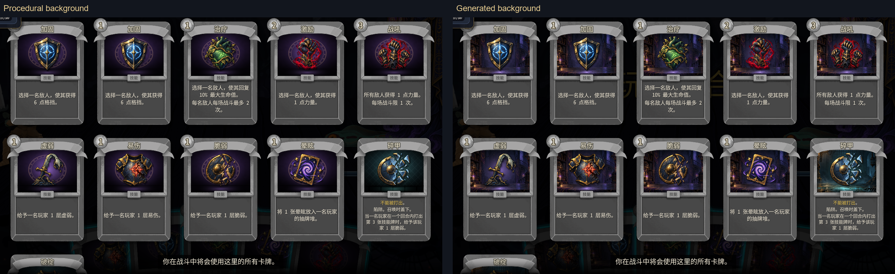
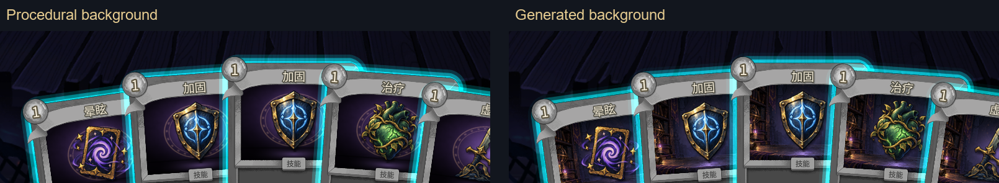
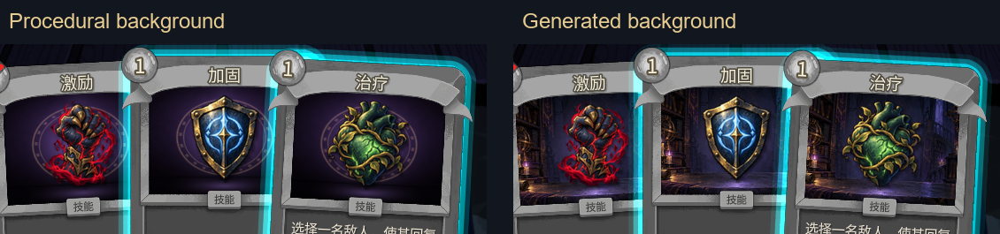
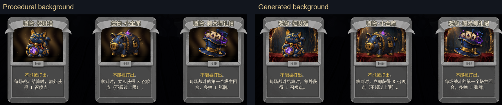
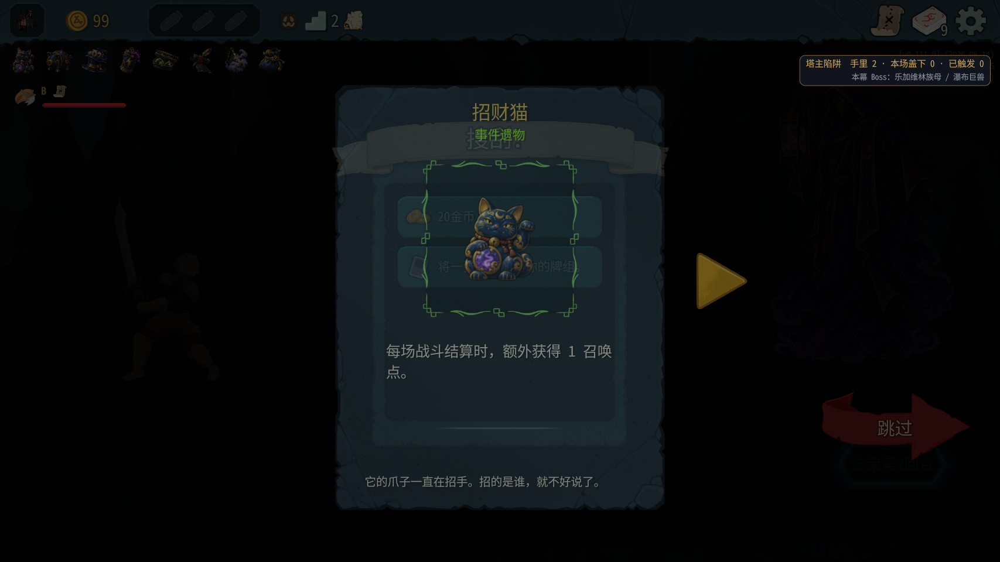
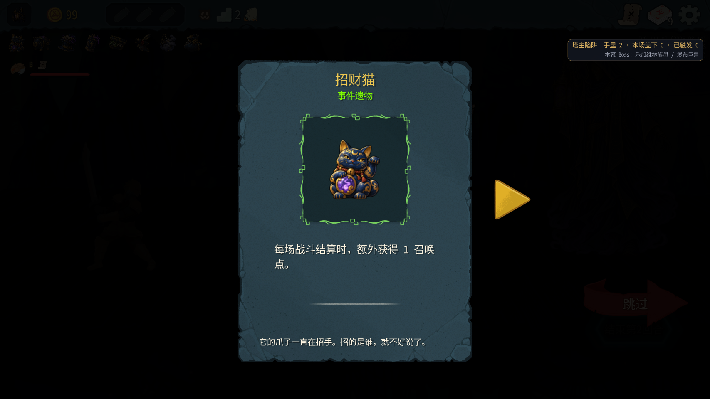
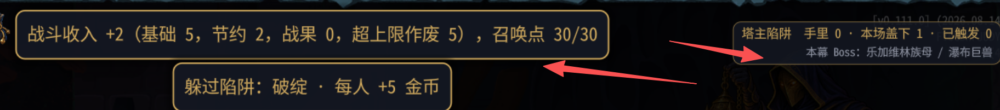

# 0.0.46 美术、界面与回归测试

测试日期：2026-10-09。被测代码：`27fc10a`，分支 `claude/optimistic-rubin-hr3eit`。只生成美术、测试和记录，没有修改 mod 代码。

## 结论与需要交接的事

- 11 张新美术已生成并安装：8 件遗物各有自己的图标，3 种卡图背景有台面、远景与明暗层次。透明度、尺寸检查通过。
- 行动牌、陷阱牌和遗物候选的程序背景／绘制背景对照已完成。可出牌和能量不足时，卡图仍是完整背景加图标，没有透出蓝色高亮或战斗场景。
- 原版遗物详情不再显示“锁定”；招财猫的名字、说明、风味文字和图标正常。8 件遗物悬停均有正确名字和说明。
- 招财猫收入标题含额外 1 点；选牌回菜单现在记 INFO，不再记这一项旧 ERROR。
- 沿地图完成 5 场战斗，塔主出牌、结束回合、奖励、碎甲触发、破绽躲过奖励均发生。没有使用 room/fight/win，没有给爬塔玩家加能量或抽牌。两端 StateDivergence 均为 0。
- **不能写“动作摘要全部逐行一致”**：塔主取消选牌回菜单多记一条“无对局”；宝箱操作附近还有一条金币快照不同。最终两端金币一致，详见第 6 节。
- **用户要求整体 UI 重新美化**，不是只改截图里的收入条。让 Claude 根据自己的审美和设计判断，结合“不拥挤、少文字、不要难懂术语”统筹设计，详见第 7 节。

## 1. 安装与测试方法

| 项目 | 实测 |
|---|---|
| 自动测试 | 109 个通过（49 + 60），不是沿用旧轮的数量 |
| 编译安装 | 成功，编译 0 warning / 0 error |
| 安装 manifest | `version=0.0.46` |
| A / B | NetId 100001 房主／塔主，100002 爬塔玩家；两个接口均回报 0.0.46 |
| 测试配置 | 仓库文件覆盖安装目录，SHA256 两份一致：`CE7D223D1626984CFD04F2F8E54D0CF4819EC3B6BDEB2B783F4866E23D169301` |
| 川换皮 | 保持禁用 |
| 游戏 | v0.111.0；只启动、操作、退出本轮测试 A/B，不操作用户自己的游戏 |
| 新局种子 | `3275466505624178284` |

所有操作由测试助手通过测试接口及原版节点方法完成。遗物外观验收用 `/master/relic` 定向给予 8 件遗物；这是测试辅助，不是自然获得记录。悬停截图调用原版 `NRelicInventoryHolder.OnFocus/OnUnfocus`，详情调用原版 `NRelicInventory.OnRelicClicked`，没有使用 computer-use。

## 2. 美术资源

使用内置 imagegen，一张一个生成请求。图标使用 [art-assets.md](art-assets.md) 的通用风格前缀和对应主体 prompt；额外强调粗轮廓、小尺寸辨识度与边缘留白。背景采用文档规定的 `opaque background, wide 4:3 scene, no central subject` 变体，强调下方台面、中央留空、边缘偏暗。没有使用游戏原始资源作为生成输入。

图标从工具返回的真实透明 PNG 按主体边界缩放居中，保留透明留白；背景按 4:3 缩到目标尺寸。没有用色键抠图，也没有把透明图标铺白底。最终检查如下：

| 文件（均在 `mod/TowerMaster/art/`） | 尺寸 | alpha / 四角 | 32×32 观察 |
|---|---|---|---|
| relic_lucky_cat.png | 128×128 | RGBA，0～255；四角 0 | 猫形和举起的爪子可辨 |
| relic_piggy_bank.png | 128×128 | 同上 | 猪形与投币口可辨 |
| relic_magic_hat.png | 128×128 | 同上 | 礼帽与伸出的纸牌可辨 |
| relic_energy_drink.png | 128×128 | 同上 | 饮料罐、闪电主体可辨 |
| relic_bento.png | 128×128 | 同上 | 打开的便当盒可辨，食物细节小尺寸较密 |
| relic_blacklist.png | 128×128 | 同上 | 卷轴、羽毛笔可辨，红色划线细节较小 |
| relic_fog_censer.png | 128×128 | 同上 | 烟雾与香炉轮廓可辨 |
| relic_stingy_purse.png | 128×128 | 同上 | 束口钱包可辨 |
| card_bg_action.png | 512×384 | RGBA，所有像素 alpha=255 | 暗紫塔内书房、符文、石台面 |
| card_bg_trap.png | 512×384 | 同上 | 青色地牢、铁栅、湿石地面 |
| card_bg_relic.png | 512×384 | 同上 | 金色宝物壁龛、暗红丝绒台面 |



统一使用深蓝／炭黑、古金和少量紫色光。图标细节比原版最简图标多；32×32 能区分物件，但便当和黑名单细节可以由 Claude 再审美判断，不据此做功能不通过结论。

## 3. 卡图对照

同一进程、同一批卡牌进行对照：先不安装 `card_bg_*.png`，再安装；补充对照临时把安装目录背景改名为 `.hold`，清空 `TowerMaster.Art.Cache/CardCache`，调用原版 `NCard.UpdatePortrait` 刷新。只改变图片加载，未改变牌组、手牌、能量或 RNG。结束前背景名全部恢复。

| 界面 | 观察与截图 |
|---|---|
| 原版牌组 | 同一 11 张牌：9 张行动牌 + 碎甲、破绽。行动牌用书房背景，陷阱牌用地牢背景；图标居中，框内不透背景。 |
| 可出牌手牌 | 同一组晕眩、加固、加固、治疗、虚弱；塔主能量 3，5 张手牌（持有魔术师礼帽、能量饮料）。原版高亮在卡框外，卡图内仍不透明。 |
| 能量不足 | 塔主自然打出加固、虚弱后能量 1；剩下激励费用 2，接口 `can_play="false:None"`，图中有禁止标记；图标和场景背景仍完整，没有变成透明贴图。加固、治疗仍可打。 |
| 原版遗物候选 | 同一批招财猫、小金库、魔术师礼帽；丝绒背景和各自物件正常，文字完整。 |









完整场景另见 `ui046-hand-image-actual.png`、`ui046-unplayable-image-actual.png`、`ui046-image-hand-player.png`。比较图是原始截图的裁切拼接，不是重新绘制游戏界面。

**遗物候选的覆盖边界：**对照为了固定同一批候选，通过反射调用现有 `MasterRewards.Send(List<string>, int, int, int, int)`，传入三个 `relic:...`、幕 1、测试编号 900001、KindRelic=3、价格 0，实际走联机动作和原版三选一，并跳过。自然走到宝箱时，本局已定向持有全部 8 件遗物，按设计退回行动牌候选（惊喜盲盒／弱点暴露／坚壁），截图 `ui046-natural-treasure-choice.png`。因此本轮证明了遗物候选卡图与原版选择 UI 的显示，**没有把这次定向显示伪装成自然宝箱抽出这三件遗物**。

### 合成时间与卡顿边界

Art.cs 没有成功合成的时间戳日志，只在失败时输出 WARN。本轮没有“卡图…合成失败”或“美术资源…读取失败”。不能给出不存在的“首次合成”成功日志。

首次换入新背景并批量清缓存、刷新两端已有 NCard 的调用耗时约 **0.640 秒**；遗物候选刷新批次约 **0.347 秒**。这是包含接口往返与多节点处理的批次耗时，不是单张卡图纯合成耗时。相关原版卡框日志：

```text
[00:13:33.106] INFO 原版卡牌框架：卡框模板 Alchemize
```

截图及接口验证没有发现卡住或贴图读取失败，但未做帧时间录像，不能凭截图断言首次打开完全没有可感卡顿。

## 4. 遗物与小修复

### 遗物图标和详情

8 个原版遗物栏节点分别对应 8 件遗物，均显示自己的新图标，不再共用塔主头像。逐个调用原版悬停入口，得到的名字和说明与 `/master/relic` 一致：

| 名字 | 悬停说明 |
|---|---|
| 招财猫 | 每场战斗结算时，额外获得 1 召唤点。 |
| 小金库 | 拿到时，立即获得 8 召唤点（不超过上限）。 |
| 魔术师礼帽 | 每场战斗的第一个塔主回合，多抽 1 张牌。 |
| 能量饮料 | 每场战斗的第一个塔主回合，多 1 点能量。 |
| 怪物便当 | 每场战斗的第一个塔主回合，所有敌人获得 3 点格挡。 |
| 黑名单 | 每场战斗的第一个塔主回合，给予当前生命最高的玩家 1 层易伤。 |
| 迷雾香炉 | 玩家看不到塔主手里有几张陷阱、本场盖了几张。 |
| 吝啬鬼钱包 | 玩家躲过陷阱拿到的金币减半。 |

各自截图：`ui046-hover-lucky_cat.png`、`ui046-hover-piggy_bank.png` 等 `ui046-hover-*.png`。同进程回菜单读档后 `/master/relic` 仍有 8 件；两端反射 `state.Players[0].Relics` 得到相同 8 个遗物类型。



招财猫详情正常：名称“招财猫”、稀有度“事件遗物”、说明和风味“它的爪子一直在招手。招的是谁，就不好说了。”均可见，没有锁图或时间线解锁说明。



新局塔主遗物栏没有残留燃烧之血图标，见 `ui046-newrun-no-stale-relics.png`。塔主随后选羽翼之靴，换牌组时日志记录去掉 WingedBoots；给予塔主遗物后栏里只见本 mod 的 8 个图标。

### 招财猫收入

第一场确认召唤花 1 点：12→11；结算 11→18，截图标题“战斗收入 +7”，明细基础 5、节约 1、招财猫 +1，和实际到账一致。

```text
[02:48:44.276] INFO 塔主账本：招财猫，召唤点 +1（想加 1），现在 18
[02:48:44.289] INFO 召唤阶段：战斗收入 +7（基础 5，节约 1，战果 0，招财猫 +1），召唤点 18/30；玩家掉血 1，击倒 []，有奖励 []
```

截图 `ui046-income-lucky-cat.png`。数值修复通过，**文案和外观仍是用户本轮要求整体优化的例子**。

### 选牌时回菜单

在自然商店三选一显示期间两端返回主菜单，再同进程读档成功。取消日志如下，级别为 INFO：

```text
[02:55:55.649] INFO 塔主回合 #21 第1回合：塔主选牌界面被关掉（回菜单/换房间），这次跳过
```

无这项 TaskCanceled 的 TowerMaster ERROR。读档后未处理的商店选择再次出现，跳过后继续沿地图走。与“已经选完不应重弹”不是同一测试条件。

## 5. 功能回归事实

| 战斗 | 地图坐标／房型 | 实际召唤 | 结果 |
|---|---|---|---|
| 1 | (2,1) 普通 | Toadpole | 自然胜利；塔主打两张加固；玩家最终 79/80；普通奖励金币 15。 |
| 2 | (1,2) 普通 | Toadpole | 自然胜利；塔主打晕眩；普通奖励金币 17。 |
| 3 | (1,5) 普通 | Toadpole | 自然胜利；塔主打加固、虚弱；玩家最终 72/80。 |
| 4 | (1,6) 精英地图点 | Toadpole，盖碎甲 | 沿地图进入，但主动选择了普通怪载体，不能当成精英强度样本。B 第一回合打 3 张防御，碎甲触发；自然胜利，塔主奖励三选一出现并跳过。 |
| 5 | (1,7) 普通 | LeafSlimeS，盖破绽 | 自然胜利；塔主打加固、虚弱；破绽未触发，持有吝啬鬼钱包，B 金币 99→104，实际 +5。 |

本轮不是胜率或强度测试；没有平衡结论。玩家牌操作遵循接口暂停状态；塔主结束后才打玩家牌，没有将牌在塔主阶段排队。

```text
[03:03:02.679] INFO 塔主回合 #34 第1回合：陷阱 brittle@1 触发，玩家 100002，数值 1
```

两端都存在该触发行且后续动作摘要中 B 有 Frail1，见 `ui046-trap-trigger.png`。最终战报两端相同：5 场、召唤 5 只、碎甲触发 1 次、塔主打牌 7 张。

**能量／手牌来源说明：**持有塔主魔术师礼帽和能量饮料后，塔主普通房第一回合 3 能量、5 手牌是遗物效果。精英地图点 B 的 4 能量／7 手牌来自其原版“轰鸣海螺”（精英战额外抽 2 张并获得 1 能量）；已查 B 的实际 Relics 和原版说明，不是测试助手加的。没有使用 energy/draw 控制台指令。

## 6. 日志、同步与异常

| 项目 | A | B |
|---|---:|---:|
| TowerMaster ERROR | 0 | 0 |
| TowerMaster WARN | 1 | 0 |
| StateDivergence（游戏日志） | 0 | 0 |
| 动作摘要行数 | 52 | 51 |

### 全部 TowerMaster WARN 原文

```text
[03:01:39.912] WARN 测试接口 /summon/select：System.InvalidOperationException: An element of type 'String' cannot be converted to a 'System.Int32'.
```

这是测试调用传 `traps:["brittle@1"]` 的错误，接口要求整数序号。改为 `traps:[0]` 后成功，不归为 mod 正常流程故障。下一场陷阱手牌变动后旧序号 1 也被 unknown_option 拒绝，重新读取列表后使用当前序号 0；没有继续盲目重试旧序号。

### 动作摘要未完全一致

1. 选牌回主菜单后 A 多一条 `动作摘要 #54 threat:reward｜无对局`，B 没有。取消选牌的 ERROR 已修，但清理后这条摘要仍有单端差异。
2. 排除这条无对局记录后，两端均 51 行，其中 **50 行逐字相同、1 行不同**。唯一状态差异在宝箱跳过塔主选牌、B 开箱附近：

```text
A [03:08:11.188] INFO 塔主回合 #47 第1回合：塔主跳过
A [03:08:11.191] INFO 动作摘要 #93 threat:reward｜层9 玩家[100001:80/80b0 g99 k10 e1 h0 d0 x0 100002:78/80b0 g104 k11 e1 h0 d0 x0]
A [03:08:11.734] INFO 测试3 宝箱：塔主不播分遗物动画

B [03:08:11.206] INFO 塔主回合 #47 第1回合：塔主跳过
B [03:08:11.207] INFO 动作摘要 #93 threat:reward｜层9 玩家[100001:80/80b0 g99 k10 e1 h0 d0 x0 100002:78/80b0 g154 k11 e1 h0 d0 x0]
```

最终接口查询两端都为 B 金币 154、塔主金币 99，均 78/80 和 80/80。差异和 B 开箱 +50 的时机对应，**推测是摘要与异步宝箱金币操作交错，但没有证明根因**；请 Claude 检查记录时机、是否需要等上一动作真正完成。不能用最终一致替代“逐行一致”验收。

### 游戏启动弹窗：测试时序问题单独记录

A 启动后接口过早进入菜单流程，游戏记录了一次启动错误；当时还没换入新背景，不能归因于背景图片。栈包含取消开场动画的路径：

```text
[ERROR] Encountered error on game startup! Attempting to show error dialog
   at MegaCrit.Sts2.Core.Nodes.NGame.GameStartupError()
   at MegaCrit.Sts2.Core.Nodes.NGame.GameStartupWrapper()
   at System.Threading.Tasks.Task.TrySetCanceled(CancellationToken tokenToRecord, Object cancellationException)
   at MegaCrit.Sts2.Core.Nodes.NGame.GameStartup()
   at MegaCrit.Sts2.Core.Nodes.NGame.LaunchMainMenu(Boolean skipLogo)
   at MegaCrit.Sts2.Core.Nodes.Screens.MainMenu.NLogoAnimation.PlayAnimation(CancellationToken token)
   at MegaCrit.Sts2.Core.Nodes.GodotExtensions.NodeUtil.AwaitProcessFrame(Node node, CancellationToken ct)
```

接口仍能用，已完成开局和第一回合。测试助手删除了遗留错误弹窗并隐藏其遮罩后继续；早期截图偏暗或含弹窗的没有用于最终卡图对照。后续截图为清理后采集。建议测试启动等待主菜单实际就绪，而不只等 `/ping` 可访问。B 游戏日志另外有一条 `ERROR: Invalid Task ID`；退出时有 Godot RID／shader 未释放诊断，不能把 TowerMaster 0 ERROR 写成“所有游戏日志绝对零错误”。

## 7. 用户最新反馈：请 Claude 对整体 UI 做设计优化

用户原话（本轮连续补充，不能只挑一条理解成局部修补）：

> 记录一下UI优化 现在UI太丑了 而且说的话也有点难懂
>
> 什么节约 战果 这些说法难看懂 然后还直接在旁边放一个数字 不美观 也不好看 难懂
>
> 我图里这个界面只是举例我现在能直观看见的UI 也就是说不止是要改这里 要带着这个思路对整体UI进行美化，像召唤界面那里其实也有类似的问题
>
> 主要让UI不要太拥挤 少用文字 还有也不要用难懂的术语
>
> 更主要的是让claude以自己的理解 以他自己的审美 设计 再结合我的要求来优化UI



### 交接要求

请 Claude **自主统筹整体 UI 的视觉与交互设计**，结合上述约束，而不是照测试助手给的一份固定排版施工。范围至少包括召唤界面、筛选与费用显示、收入提示、陷阱提示、右上信息条，以及原版选牌中增加的说明。

- 不要把所有数据、计算项、零值和机制解释同时挤在画面里；先让玩家一眼知道当前要选什么、花多少、实际得到多少。
- 少用文字，增加留白和明确的视觉层次；减少多个长条提示同时占据屏幕。
- 避免“节约 2 / 战果 0 / 超上限作废 5”这种术语加裸数字。必要明细可以悬停或展开，用普通话完整解释，不要求玩家先学会记账术语。
- 信息条与召唤界面也应按同一思路梳理；用户不是只要求改截图中两个箭头指的部位。
- 本轮美术背景改善了卡图，但不等于整个界面已经达到用户的审美要求。

下面只是可参考的方向，**不要求直接采纳**：收入先显示“获得 2 召唤点”“当前 30/30”；明细再解释“本次奖励超过上限，另外 5 点未到账”。不要用减少文字作借口省掉玩家作决定所需的价格、剩余点数和不可选原因。由 Claude 自己决定最终风格、排版和措辞。

### 用户补充：塔主遮挡怪物，调整图层

> 另外还有个问题 就是塔主可能会跟怪物的位置重叠或者说挡住怪物，看看能不能给塔主这个形象的图层调到怪物下方

本轮截图 `ui046-unplayable-image-actual.png` 和 `ui046-hand-image-actual.png` 中，塔主全身像与右侧小怪处在同一大片区域，存在轮廓交叠。用户明确要求怪物优先可见；请 Claude 验证塔主在怪物后方绘制，血条、意图和选中提示也不被挡住。位置／尺寸／透明度可作为补充，不能只改位置而不验证层级。

只读定位（本轮没有改实现）：

- `mod/TowerMaster/MasterPresence.cs:287`，`private static void Decorate(Godot.Control room)`：将 TextureRect 直接加到战斗房间。`294` 行全身像高度取房间高度的 62%，`302` 行固定靠右定位；`307–308` 行 `AddChild` 后将兄弟索引移到 0。该构造段没有显式设置 `ZIndex` 或 `ZAsRelative`。
- `decompiled/sts2/MegaCrit.Sts2.Core.Nodes.Rooms/NCombatRoom.cs:218` 起取得 CombatSceneContainer、AllyContainer、EnemyContainer；`252` 行将 SceneContainer 的 ZIndex 设为 -10，`253` 行 CombatVfxContainer 设为 -9；`586` 行将敌人节点加到 EnemyContainer。
- 因此 **不能把 `MoveChild(...,0)` 当成已经保证跨容器绘制在怪物下方**。请比较运行时父子容器、有效 Z 值和 CanvasLayer，选位于场景背景前、怪物及其 UI 后的层级；不要直接拍一个负 Z 值，以免塔主掉到背景后完全消失。此处是排查方向，未在运行时测到完整有效 Z 值，不能宣称已证明唯一根因。

## 8. 提交边界

仅提交本报告、`docs/screenshots/ui046-*` 截图／总览／对照图和 11 张生成美术。没有提交原始日志、测试中间 JSON、辅助脚本、反编译源码或游戏资源。两个测试实例已正常退出；新背景与遗物图标保留在安装目录，配置未为美术测试改写。
