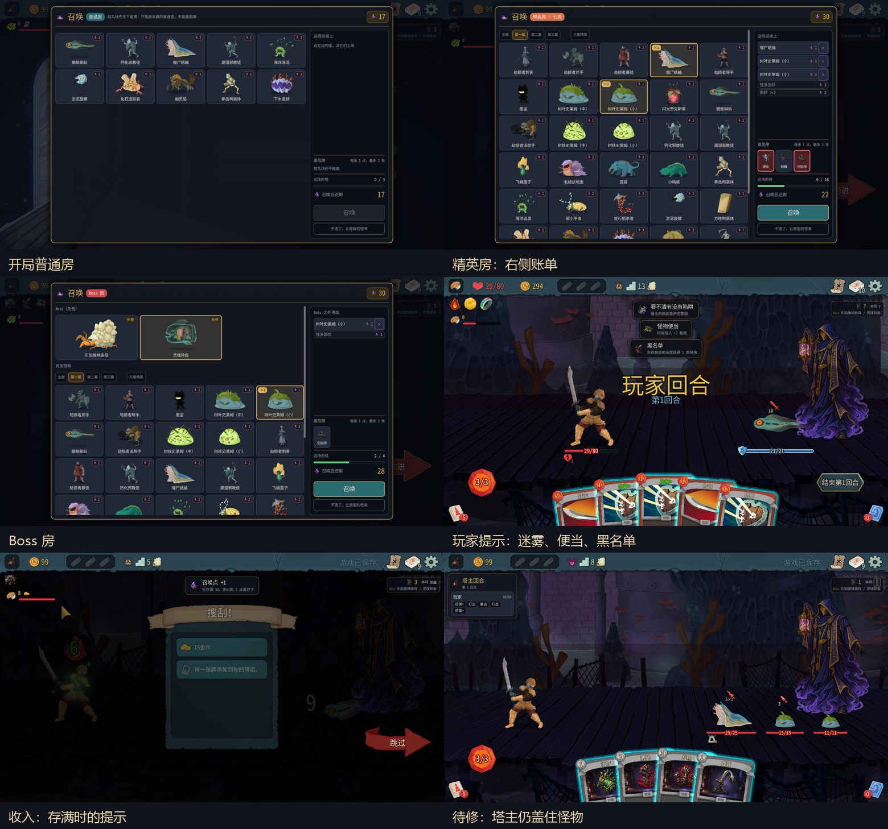

# 0.0.47 界面验收



测试版本：0.0.47，提交 ddbcad6。A=100001 房主/塔主，B=100002 爬塔玩家。同机双实例，川换皮禁用；未操作用户个人游戏，未修改 mod 代码。测试日期：2026-10-09。没有平衡结论。

## 安装与方法

109 个单元测试通过（49+60），编译安装成功，0 警告、0 错误；manifest=0.0.47。仓库与安装目录测试配置 SHA256 均为 `CE7D223D1626984CFD04F2F8E54D0CF4819EC3B6BDEB2B783F4866E23D169301`。

全部游戏操作通过测试接口完成，包括真实鼠标悬停（Viewport.WarpMouse）。沿地图投票进房间，没有 room/fight/win；没有给 B 加能量或抽牌。第一局为覆盖提示，给 A 发放小金库、便当、迷雾香炉；黑名单从宝箱获得。连续盲盒用 master/grant 增加 3 张牌，并仅对 A 使用 `draw 15`、`energy 10`。这些都是覆盖手段，不是自然平衡样本。

第一局种子 15448176873173279237：9 场胜利，随后第一幕 Boss 灵魂异鱼战第 7 回合爬塔玩家阵亡。第二局种子 6207853384876562582：7 场战斗胜利，包括一场按原版出场。共 16 场胜利和一场 Boss 失败。塔主出牌、结束回合、玩家恢复、奖励与地图推进可正常走通。两个测试实例已正常返回菜单退出。

## 优先修复

### 1. 塔主仍在怪物前面：不通过

普通小怪、幽灵船、多个怪物、灵魂异鱼均能看到塔主袍摆/躯干覆盖怪物。用户原话：『塔主好像还是在怪物图层上方呀』。

证据：[多怪 A](screenshots/ui047-multi-monster-layer-A.png)、[多怪 B](screenshots/ui047-multi-monster-layer-B.png)、[Boss A](screenshots/ui047-boss-mid-fight-A.png)。

运行时值：塔主 TextureRect 是 CombatRoom 的直接子节点，ZIndex=-9，ZAsRelative=true；CombatSceneContainer 的 ZIndex=-10，ZAsRelative=true；EnemyContainer 和 NCreature 的 ZIndex=0，ZAsRelative=true。因此怪物继承父层后的有效顺序是 -10，塔主 -9 仍在前面。`mod/TowerMaster/MasterPresence.cs:308` 只把塔主自身设为 -9。原版 `decompiled/sts2/MegaCrit.Sts2.Core.Nodes.Rooms/NCombatRoom.cs:252` 设置场景容器 -10，`:586` 把怪物加进 EnemyContainer。请按实际父子层级修复，并回归血条、意图、背景与塔主可见性。

### 2. 上一局战报残留新局：不通过

第一局自然阵亡后没有点击『看原版结算』，通过原版 ReturnToMainMenu 返回菜单，同进程创建第二局。两端旧 CanvasLayer 仍挂在 /root，新局地图/召唤时仍显示『塔主获胜！』『称号：赌狗塔主』。用户截图并指出一直挂着。已保存 [A](screenshots/ui047-stale-report-new-run-A.png)、[B](screenshots/ui047-stale-report-new-run-B.png)，随后用 `/master/report close=true` 关闭，恢复测试。

只读定位：`RunReportPanel.cs:36` 延迟创建战报，`:42` Close、`:48` Show；`RunLifecycle.cs:Reset` 清理回合、召唤、牌组、信息条和自动跟随，但未调用 RunReportPanel.Close。全仓搜索该调用只发现 TestBridge 的手动关闭入口。请同时防止旧局延迟回调在新局重新弹出。

### 3. 六条同时通知重叠：不通过

通过现有 ShowNotice 组件连续发 6 条测试通知，标题明确标『提示测试』，这不是六个自然事件。第 6 条和第 1 条同位置；约 4.5 秒后全部消失。证据：[重叠](screenshots/ui047-notice-six-stress.png)、[消失](screenshots/ui047-notice-six-expired.png)。`SummonPanel.cs:1062` 用 `slot % 5` 排列，却仍接收第六条。需要限制、排队或合并。三张盲盒实际出牌提示能分开显示，并正常消失：[A](screenshots/ui047-gamble-three-A.png)、[B](screenshots/ui047-gamble-three-B.png)。本次三次均开出『所有敌人 +5 格挡』，未覆盖第二种随机结果。

## 提示、信息条与召唤界面

| 项目 | 实机结果与证据 |
|---|---|
| 收入普通/存满 | A 标题『召唤点 +N』，正常小字显示余额；超容量时显示『已存满 30，多出的 5 点没存下』。[普通](screenshots/ui047-income-1-A.png)、[存满](screenshots/ui047-income-3-A.png)。B 没有 A 的收入通知。 |
| 没盖/盖下陷阱 | B 看到『塔主这场没盖陷阱』或『塔主盖下了 N 张陷阱』。[没盖](screenshots/ui047-battle-start-1-B.png)、[两张](screenshots/ui047-trap-start-two.png)、[一张](screenshots/ui047-one-trap-announced-B.png)。 |
| 陷阱生效/空陷阱 | 硬化第三张攻击触发，鼓舞第 3 回合触发；空陷阱结算能看到翻开提示。[硬化](screenshots/ui047-harden-fired-B.png)、[空陷阱](screenshots/ui047-empty-trap-B.png)。 |
| 躲过陷阱 | 第二局盖再生并在第 4 回合前打赢，B 金币 99→109，两端 trap_dodge 摘要一致。[躲过提示](screenshots/ui047-income-14-B.png)（当时旧战报尚未关闭）。 |
| 便当/黑名单/迷雾 | 三条上下排列，图标分别是香炉、便当、黑名单；B 信息条显示 ?，A 保留数字。[B](screenshots/ui047-bento-blacklist-fog-visible-B.png)。 |
| 宝箱/篝火 | 选遗物、删牌/跳过与 B 原版操作能继续；通知截图 [宝箱](screenshots/ui047-treasure-notice-A.png)、[篝火](screenshots/ui047-rest-notice-A.png)。 |
| 信息条计数 | 手里数与 /traps 一致；盖两张显示两个小格，硬化触发后一个变红；下一场没盖显示『没盖』。战斗结束后到地图/奖励间仍可能保留上一场红格，进入下一战后重置。 |
| Boss 信息 | 本幕显示乐加维林族母 / 灵魂异鱼，与 Boss 召唤两个候选一致。 |
| 信息条真实悬停 | 用户停止移动鼠标后重试，说明正常出现，列出硬化、遗物、Boss 名称。[重试](screenshots/ui047-hud-hover-retry.png)。不能把之前没出现的截图作为失败结论。 |
| 开局/后期普通、精英、Boss | [开局](screenshots/ui047-summon-opening-settled.png)、[后期普通](screenshots/ui047-ordinary-later-bill.png)、[精英账单](screenshots/ui047-summon-elite-bill.png)、[Boss 账单](screenshots/ui047-boss-bill.png)。右栏底部召唤按钮一直可见，怪物列表单独滚动。 |
| 账单 | 精英噬尸蛞蝓+两只小史莱姆+两陷阱：怪物价 3、怪多加价 3、陷阱 2、总 8、剩 22；UI 怪物进度 6/16，接口 cap=16.9。陷阱在账单合并为『陷阱×2』一行，并非每张单列。 |
| 筛选/价格 | 卡角宝石+数字，费用筛选已去掉，只有幕分页和条件性的只看精英。开局保护没有精英候选时不显示精英按钮。 |
| 超上限 | 开局选三只蝌蚪超过上限，确认不可用，红字拒绝。[截图](screenshots/ui047-summon-overspend.png)。 |
| 悬停提示 | 怪物、怪多加价、上限均有运行时 TooltipText；多次真实定位截图未可靠截到后三类说明，不能判定全部通过。用户提供的陷阱悬停截图明确有提示，但文字发糊。 |
| 选陷阱 | 第一幕顶部『还能花 N 点 / 还能挑 N 张』可见；空手时不再显示旧的空手提示。[截图](screenshots/ui047-draft-act1-empty-hand.png)。 |

未覆盖：第二/三幕选陷阱实机截图（第一局 Boss 失败），自然商店通知（两局实际路线未进商店），完整窗口化/全屏对照，本轮用户没有给出卡顿观察。未用假的商店通知代替自然流程。图片预览打开瞬间会暂时很小，等待取景完成后正常；使用 settled 截图验收，不把瞬间状态当成持续退步。

## 用户新增要求（原话与后续设计）

- 『我希望注释的文字能看起来更像注释而不是一段普通的文字』。
- 『现在对于文字的设计还是很差， 本场 没盖 字体一样颜色一样字号一样 没有任何区别 按这个思路对文字UI进行调整』。[用户截图](screenshots/ui047-user-text-hierarchy.png)。请建立标题、标签、状态、数值、辅助注释的整体层级，不只改本场这一例；由 Claude 自主决定视觉方案。
- 提示框注释发糊：[用户截图](screenshots/ui047-user-tooltip-blurry.png)。请检查实际字体和缩放/采样，不要只加阴影。
- 塔主视角卡牌不要称怪物为『敌人』，改为『选择一只怪物』『所有怪物』，一并检查目标、提示和描述。
- 用户询问按原版是否免费：实测普通房标准开销 5，点击后 30→25，接口 charged=5；日志记录『塔主选择按原版出场，按原版出场，花费 5，剩余 25』。不是免费。`SummonSession.cs:132` 未确认选用 FallbackQuote，`SummonPhase.cs:275` 起实际扣款且不足时截到余额。是否合理、是否修改规则由 Claude 判断，本报告不作平衡结论。UI 需直观说明实际扣费，避免误解。
- 动作与特效详细需求见 [后续需求](master-animation-vfx-request.md)：通用埋牌特效不能透露陷阱类型；易伤、格挡等行动各有小幅动作和独立特效；Claude 决定方案并提供自足、详细的生图 prompt，本轮未生成或改代码。

## 同步与异常

两端动作摘要各 163 条；162 条相同，1 条不同。两端 mod 与游戏日志 StateDivergence 均为 0。不能称为逐行完全一致。差异是第一局宝箱选黑名单的 threat:reward，B 金币采样时间不同；之后摘要恢复相同，原因需要 Claude 判断：

```text
A INFO 动作摘要 #155 threat:reward｜层9 玩家[100001:80/80b0 g99 k11 e2 h0 d0 x0 100002:71/80b0 g249 k10 e2 h0 d0 x0]
B INFO 动作摘要 #155 threat:reward｜层9 玩家[100001:80/80b0 g99 k11 e2 h0 d0 x0 100002:71/80b0 g294 k10 e2 h0 d0 x0]
```

TowerMaster：A ERROR=0、WARN=1；B ERROR=0、WARN=0。唯一 WARN 是测试调用先用了 System.Numerics.Vector2，后改为明确的 Godot.Vector2 后可移动鼠标；属于调用错误。完整异常原文：

```text
[03:47:36.824] WARN 测试接口 /reflect：System.ArgumentException: Object of type 'System.Numerics.Vector2' cannot be converted to type 'Godot.Vector2'.
   at System.RuntimeType.CheckValue(Object& value, Binder binder, CultureInfo culture, BindingFlags invokeAttr)
   at System.Reflection.MethodBaseInvoker.InvokeWithOneArg(Object obj, BindingFlags invokeAttr, Binder binder, Object[] parameters, CultureInfo culture)
   at System.Reflection.RuntimeMethodInfo.Invoke(Object obj, BindingFlags invokeAttr, Binder binder, Object[] parameters, CultureInfo culture)
   at System.Reflection.MethodBase.Invoke(Object obj, Object[] parameters)
   at TowerMaster.TestBridge.Invoke(Object obj, JsonObject a, Type staticType)
   at TowerMaster.TestBridge.Reflect(JsonObject a)
   at TowerMaster.TestBridge.<>c__DisplayClass17_0.<<OnMainThread>b__0>d.MoveNext()
--- End of stack trace from previous location ---
   at TowerMaster.TestBridge.Route(String method, String path, String token, String body)
```

游戏日志 A 未检出 ERROR；B 检出以下异常（摘要，未提交原始日志）：

- `ERROR: Invalid Task ID`，1 次；启动期间 Godot worker_thread_pool.cpp:418，GetOrLoadOrCreateScriptForType。
- `System.InvalidOperationException: Rest site option MegaCrit.Sts2.Core.Entities.RestSite.HealRestSiteOption was selected, but it was not in the list of rest site options!`，5 次；NRestSiteButton.SelectOption → OnRelease → 测试反射调用。助手在休息完成后重复尝试同一按钮引发，不能据此判断正常玩家点击会失败。
- `ERROR: System.ObjectDisposedException: Cannot access a disposed object. Object name: Godot.CompressedTexture2D.`，3 次；TextureRect.SetTexture → NMultiplayerPlayerState.TweenLocationIconIn 回调。根因不确定，需查角色图标切换/资源生命周期。

只提交本报告、反馈资料和界面截图；完整本地日志、游戏资源、反编译源码、测试助手脚本未提交。
