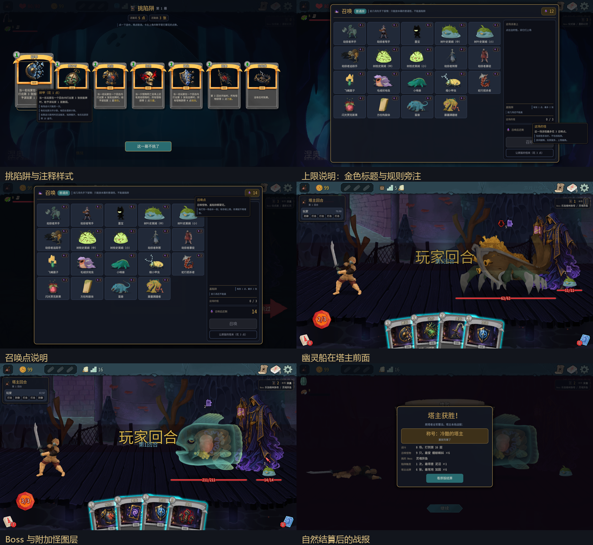
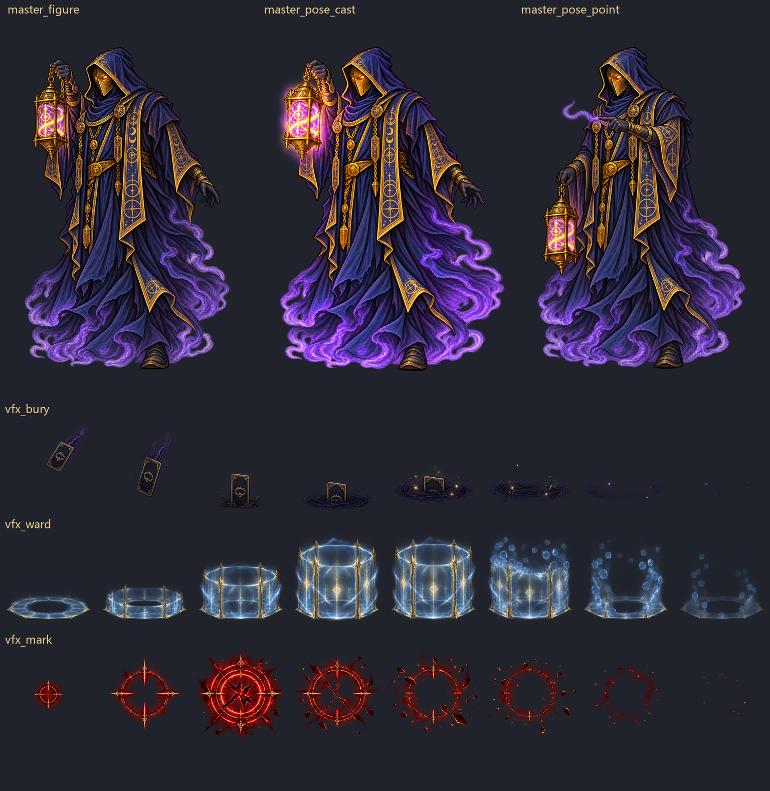

# 0.0.48 界面、图层与样例验收



版本 0.0.48，提交 0d6e5d3；分支 claude/optimistic-rubin-hr3eit。测试日期 2026-10-09。A=100001 房主/塔主，B=100002 爬塔。同机双实例，仅操作测试接口识别的 PID 26880/21656；用户自己的游戏进程未操作。两端启动日志均确认川换皮 disabled，画面为原版铁甲。没有修改 mod 代码，没有平衡结论。

## 结果概览

| 项目 | 结果 |
|---|---|
| 编译与单测 | 109 个全过（49+60），编译安装 0 错误/0 警告；manifest=0.0.48 |
| 多怪、幽灵船、Boss 图层 | 通过；怪物画在塔主前，意图/血条可见，塔主没有落到背景后 |
| 文字层级、自绘悬停 | 八类目标均真实悬停并截图，标题/正文/竖线规则注释可区分，所测截图没有越出屏幕；卡牌仍非用户要求的完整原版详情结构 |
| 原版出场扣点 | 按钮花 3 点，接口实际 12→9、charged=3，一致 |
| 六条通知 | 同屏四条，后两条排队，均消失，不重叠 |
| 自然结算战报换局清理 | 通过；不点击关闭，直接回菜单/新局，两端旧 layer 均清空 |
| 动作摘要 | 161 条/端，160 条一致、1 条塔主生命差异；不能称为完全一致 |
| StateDivergence | 两端 mod/game 均 0 |
| 美术 | 已保留五个旧方案样例和三条 GIF；预审未全部通过，不是完整角色动画；用户已明确否定仅关键姿势换图的方案，暂停后续美术制作，需 Claude 修订 |

测试配置用仓库文件覆盖安装目录，SHA256 双方一致：`CE7D223D1626984CFD04F2F8E54D0CF4819EC3B6BDEB2B783F4866E23D169301`，master_cards/master_turn 均启用。A/B 共用本机游戏安装目录。五张新图是未接入的资源样例，本次实际战斗仍使用原来的 master_figure。

## 美术样例：未作为完整动画交付



使用内置 imagegen，先逐条采用 master-animation-plan.md 第 3 节 prompt，两张姿势均以 master_figure.png 作参考。初次指点方向错误，进行了局部定向纠正；首版横向序列出现帧排布挤压，重试采用 4×2 等宽格的中间排版，再机械重排成文档要求的 8 帧横条。未新增主体或改变特效类别。输出尺寸由格式缩放处理：两张 512×768，三条 2048×256。实际角色动画代码尚未使用这些文件。

| 资源 | 当前文件/检查 |
|---|---|
| 举灯 | `mod/TowerMaster/art/master_pose_cast.png`，RGBA，四角 alpha=0；辉光范围超出参考人物约定范围，不能凭外观相似宣称锚点验收通过 |
| 指点 | `mod/TowerMaster/art/master_pose_point.png`，RGBA，四角 alpha=0；已朝左、灯仍在原侧，仍需正式锚点校准 |
| 埋牌 | `mod/TowerMaster/art/vfx_bury.png`，RGBA，整图四角 0；卡背通用不泄露陷阱，但地面/尺度没有精确达到各帧 y=200 的要求 |
| 护盾 | `mod/TowerMaster/art/vfx_ward.png`，RGBA，整图四角 0；第 4 帧中心 alpha=219/255，中心过实；帧角还有 alpha=1 的残值，未通过严格透明验收 |
| 印记 | `mod/TowerMaster/art/vfx_mark.png`，RGBA，整图右下角 alpha=1；部分帧角也有 1，尺寸/淡出强度未精确符合 prompt，未通过严格验收 |

角色头/脚偏差 <8px **未可靠定量验证**，不写通过。并排样例可评风格，但不能据此等同于无跳位。序列的共同锚点/地面线也没有全部通过。完整动画更不能由这三张姿势替代。

播放预览只用于旧方案样例评审，暗底便于看透明效果： [埋牌 GIF](screenshots/ui048-vfx_bury.gif)、[护盾 GIF](screenshots/ui048-vfx_ward.gif)、[印记 GIF](screenshots/ui048-vfx_mark.gif)。8 帧每帧约 60ms，循环展示，不是完整角色动作。原始 prompt 来源及修改理由以本节和 [原方案第 3 节](master-animation-plan.md) 为准。

用户原话：『塔主的动作不应该只有几帧 我要的是完整的动画』『如果你还不太确认可以再找claude要清楚』。详见 [用户补充](ui-048-user-followup.md)：Claude 应先重新给出完整起手→施法/埋牌→收势动画方案及自足制作说明，再决定技术与资源，不能继续把姿势换图当作完成。没有擅自生成其他类别特效。

## 图层验证

证据：[多怪 A](screenshots/ui048-large-multi-layer-A.png)、[多怪 B](screenshots/ui048-large-multi-layer-B.png)、[幽灵船 A](screenshots/ui048-ship-layer-A.png)、[幽灵船 B](screenshots/ui048-ship-layer-B.png)、[Boss A](screenshots/ui048-boss-layer-A.png)、[Boss B](screenshots/ui048-boss-layer-B.png)。

运行时塔主 TextureRect 位于 CombatSceneContainer 内，与 EnemyContainer 同父节点，GetIndex(false) 分别为 3、4。所测幽灵船的船身/腿、灵魂异鱼和附加史莱姆均盖在塔主前，塔主仍可见。与上一版直接挂 CombatRoom、有效 ZIndex 高于怪物的情况不同。

两端日志每场均有下列行，无退回旧图层的 WARN。以下为首次实机原文，其余同文重复：

```text
[05:24:11.395] INFO 塔主形象：放进 CombatSceneContainer，排在 EnemyContainer 前面（怪物后面）
[05:24:11.349] INFO 塔主形象：放进 CombatSceneContainer，排在 EnemyContainer 前面（怪物后面）
```

## 文字层级与真实悬停

信息条『本场』小且暗，『没盖』更亮更大；源码实际为标签 13、状态值 16。方块计数/触发红格可显示，迷雾时 B 保留 ?。提示标题亮、大，小字有竖线、灰蓝旁注：[收入](screenshots/ui048-income-1-A.png)、[信息条](screenshots/ui048-hud-no-traps-A.png)。字体层级有改进，但用户的新要求仍是少文字、更多直观图形，不等于本轮最终审美已被接受。

下列均通过测试接口移动真实鼠标到对应控件，等待约 0.8 秒后截图；未通过反射直接调用 Ui.Show 冒充悬停。信息条在召唤遮罩下无法悬停是正常的，改在战斗中验证。

| 目标 | 截图与观察 |
|---|---|
| 信息条 | [截图](screenshots/ui048-hover-hud-in-battle.png)，金色标题，正文和辅助说明可读 |
| 召唤点宝石 | [截图](screenshots/ui048-hover-gem.png)，说明召唤/盖陷阱都扣点，存满不增加 |
| 怪物卡 | [截图](screenshots/ui048-hover-monster.png)，怪名与费用可读 |
| 这场的怪 | [截图](screenshots/ui048-hover-cap.png)，含怪多加价、不含陷阱的规则放入竖线旁注 |
| 怪多加价 | [截图](screenshots/ui048-hover-crowd.png)，解释额外数量收费；没有规则行时只呈现正文 |
| 陷阱小卡 | [截图](screenshots/ui048-hover-trap-mini.png)，触发效果/限制分层可辨 |
| 挑陷阱卡片 | [截图](screenshots/ui048-hover-draft-card.png)，卡面放大与金标题详情存在，但仍是自绘外置说明 |
| 让原版的怪来 | [截图](screenshots/ui048-hover-vanilla.png)，注释明确是平均价、不是免费 |

所测提示框没越屏，标题金色；带『※』的规则显示成竖线冷灰说明。主图保留全画面，阅读应以原始 PNG/实际尺寸为准，不把聊天缩图的模糊当成游戏渲染缺陷。

[原版与 mod 提示对照](screenshots/ui048-tooltip-comparison.png)：原版更紧凑，mod 规则旁注明确但占的空间更大。原版遗物对照图是调用其原版 OnFocus 显示，**不是**冒充真实悬停测试；真实鼠标的八个 mod 目标见上表。

## 卡牌结构与文案

塔主手牌和陷阱的可见说明用『怪物』，本轮检查 MasterCards/Traps 显示字符串未见『敌人』。[塔主手牌](screenshots/ui048-ship-layer-A.png)。源码注释和 MasterHand 的便当日志里仍有『敌人』，不属于卡牌说明；原版拖牌自带目标文本按要求不计。

用户认为卡牌不应另做自绘详情，原话：『不是说沿用原版的逻辑，而是这些卡牌就应该照抄原版』『还有卡牌介绍这些文字理应简洁』。[用户截图](screenshots/ui048-user-card-details.png)。

只读查到选陷阱卡通过 VanillaCard.Create 套原版场景，并把 NCard.MouseFilter 设为 Ignore，绑定模板 Model 再覆盖卡面文字；交互和 Ui.Tip 在外层 Button。这不是实际陷阱模型完整接入原版右键详情。需 Claude 让这些牌直接采用原版卡牌展示/右键介绍/关键词等结构与表现，而非只套卡框和模仿逻辑。详见用户补充文档；本地没修改代码。

## 扣点、通知与换局清理

- 开局普通房按钮写『让原版的怪来（花 3 点）』。接口返回 standard_cost=3、charged=3、points_before=12、points_after=9。与按钮一致。
- 连发六条 ShowNotice 组件测试通知（标题标明队列测试，不是六个自然游戏事件）：[先四条](screenshots/ui048-notice-six-first-four.png)→[再两条](screenshots/ui048-notice-six-queued-last-two.png)→[全部消失](screenshots/ui048-notice-six-expired.png)。无互相重叠。
- 第二局正常地图进 Boss，选择灵魂异鱼＋一只小史莱姆。为验证结局只调用 A/B 原版结束回合，让 B 第 6 回合被怪物击倒；没有 console damage/win。两端出现 [战报 A](screenshots/ui048-natural-defeat-report-A.png)、[战报 B](screenshots/ui048-natural-defeat-report-B.png)。
- 不点『看原版结算』、不调用 report close，直接 ReturnToMainMenu，再同进程新建大厅、新局。两端 RunReportPanel._layer 从 CanvasLayer→null，新局可见节点中旧『塔主获胜』为 0。[菜单 A](screenshots/ui048-report-cleared-main-menu-A.png)、[新局 A](screenshots/ui048-report-cleared-new-run-A.png)、[新局 B](screenshots/ui048-report-cleared-new-run-B.png)。通过。

## 问号房与一次接口操作时序问题

第一局 Overgrowth (1,13) 的 Unknown 实际生成 VineShambler 战斗，没有召唤面板。助手在异步转换期间误以为仍为非战斗房，提前调用 B 地图投票去 (2,14)。塔主阶段随后停住：master_hand.active=true、B paused=true，结束回合提交后不推进；专门 threat/end 返回 ended=true 也未恢复，正常出牌助手到 300 秒停止。未用 win、强制换房或修改暂停字段绕过；保存证据后正常回菜单重开测试局。[停住 A](screenshots/ui048-map-vote-during-combat-stall-A.png)。第二局改为检查 combat 是否进行中、等待房间转换完成，再沿地图操作，成功走到 Boss。

投票发早属于助手操作时序错误；接口缺少足够的阶段拒绝/等待保障应交 Claude 评估，不能据此宣称正常用户操作一定卡死。

用户先要求问号战斗由塔主布置，随后进一步修正：『或者说问号房出怪应该纳入特殊事件 让claude想一个更有意思的处理方式』『而不是简单地纳为一个普通的怪物房间』。**以后者为准**，不指定普通召唤房方案。当前 RoomKindAt 仅按地图 PointType 接受 Monster/Elite/Boss，Unknown 返回 null；需 Claude 设计特殊事件中的塔主参与方式，同时明确同步、奖励、专用场景、存档和接口时序。

## 回归与日志

16 场战斗胜利，另有一场 Boss 结局验证；召唤确认、塔主出牌、原版结束回合、玩家恢复、陷阱触发/回收、奖励与继续走图实际走通。鼓舞第 3 回合、泥沼第 2 回合均有两端触发行；没有给 B 加能量、抽牌，没有 room/fight/win。测试不是胜率或平衡样本。

动作摘要 A/B 各 161 条，160 条相同，1 条不同。差异是第一局问号事件后首次 summon 的塔主生命，原因未确认，不能称为完全一致。原文：

```text
A
[05:29:31.966] INFO 动作摘要 #51 summon｜层4 玩家[100001:62/80b0 k12 e1 h0 d0 x0 100002:79/80b0 k11 e0 h0 d0 x0]
```
```text
B
[05:29:31.988] INFO 动作摘要 #51 summon｜层4 玩家[100001:80/80b0 k12 e1 h0 d0 x0 100002:79/80b0 k11 e0 h0 d0 x0]
```

StateDivergence：A mod=0/game=0；B mod=0/game=0。统计完成战报新局检查后的日志；退出后再查本地 mod 文件没有新增 WARN/ERROR。

TowerMaster：A ERROR=0、WARN=1；B ERROR=0、WARN=0。唯一 WARN 是助手查询字体时把字符串直接传给 Godot.StringName，属于调用参数错误。完整原文：

```text
[05:27:45.618] WARN 测试接口 /node/call：System.Text.Json.JsonException: The JSON value could not be converted to Godot.StringName. Path: $ | LineNumber: 0 | BytePositionInLine: 11.
   at System.Text.Json.ThrowHelper.ThrowJsonException_DeserializeUnableToConvertValue(Type propertyType)
   at System.Text.Json.Serialization.Converters.ObjectDefaultConverter`1.OnTryRead(Utf8JsonReader& reader, Type typeToConvert, JsonSerializerOptions options, ReadStack& state, T& value)
   at System.Text.Json.Serialization.JsonConverter`1.TryRead(Utf8JsonReader& reader, Type typeToConvert, JsonSerializerOptions options, ReadStack& state, T& value, Boolean& isPopulatedValue)
   at System.Text.Json.Serialization.JsonConverter`1.ReadCore(Utf8JsonReader& reader, T& value, JsonSerializerOptions options, ReadStack& state)
   at System.Text.Json.Serialization.Metadata.JsonTypeInfo`1.Deserialize(Utf8JsonReader& reader, ReadStack& state)
   at System.Text.Json.Serialization.Metadata.JsonTypeInfo`1.DeserializeAsObject(Utf8JsonReader& reader, ReadStack& state)
   at System.Text.Json.JsonSerializer.ReadFromNodeAsObject(JsonNode node, JsonTypeInfo jsonTypeInfo)
   at System.Text.Json.JsonSerializer.Deserialize(JsonNode node, Type returnType, JsonSerializerOptions options)
   at TowerMaster.TestBridge.ConvertArg(JsonNode node, Type type)
   at TowerMaster.TestBridge.<>c__DisplayClass93_0.<Invoke>b__0(ParameterInfo p, Int32 i)
   at System.Linq.Enumerable.SelectIterator[TSource,TResult](IEnumerable`1 source, Func`3 selector)+MoveNext()
   at System.Linq.Enumerable.<ToArray>g__EnumerableToArray|314_0[TSource](IEnumerable`1 source)
   at System.Linq.Enumerable.ToArray[TSource](IEnumerable`1 source)
   at TowerMaster.TestBridge.Invoke(Object obj, JsonObject a, Type staticType)
   at TowerMaster.TestBridge.NodeCall(JsonObject a)
   at TowerMaster.TestBridge.<>c__DisplayClass17_0.<<OnMainThread>b__0>d.MoveNext()
--- End of stack trace from previous location ---
   at TowerMaster.TestBridge.Route(String method, String path, String token, String body)
```

额外游戏日志异常（未提交原始日志）：

**A**

- `[ERROR] [NetMessageBus] Exception encountered while processing message VotedForSharedEventOptionMessage index 0 page 1: System.InvalidOperationException: Option chosen for player MegaCrit.Sts2.Core.Entities.Players.Player on EVENT.JUNGLE_MAZE_ADVENTURE (50104972), but it is already finished!`
- `[ERROR] System.InvalidOperationException: Tried to set event options after event was finished!`
- `[ERROR] System.ObjectDisposedException: Cannot access a disposed object.`
**B**

- `[ERROR] [NetMessageBus] Exception encountered while processing message SharedEventOptionChosenMessage index 0 page 1: System.InvalidOperationException: Option chosen for player MegaCrit.Sts2.Core.Entities.Players.Player on EVENT.JUNGLE_MAZE_ADVENTURE (2480785), but it is already finished!`
- `ERROR: System.ObjectDisposedException: Cannot access a disposed object.`
- `ERROR: System.ObjectDisposedException: Cannot access a disposed object.`
- `ERROR: System.ObjectDisposedException: Cannot access a disposed object.`
- `[ERROR] System.ObjectDisposedException: Cannot access a disposed object.`

共享事件 EVENT.JUNGLE_MAZE_ADVENTURE 两端都被助手尝试选择，出现 finished 后又收选项的错误；应核对自动跟随/投票去重及助手调用时序，未独立证明正常单次点击可复现。B 的 CompressedTexture2D 已释放异常有 3 次，栈指向 NMultiplayerPlayerState.TweenLocationIconIn；两端另有 NMultiplayerVoteContainer 已释放异常，涉及 EventSplitVoteAnimation。根因不确定，需 Claude 查资源/回调生命周期。

所有用户新增需求和原话汇总在 [后续修改要求](ui-048-user-followup.md)，包括完整动画、真实原版卡牌、简洁文案、信息图形化和问号特殊事件。只提交样例图、截图/GIF、报告和需求资料；未提交原始日志、游戏资源、反编译源码或本地测试助手。
