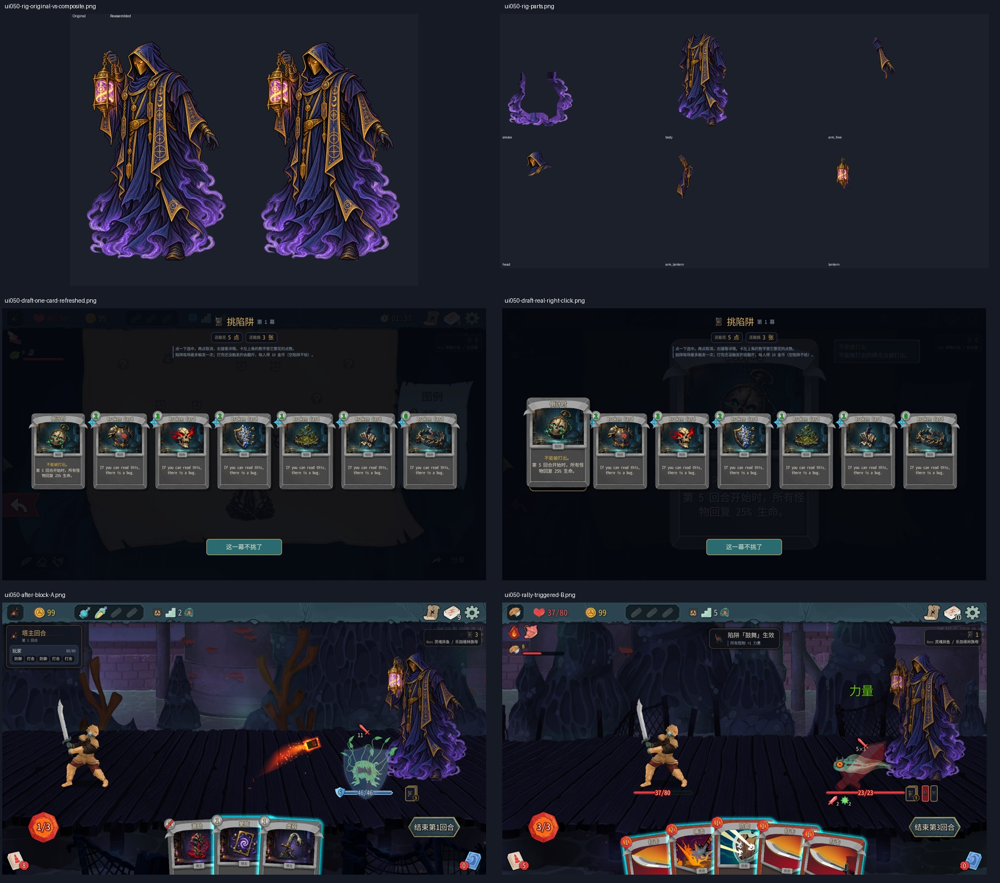
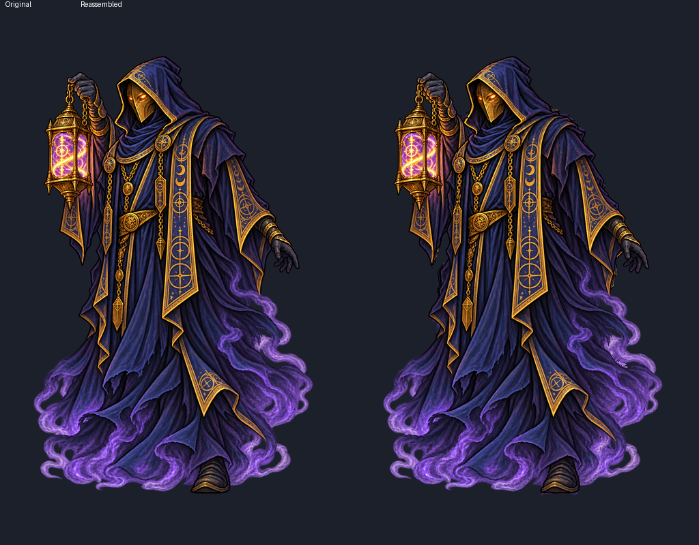
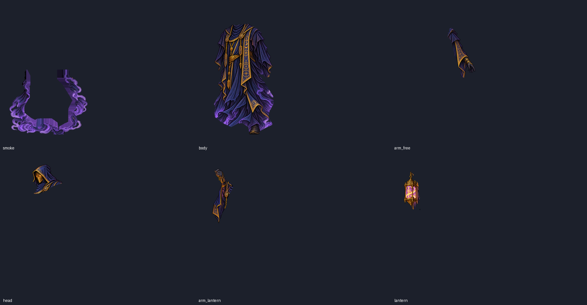
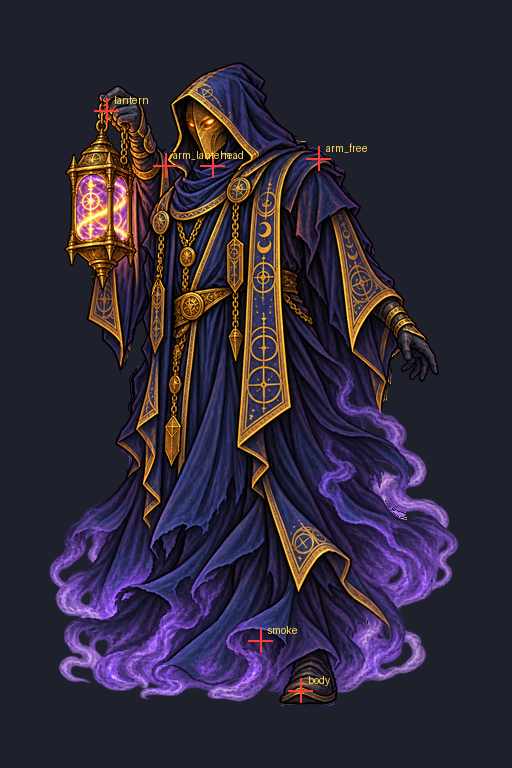
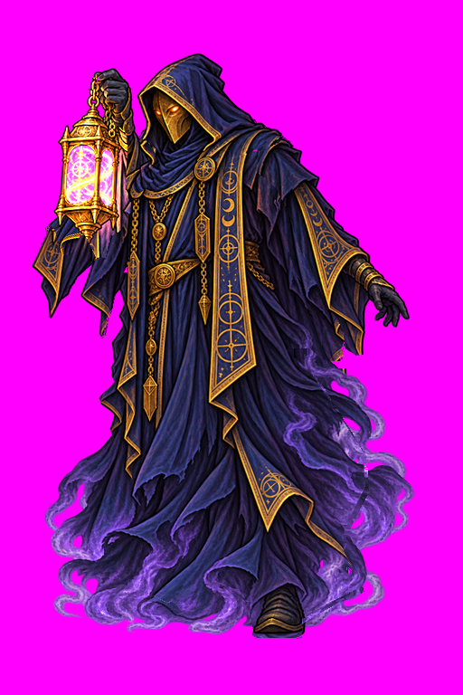
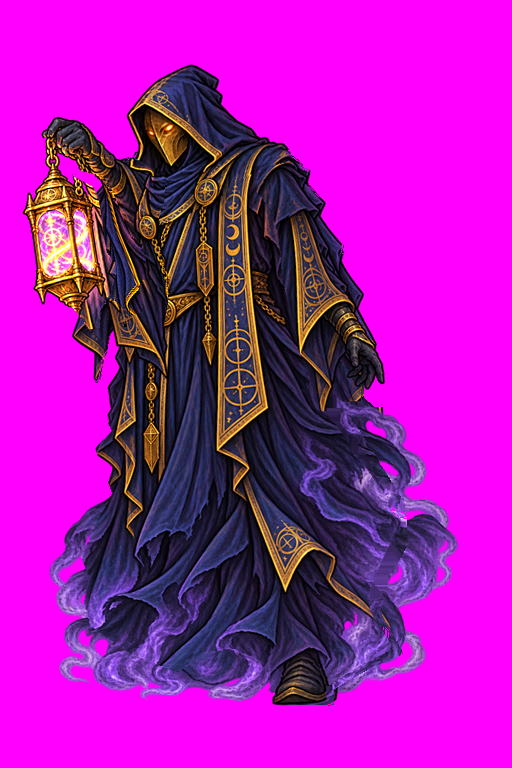
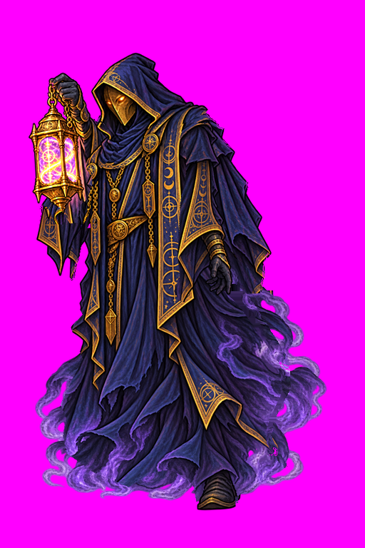
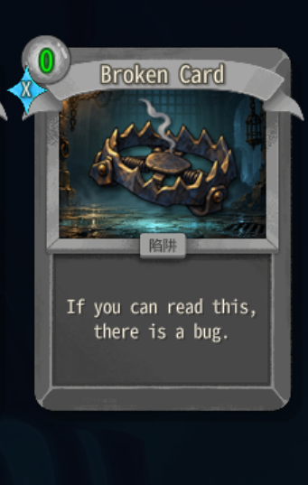
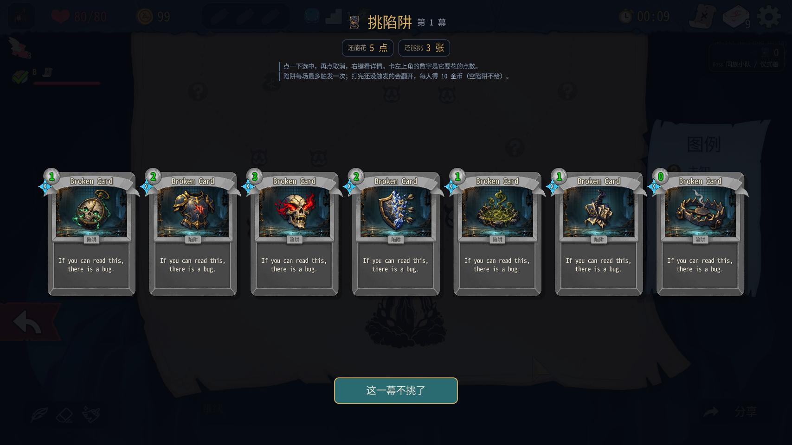
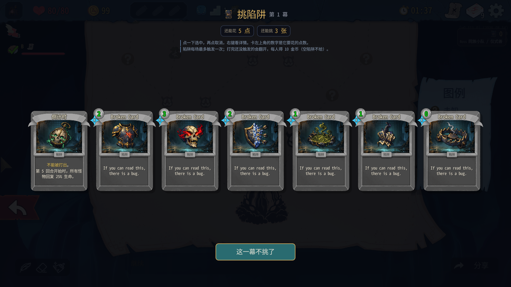

# 0.0.50 验收结果



## 结论与范围

构建、109 项测试通过；安装 manifest=0.0.50。基于 `418460b`，未修改 mod 代码或 `rig_anims.json`。完成六个骨骼部件、原图叠合及动画工具检查；游戏里完成加固、易伤、埋牌、鼓舞触发、三种伏击和跳过、迷雾显示、同进程读档。**本轮不全通过**：陷阱挑选卡面显示 Broken Card；事件战误触发伏击；地图投票接口在胜利后仍误拒绝。没有做平衡结论。

测试只操作 A=100001 房主/塔主、B=100002 爬塔。川换皮启动日志：`Skipping loading mod liuchuan, it is set to disabled in settings`。未操作用户自己的游戏进程。用户指出鼠标被移动后停止桌面输入，改接口；之后用户明确授权「你可以使用真实鼠标测试了 我不会再动」，再恢复受测试 PID 检查保护的鼠标操作。

仓库和安装 `towermaster.test.json` SHA256 均为 `CE7D223D1626984CFD04F2F8E54D0CF4819EC3B6BDEB2B783F4866E23D169301`。两端 /ping=.50。新注册 118 种牌、本地化补 220 条（实际日志）。

## 六部件与连续动画

六张 PNG 均 512×768、RGBA、原位，四角透明。原图像素以遮罩分给六个部件；隐藏的肩膀/领口/袖子/烟雾采用局部生成补画，原有可见像素不随生成图移位。补画带与关节接口保留重叠；原图归属与新增隐藏接口分开处理。

使用 Claude 模板坐标，**没有调整转轴**：smoke(260,640)、body(300,690)、arm_free(318,158)、head(212,165)、arm_lantern(165,165)、lantern(106,110)。父子和 z 顺序沿用模板；组装和动画曲线由既有代码/rig_anims.json 实现。





补画像素示意：[身体](screenshots/ui050-rig-body_added_pixels.png)、[自由臂](screenshots/ui050-rig-arm_free_added_pixels.png)、[头](screenshots/ui050-rig-head_added_pixels.png)、[持灯臂](screenshots/ui050-rig-arm_lantern_added_pixels.png)、[袖子](screenshots/ui050-rig-sleeve_added_pixels.png)、[烟雾](screenshots/ui050-rig-smoke_added_pixels.png)。

检查工具终端原文：

```
已生成 guide.png（转轴位置；连线 = 挂在哪个父部件上）
✓ 部件检查通过
✓ 叠回去和原图：0.1% 的人物像素差得明显（< 3% 才算对齐；亮的地方看 composite_diff.png）
已生成 anim_idle.gif
已生成 anim_cast.gif
  cast：最大幅度在 0.40 秒，品红底图 holes_cast.png（看人物内部有没有品红）
已生成 anim_point.gif
  point：最大幅度在 0.38 秒，品红底图 holes_point.png（看人物内部有没有品红）
已生成 anim_bury.gif
  bury：最大幅度在 0.50 秒，品红底图 holes_bury.png（看人物内部有没有品红）
```

工具自动判定部件及叠合差异；品红洞和 GIF 仍需视觉验收，不把「已生成」当成自动通过。观察预览没有躯干/肩颈的大洞、脱离或整部件飘走；外沿烟雾原有透空仍可见。局部接口是否在全部实际缩放/动画组合下都无细缝，仍需要后续复查，不能据单帧保证。





连续动画预览：[idle](screenshots/ui050-rig-anim_idle.gif)、[cast](screenshots/ui050-rig-anim_cast.gif)、[point](screenshots/ui050-rig-anim_point.gif)、[bury](screenshots/ui050-rig-anim_bury.gif)。这些是 Claude 的连续骨骼动画，不是切换几张姿势图。

游戏连续截帧 GIF：[加固](screenshots/ui050-game-cast-interface.gif)、[易伤](screenshots/ui050-game-point-interface.gif)、[盖两张陷阱](screenshots/ui050-game-bury-two-traps.gif)。截帧来自测试接口，采样频率低于游戏渲染频率，不能替代逐帧无抖动证明；埋牌序列包含进房转换，未完整抓到每次插牌的全部帧。

游戏两端均出现「塔主动画：骨架搭好（6 个部件）」；首次 A `[10:21:51.140] INFO 塔主动画：骨架搭好（6 个部件）`，B `[10:21:51.105] INFO 塔主动画：骨架搭好（6 个部件）`。

加固后两端怪物 Block=6；易伤成功打出并记录在同步动作摘要。截图中塔主位于怪物后方，未挡住已测怪物的血条和意图；没有覆盖所有大怪/Boss。下一批六条特效为可选项，本轮未生成。

## 卡牌：明确的显示回归




新局先古之民后的挑陷阱，7 张卡标题/说明均为 Broken Card / If you can read this, there is a bug.；卡图、类型「陷阱」和挑选费用可以显示。接口模型的 Title 为正确中文，所以不是没有找到牌模型。

只读定位：`mod/TowerMaster/VanillaCard.cs:72` 的 `CreateFor(object model, float scale, string? cost = null)` 在 Ready 中赋 `NCard.Model` 并延时写费用，没有调用原版 `UpdateVisuals`。原版 `MegaCrit.Sts2.Core.Nodes.Cards.NCard`：Model setter（本地反编译文件 NCard.cs:372 起）调用 Reload；`Reload()`（:846）更新卡图/类别等；`UpdateVisuals(PileType pileType, CardPreviewMode previewMode)`（:557）才更新标题、描述等。

**接口诊断验证**：仅对第一张倒计时调用 `NCard.UpdateVisuals(PileType.None, CardPreviewMode.Normal)`，标题和描述立即正确，其余 6 张仍 Broken Card。未改代码。这是临时诊断，不是修复。



刷新还把第一张左上数字从挑选花费 1 改成牌模型费用 0。因此 Claude 修复时应在完整刷新后恢复挑选费用，且确认后续刷新不会再次覆盖。

真实鼠标右键挑陷阱成功打开 `NInspectCardScreen`：[截图](screenshots/ui050-draft-real-right-click.png)。原版详情能显示真正模型内容；右箭头节点存在。随后在原版详情里用真实鼠标点右/左箭头，`_index`分别0→1、1→0，确认能翻页：[下一张](screenshots/ui050-native-detail-next-card.png)、[上一张](screenshots/ui050-native-detail-previous-card.png)。此次翻页样本是塔主牌组，不是重新打开陷阱挑选页。塔主牌详情另通过 `VanillaCard.Inspect(state.Players[0].Deck.Cards,0)` 打开原版界面：[截图](screenshots/ui050-native-inspector-via-interface.png)，这不算真实右键手势验收。召唤面板小陷阱卡右键、遗物牌类别未完成专项验收。伏击候选为原版 NChooseACardSelectionScreen，三张模型名称/中文标题接口正确。

## 陷阱托盘与功能

第一局第 4 场盖鼓舞+空陷阱，总花费 3（怪1+陷阱2），点数 22→19。手里由3张变1张，盖下2张；两端截了托盘：[A](screenshots/ui050-two-traps-battle-tray-A.png)、[B](screenshots/ui050-two-traps-battle-tray-B.png)。上方信息条只保留手里数量/Boss，没有重复「本场」。

第3回合鼓舞触发，伏兵已有1力量的怪再增1，成为2；两端动作摘要一致、能力类型一致，托盘触发状态截图：[A](screenshots/ui050-rally-triggered-A.png)、[B](screenshots/ui050-rally-triggered-B.png)。日志原文：

- A `[12:11:18.071] INFO 塔主回合 #30 第3回合：陷阱 rally@1 触发，数值 1`
- B `[12:11:19.079] INFO 塔主回合 #30 第3回合：陷阱 rally@1 触发，数值 1`
- A `[12:11:48.396] INFO 塔主陷阱：战斗胜利，触发 1 张，没触发 1 张`
- A `[12:11:48.396] INFO 塔主陷阱：没触发的陷阱收回，获得 空陷阱，手里 2 张`

空陷阱收回，B金币仍99，没有给空陷阱躲过奖金。未触发的非空陷阱奖金本轮未单独覆盖。

第二局用 `tm_master_relic id=fog_censer` 辅助：A可见数字，B托盘和右上为「?」，开场提示「看不清有没有陷阱」：[A](screenshots/ui050-fog-tray-A.png)、[B](screenshots/ui050-fog-tray-B.png)。真实悬停托盘未覆盖。

## 问号房伏击

| 项目 | 事实 |
|---|---|
| 伏兵（接口在普通战发选牌） | 两端动作摘要一致，Toadpole+1力量、+5格挡；截图 [三选一](screenshots/ui050-ambush-offer-A.png) |
| 买路钱（事件战自然弹出后选择） | 两端B金币99→89；A召唤点26→29 |
| 援军（接口在普通战发选牌） | 两端新增 LeafSlimeS 12/12，原怪 AxeRubyRaider20/20；正常打死、胜利 |
| 跳过（接口） | skip=true成功，B提示截图 [B](screenshots/ui050-ambush-skip-notice-B.png) |
| 战斗中地图投票 | `B/map/vote: invalid_phase：还在战斗中，打完再投票（问号房也可能是战斗）`，符合战中拒绝要求 |
| 事件战不触发 | **不通过**，见下 |
| 读档不重复 | 第二局同进程读档恢复第3层，cards.visible=false，未重弹；完整进程重启未覆盖 |

自然路线到第7层问号事件，选择「我能打两个
和它们战斗以得到更好的奖励。」再点「战斗」，进入两只 PunchConstruct。日志却出现：`[12:14:03.073] INFO 问号房伏击：第 7 层是问号房里的战斗，塔主三选一`。这是**由事件选择启动的事件战**，本应排除，实际弹出了伏击：[两端截图 A](screenshots/ui050-event-battle-unexpected-ambush-A.png)、[B](screenshots/ui050-event-battle-unexpected-ambush-B.png)。没有遇到纯问号直接变怪的自然样本，不能用这次误触发冒充通过。

同一战斗第二次 `tm_master_ambush` 返回 offered，但不再显示选牌；随后 pick 报 `A/cards/pick: invalid_phase：没有显示选牌界面`。本轮因此把选项分到不同战斗测试，未重复提交牌。

## 正常战斗与读档

第一局正常胜利4场，之后事件双怪战B自然阵亡；第二局正常胜利2场。全部沿地图原版投票，不用 room/fight/win，不给B加能量或抽牌。只在伏击/迷雾专项使用测试接口触发或给遗物；普通牌由 tm_play、tm_end_turn 操作。B每回合原版3能量，正常手牌。

| 第一局战斗 | 回合 | B战后生命 |
|---|---:|---:|
| Seapunk，加固6 | 3 | 67/80 |
| 两只Toadpole，塔主易伤 | 4 | 38/80 |
| 一只Toadpole | 2 | 37/80 |
| 一只Toadpole，鼓舞+空陷阱，伏兵 | 4 | 24/80 |

这些只是流程样本，不用于平衡评价。事件战自然阵亡未用伤害控制台。第二局援军战胜利后B80/80。

同进程回菜单多人读档，塔主12张牌前后一致（9行动+硬化/泥沼/空陷阱），召唤点22、场数2一致，选牌没有重弹：[A](screenshots/ui050-same-process-reload-A.png)、[B](screenshots/ui050-same-process-reload-B.png)。未关闭测试实例去做冷读档。

助手出牌循环第二局曾因「无休手斧」/新增牌导致状态判断超时，停止重发，查看后能量已0、敌人3生命；正常结束回合后继续胜利。属于助手等待方式限制，没有用 win 绕过。

## 同步与异常

两端共62条动作摘要（保留摘要编号和全文、只去掉时间戳）逐行**完全一致**；差异0。两端游戏日志 StateDivergence=0；TowerMaster独立日志 ERROR=0、WARN=0，所以没有对应错误原文可列。原版启动日志另有 `Mod TowerMaster does not declare min game version. Assuming that it is supported.`，与本轮功能错误分开记录。

显示缺陷与规则错误没有自动产生 ERROR/WARN，不能因此判定没有bug。

胜利之后、in_progress=false且原版地图可选时，`tm_map_vote`仍两次返回上面的 invalid_phase；原版地图节点 `NMapPoint.OnRelease()` 经接口调用可以正常投票跟进，不绕过真实战斗。这是 `TestBridge.cs:463` 仅检查 CombatState/RoundNumber/CombatRoom、没有排除已结束战斗的误拒绝。建议修接口判断。

未覆盖清单：下一批6条可选特效；全部大怪/Boss动画遮挡；陷阱组左右翻页、手牌/小陷阱卡右键和托盘悬停；遗物牌类别；纯问号直接战斗自然样本；完整进程重启读档。上面只对已列证据作判断。
