# 0.0.51 测试结果

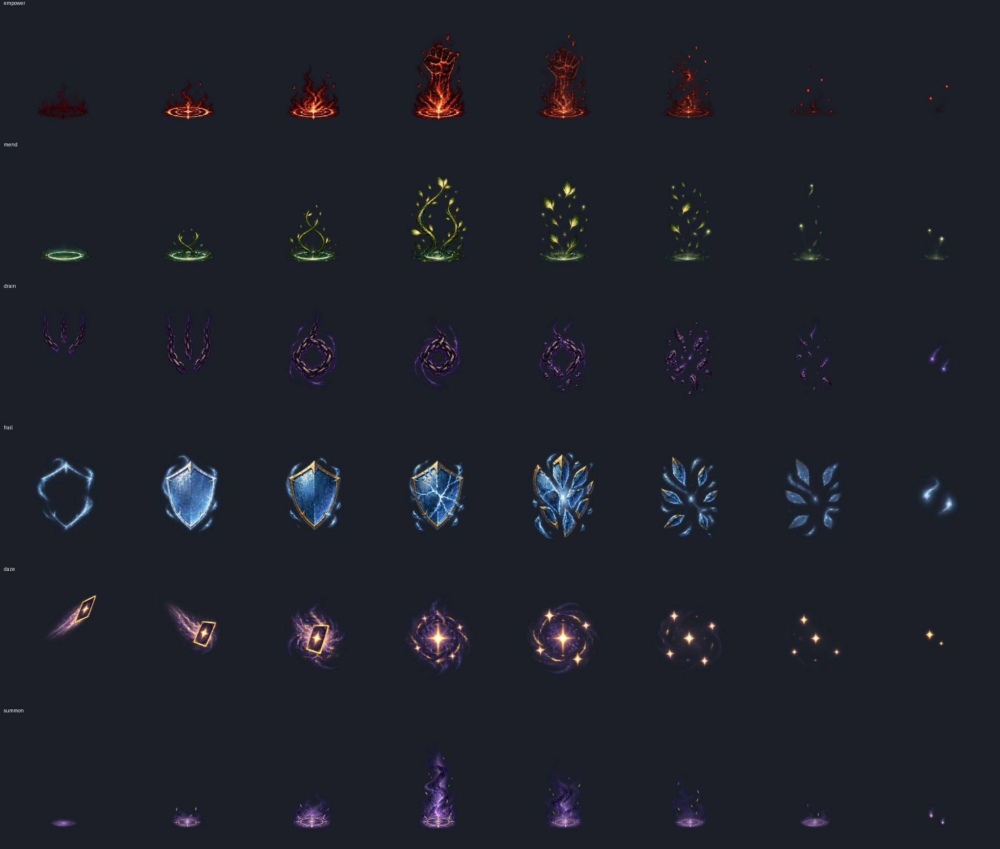

实现提交：`6edc0b6`，分支 `claude/optimistic-rubin-hr3eit`。本轮只增加美术和测试资料，没有修改 mod 代码。109 个测试通过（49 core + 60 mod），编译安装无警告/错误，安装 manifest=0.0.51。

仓库与安装后的 towermaster.test.json SHA256 一致：`CE7D223D1626984CFD04F2F8E54D0CF4819EC3B6BDEB2B783F4866E23D169301`，master_cards=true。A=100001、B=100002。两端日志均有 `Skipping loading mod liuchuan, it is set to disabled in settings`。只退出、重启了核对 clientId 的测试进程，用户个人游戏未操作。

## 结论与待修

- 挑陷阱中文标题、说明恢复，未再出现 Broken Card；七张花费为 1/2/2/2/2/1/0。
- 战斗中地图投票被拒；胜利、关闭奖励后投票成功。塔主阶段 B 出牌、结束回合均返回 invalid_phase，没有入队。
- 两次启动会话各 42 条动作摘要，两端逐行完全相同，共 84 条/端。StateDivergence=0。
- 完全重启后牌组、召唤点、遗物恢复，动画和托盘仍显示。
- **待修：伏击·援军成功添加小怪，但没有播放 vfx_summon。** `MasterAmbush.cs:73–75` 只调用 AddMonster；随后 Notify/Cast 未调用 MasterVfx。摇人通过 MasterCards 的 AfterCard 接入了召唤特效，伏击援军没有同等调用。慢放截图也未观察到召唤紫色门。
- 自然问号房只遇到非战斗事件，事件战/问号直接变战斗两种判定未覆盖，不能据源码判定为通过。
- 用户中途要求「先别测真实鼠标」；之后全部接口操作。详情左右翻页、陷阱小卡右键、手牌右键、托盘真实悬停未完成，不算通过。

## 挑陷阱与卡牌

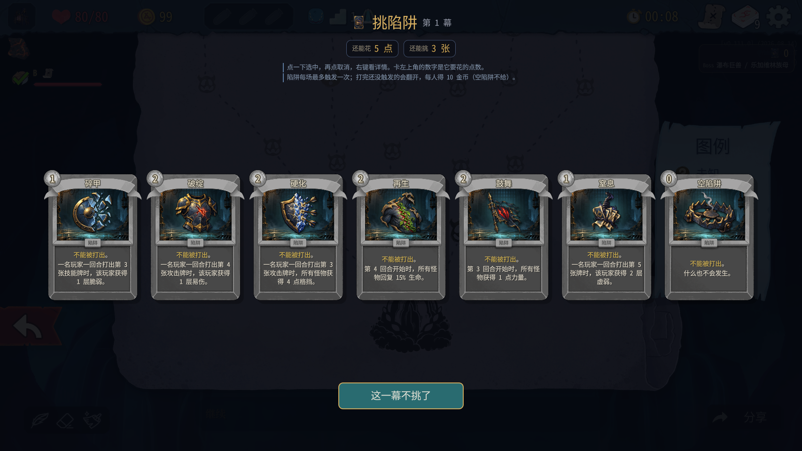

标题：碎甲、破绽、硬化、再生、鼓舞、窒息、空陷阱。树中 TitleLabel 为中文，EnergyLabel 为挑选价格，上述顺序为 1、2、2、2、2、1、0。接口确认挑选碎甲、硬化、空陷阱能进入召唤。

在用户禁止鼠标之前，悬停放大、点选和原版详情打开曾截到画面；第二次点击未可靠取消（接口仍有 picked=[0]），不能宣称真实鼠标取消验证成功。右键详情打开后翻页未完成。接口清空/重新选中正常。花费数字的完整「悬停→选中→取消」真实鼠标链仍待复测。


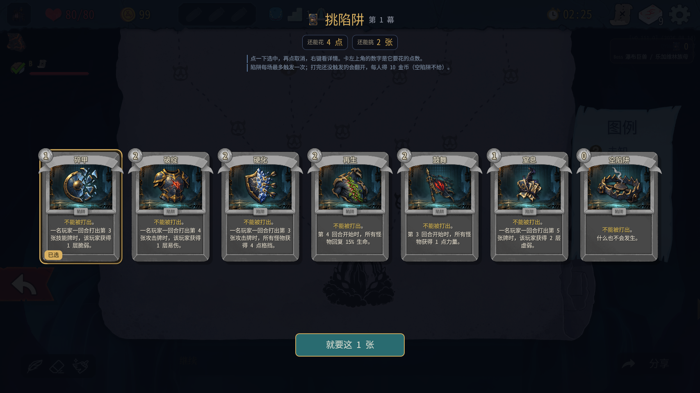

宝箱三张遗物候选 TypeLabel 均为「遗物」（便当、吝啬钱袋、黑名单）。选便当后正常继续。

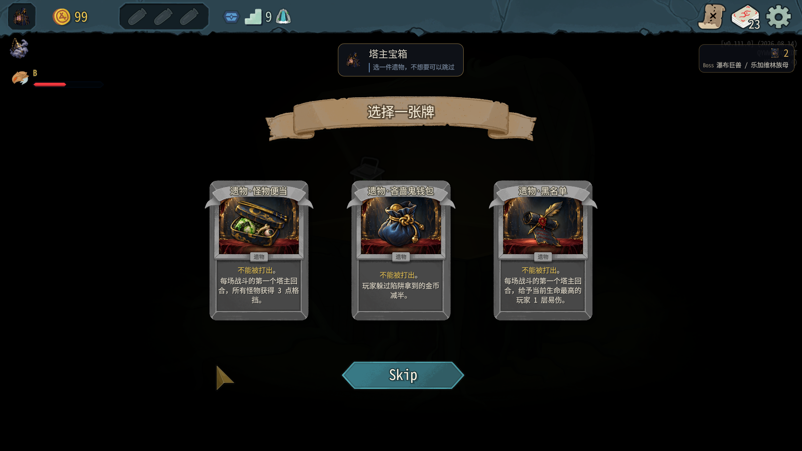

## 六条新特效

按 master-animation-plan 第 3 节生成并规范为 2048×256 RGBA，8 帧横条，每格 256×256，逐格四角 alpha=0。原始生成尺寸并非目标尺寸，按等宽帧切分、每条统一缩放，固定中心/地面锚点后输出；未逐帧独立缩放。empower/mend/summon 地面锚点 y=220，drain/frail/daze 中心锚点 y=120。同类图标、紫金魔法与原三条保持协调。

| 文件 | 对应 | 动态预览 |
|---|---|---|
| vfx_empower.png | 激励 | [GIF](screenshots/ui051-vfx-empower.gif) |
| vfx_mend.png | 治疗 | [GIF](screenshots/ui051-vfx-mend.gif) |
| vfx_drain.png | 虚弱 | [GIF](screenshots/ui051-vfx-drain.gif) |
| vfx_frail.png | 脆弱 | [GIF](screenshots/ui051-vfx-frail.gif) |
| vfx_daze.png | 晕眩、黏液大礼包 | [GIF](screenshots/ui051-vfx-daze.gif) |
| vfx_summon.png | 摇人 | [GIF](screenshots/ui051-vfx-summon.gif) |

真实出牌：激励、治疗、虚弱、脆弱、晕眩、黏液大礼包、摇人均通过 tm_master_play 执行，未出现效果失败的 ERROR/WARN。治疗另测受伤目标，两端蟾蜍蝌蚪生命 16→18。摇人由一只蟾蜍蝌蚪变为两只怪，新增 LeafSlimeS 11 生命，两端相同，正常击杀并胜利。各效果的同步依据为完整动作摘要对比；state 不列全能力/牌堆，不能把 state 截图当作每种状态层数的单独证据。

为看清短特效，另外在两端同时将 Godot Engine.TimeScale 暂设 0.15，直接调用 MasterVfx.AfterCard 进行纯视觉重播，结束后恢复 1；这不算第二次实际出牌/数值验证。连续重播过近的截帧可有上一条尾迹，不能据此宣称正常出牌必然重叠。实际普通速度短效截图有漏帧，六条播放接线和慢放画面结合验证。

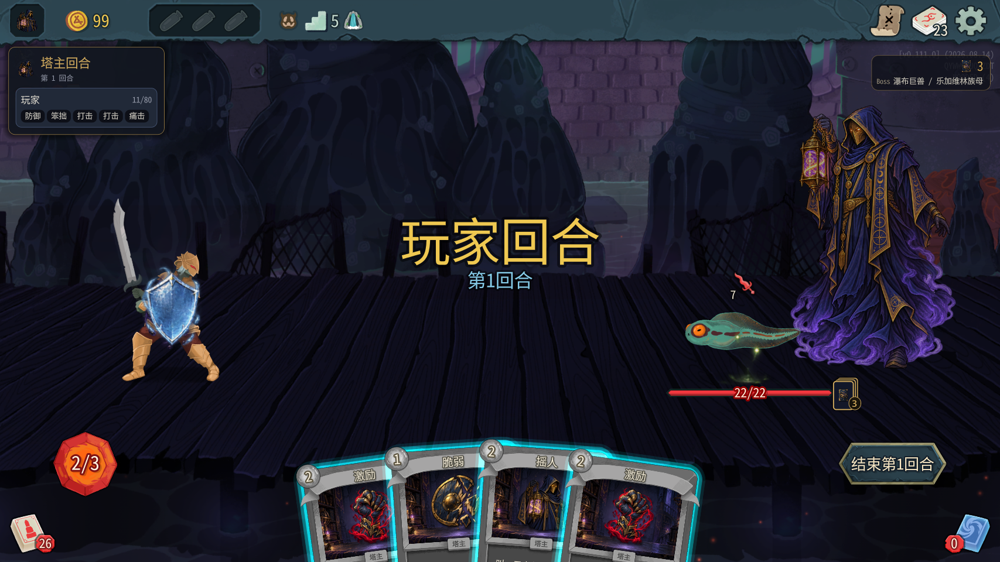

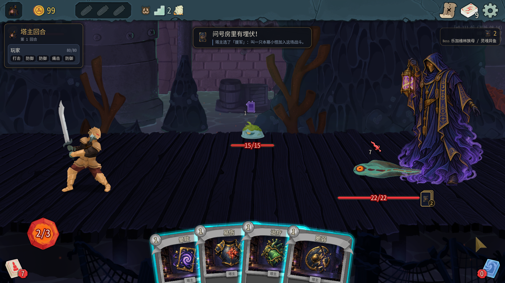
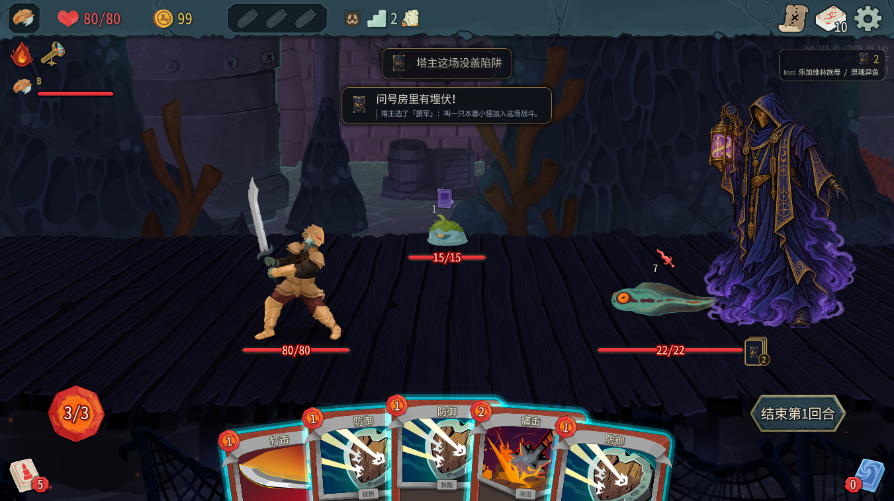

## 大怪、动画、冷读档

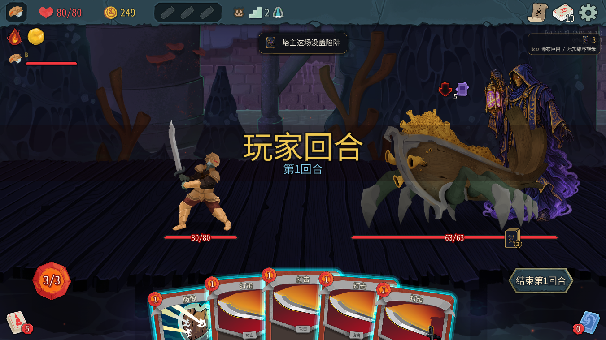

幽灵船船身在塔主前面，塔主仍可见，未挡血条/意图。第一场 A 截图有测试助手之前打开未关闭的原版详情遮盖，所以没有用作干净图层证据；下一场已通过接口关闭。未完成 Boss、大怪完整举灯/推灯全动作的真实鼠标验收。

冷读档前：22 张牌（包括额外行动牌与陷阱牌），21 召唤点、2 场，迷雾香炉。两测试实例回菜单、退出并完全重启后，多人读档：牌组 key 顺序一致、21 点/2 场一致，两端 Player.Relics 仍含迷雾香炉，未重复奖励。下一场动画 6 部件、托盘正常，后续盖硬化+空陷阱，硬化触发，正常胜利。

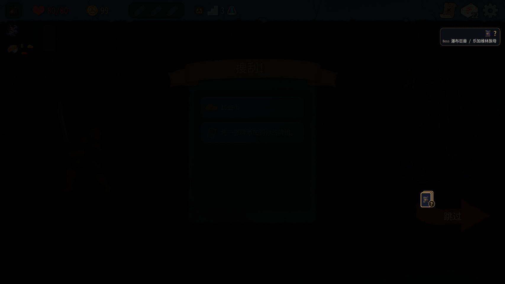
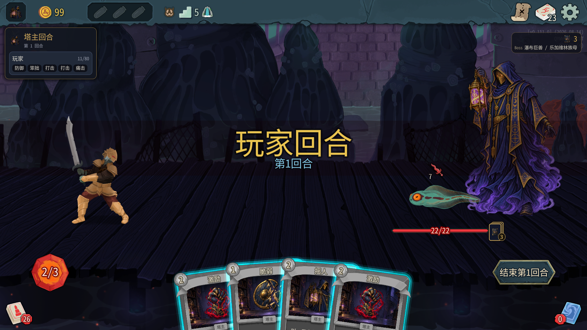
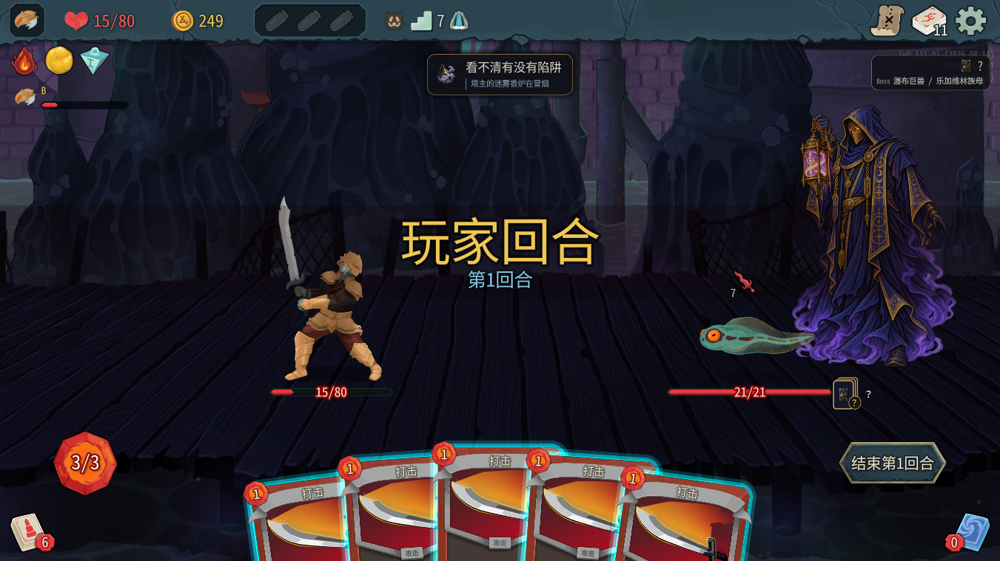

动画原文摘录：

```text
[22:48:05.438] INFO 塔主动画：骨架搭好（6 个部件）
[22:48:05.396] INFO 塔主动画：骨架搭好（6 个部件）
[22:56:35.984] INFO 塔主动画：骨架搭好（6 个部件）
[22:56:36.400] INFO 塔主动画：骨架搭好（6 个部件）
```

## 正常战斗和伏击

全部沿地图投票进房；没有 room/fight/win，没有给 B 增能量或抽牌。A 用 tm_master_grant 添加所测牌，需要时 draw 8 抽到目标牌；另为受伤治疗样本添加多份治疗。第一场为分回合验证各减益主动拖长至 10 回合，不用于平衡数据。

第一局种子 14432072072771538905：幽灵船（10 回合）、蟾蜍蝌蚪+摇人小怪（3 回合），冷读档后另打蟾蜍蝌蚪及硬化/空陷阱场，均自然胜利。第二局种子 17221775724631865685：援军场 3 回合，之后普通战 2 回合，均正常结束、奖励可关闭，B 最后 75/80。

伏击援军由 tm_master_ambush 在普通战强制显示用于补测，并非自然问号样本。两端新增 LeafSlimeS 15 生命一致，胜利正常，但特效未接入，见待修项。

最后一次战斗中接口原文：

```text
B/map/vote: invalid_phase：还在战斗中，打完再投票（问号房也可能是战斗）
B/combat/play: invalid_phase：塔主回合中，玩家出牌暂停，等塔主结束再出
B/combat/end_turn: invalid_phase：塔主回合中，玩家出牌暂停，等塔主结束再出
```

胜利后 /rewards/proceed 返回 proceeded=true；投票进入自然问号事件「装瓶/攀爬」。第一局的问号事件也没有战斗。未遇到「我能打两个」等事件战，日志中没有本轮可摘录的「父事件→事件战，不伏击」样本。

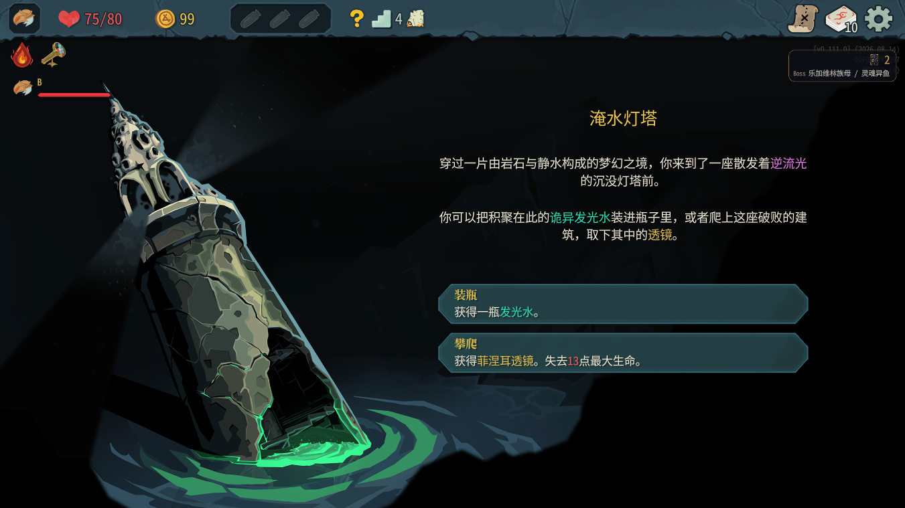

## 日志审计

| 范围 | A 摘要 | B 摘要 | 逐行相同 | TowerMaster ERROR | TowerMaster WARN | 两端 StateDivergence |
|---|---:|---:|---|---:|---:|---:|
| 首次启动、重启前 | 42 | 42 | 是 | 0 | 0 | 0 |
| 冷重启后到收尾 | 42 | 42 | 是 | 0 | A 1 / B 0 | 0 |

唯一 WARN 是测试助手尝试在标准模式设置固定种子，原版不支持；放弃该大厅并正常新建，没有据此修改游戏代码或强行设置种子。错误原文及堆栈全部如下：

```text
[23:04:42.877] WARN 测试接口 /reflect：System.NotImplementedException: Seed should not be changed in standard mode!

   at MegaCrit.Sts2.Core.Nodes.Screens.CharacterSelect.NCharacterSelectScreen.SeedChanged()

   at MegaCrit.Sts2.Core.Multiplayer.Game.Lobby.StartRunLobby.SetSeed(String seed)

   at System.RuntimeMethodHandle.InvokeMethod(Object target, Void** arguments, Signature sig, Boolean isConstructor)

   at System.Reflection.MethodBaseInvoker.InvokeDirectByRefWithFewArgs(Object obj, Span`1 copyOfArgs, BindingFlags invokeAttr)
```

没有做平衡结论。真实鼠标项目待用户允许后补测；事件战与自然问号战斗仍需真实样本。原始日志、反编译源码、游戏资源未提交。

