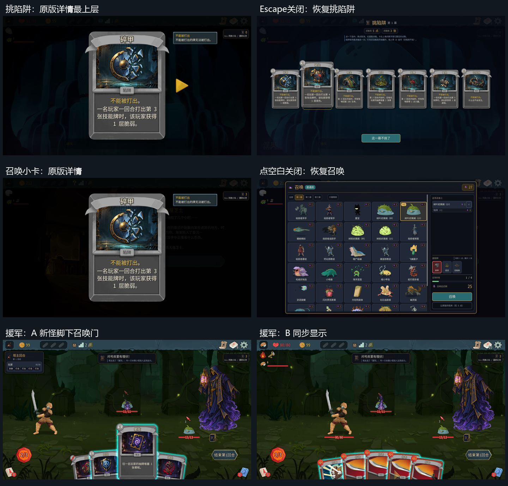
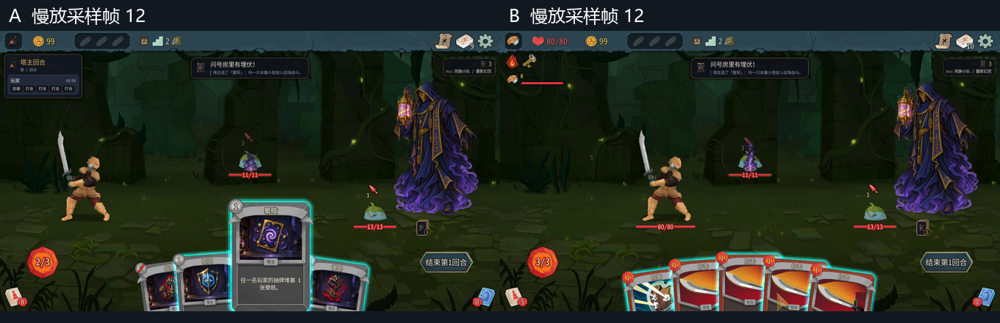

# 0.0.52 验收记录



测试版本 `claude/optimistic-rubin-hr3eit` / `c7bf211`，manifest **0.0.52**；游戏 v0.111.0。测试日期2026-10-10。只操作测试 A=100001（房主/塔主）和 B=100002（爬塔），川换皮禁用；不改mod代码、不做平衡结论。

## 安装与启动

- 编译安装成功，测试实际 **109 通过**（核心49 + mod60），0失败。首次把游戏构建参数同时传给测试项目，出现缺少 Harmony 的构建错误；使用正常测试构建后全部通过。此为测试调用问题，未改代码。
- 安装 `TowerMaster.json` 的version为0.0.52。仓库和安装目录 `towermaster.test.json` SHA256一致：`CE7D223D1626984CFD04F2F8E54D0CF4819EC3B6BDEB2B783F4866E23D169301`；master_cards=true，master_turn=true。
- 第一次启动期间，测试脚本仅以桥接接口可响应为就绪依据，过早调用 ReturnToMainMenu，取消启动流程；A出现用户截图的启动致命错误。游戏日志原文：

```text
[ERROR] Encountered error on game startup! Attempting to show error dialog
   at MegaCrit.Sts2.Core.Nodes.NGame.GameStartupError()
   at MegaCrit.Sts2.Core.Nodes.NGame.GameStartupWrapper()
   at System.Threading.Tasks.Task.TrySetCanceled(CancellationToken tokenToRecord, Object cancellationException)
   at MegaCrit.Sts2.Core.Nodes.NGame.GameStartup()
```

以上为堆栈关键帧摘录，完整日志仅留本地。只重启测试A/B后，改为等待 NMainMenu 已出现且启动动画结束，再开局，之后启动正常。不能把该错误列成mod启动缺陷。

## 右键详情与界面恢复

| 项目 | 操作与结果 | 证据 |
| --- | --- | --- |
| 挑陷阱详情最上层 | 真实鼠标右键碎甲，原版详情可见，挑陷阱面板暂时隐藏 | [详情](screenshots/ui052-draft-inspect-top.png) |
| 左右翻页 | 点击右箭头到破绽、左箭头回碎甲，均在同组陷阱中翻页 | [返回碎甲](screenshots/ui052-draft-inspect-flip-left.png) |
| Escape恢复 | 详情关闭动画结束后，原挑陷阱页恢复，选择仍为空 | [恢复](screenshots/ui052-draft-restored-escape.png) |
| 空白关闭 | 再次打开详情，真实点击卡外空白，原面板恢复 | [恢复](screenshots/ui052-draft-restored-blank.png) |
| 悬停/选择/取消/确认 | 卡能放大；左键选择碎甲→再次点取消；选择三张后真实鼠标点确认，进入召唤 | [选中](screenshots/ui052-draft-selected-after-inspect.png) |
| 召唤小卡详情 | 第四场真实右键碎甲、泥沼，原版详情最上层，召唤面板隐藏 | [详情](screenshots/ui052-summon-inspect-top.png) |
| 召唤小卡关闭 | Escape与卡外空白分别关闭；怪物/陷阱选择和账单保留；真实点召唤进入下一战并胜利 | [Escape](screenshots/ui052-summon-restored-escape.png) / [空白](screenshots/ui052-summon-restored-blank.png) |

**尚有结构差别：召唤小卡详情只有当前一张，没有左右翻页箭头。** `mod/TowerMaster/SummonPanel.cs:504` 传给 RightClickInspect 的是 `[model]` 单元素列表，和挑陷阱页的全候选列表不同。若“同上”要求召唤详情也能翻看所有陷阱，这项尚未满足。

测试中一次空白点击被工具因检测到用户输入而拒绝，未执行；刷新窗口后重新打开详情并完成实际空白点击。未把被拒绝的操作计为通过。另一处右键卡面未打开详情时先按Escape，确实打开了背后的原版暂停菜单；关闭暂停后改点标题，确认原版详情已打开再按Escape，恢复正常。这个样本不能算“Escape从详情穿透”，但右键命中区域可留意。

## 伏击·援军召唤门

用 `tm_master_ambush` 在第一场普通战强制弹伏击，选援军。原怪 LeafSlimeS 13生命，新增 LeafSlimeS 11生命；两端均出现。召唤门在新增小怪脚下，采样时可同时看到塔主举灯、提示及紫色门。新怪可正常击杀，战斗正常胜利。

为了观察动画，把两端 Engine.TimeScale临时设0.15，采样后恢复1；没有给B加能量或抽牌。截图不是逐帧视频，不能证明毫秒级时差；采样足以确认出手动画与门在同一段演出中、门没有播在原怪身上。



[慢放采样GIF](screenshots/ui052-portal-preview.gif)，[A原尺寸](screenshots/ui052-ambush-portal-A-12.png)，[B原尺寸](screenshots/ui052-ambush-portal-B-12.png)。

## 0.0.51 黑屏复现与对照

上一轮步骤保留：种子9612529536296654772 / Overgrowth，A先古选寻龙尺→第一场挑陷阱右键详情被遮挡→Escape→选倒计时/硬化/空陷阱→鼠标确认→接口召唤LeafSlimeS；两端黑屏数分钟、接口仍响应、无StateDivergence。详见 ui-051-result.md。

| 本轮条件 | 种子与步骤 | 结果 |
| --- | --- | --- |
| 只右键详情 | 931252337213971606 / Overgrowth；A营养牡蛎；挑陷阱真实右键、翻页、Escape/空白关闭，确认后召唤LeafSlimeS | 正常进战；连续4胜，经过商店和2个问号事件 |
| 只寻龙尺 | 2035611953529161088 / Underdocks；A寻龙尺，接口挑倒计时/再生/空陷阱，不打开详情，召唤Toadpole | 正常进战，2回合胜利 |
| 寻龙尺 + 右键 + Escape | 5899812763015331093 / Underdocks；A寻龙尺；第一场挑陷阱从标题真实右键倒计时，详情可见；Escape关闭；挑倒计时/硬化/空陷阱，真实鼠标点确认；召唤Toadpole | 正常进战，2回合胜利，未复现黑屏 |

两组寻龙尺样本中，获取祝福后牌组能查到“探寻”，确认陷阱并替换牌组后不再有它。不同种子/不同第一幕，不能据这两例证明上一轮特定种子永不复现；本轮没有强行修改标准模式种子。

[组合详情](screenshots/ui052-combined-inspect-title.png)，[Escape后](screenshots/ui052-combined-restored-valid.png)，[组合进战A](screenshots/ui052-combined-entered-A.png) / [B](screenshots/ui052-combined-entered-B.png)，[只寻龙尺进战A](screenshots/ui052-only-dowsing-entered-A.png) / [B](screenshots/ui052-only-dowsing-entered-B.png)。

只读定位和签名已经单独整理：[先古祝福与黑屏等待链](game-api/ancients-052-flow.md)。结论是：离开事件房的 Task.WhenAll、多人同步TCS、Tween Finished等待都有停住的可能；探寻删除本身没有await，第一场普通战不执行它的Unknown任务变牌，尚无证据认定它是根因。详情改ScreenContext/输入阻挡与快捷键，不设置全局游戏暂停。没有改游戏或mod实现。

签名按命名空间分五个 `.ancients-052.md` 文件：Events（EventOption等）、Models（EventModel/AncientEventModel）、Models.Events（Neow）、Nodes.Rooms（NEventRoom）、Nodes.Events（NAncientEventLayout及其继承按钮逻辑）。只导出声明和元数据，不含方法体或反编译源码文件。

## 正常回归与日志

第一局沿地图：古人→普通战(3,1)→普通战(2,2)→商店(2,3)→普通战(1,4)→问号(2,5)→问号(3,6)→普通战(3,7)。召唤、塔主加固出牌、原版结束回合、B出牌、奖励、陷阱埋下及未触发10金币奖励均经过。首三场受开局保护；第四场盖碎甲，没触发，B金币202→212。问号为水中剑/满屋芝士类事件，各端正常选择并继续。[商店A](screenshots/ui052-shop-A.png) / [B](screenshots/ui052-shop-B.png)，[问号A](screenshots/ui052-unknown-A.png) / [B](screenshots/ui052-unknown-B.png)。

随后两组寻龙尺各完成一场，共 **6场胜利**。B使用正常手牌与能量，通过tm_play/tm_end_turn打完；未使用room/fight/win、未加B能量或抽牌。回归敌人选低费普通怪，结果不用于胜率或平衡结论。

| 范围 | A | B |
| --- | --- | --- |
| 动作摘要（重启后的同一进程会话，含对照新局） | 39 | 39 |
| TowerMaster ERROR | 0 | 0 |
| TowerMaster WARN | 0 | 0 |
| 游戏 ERROR | 0 | 0 |
| 游戏 WARN | 643 | 392 |
| 游戏 StateDivergence | 0 | 0 |

`tm_compare_logs(keywords=[动作摘要])`：equal=true，diffs=[]。两端39条逐行一致；TowerMaster ERROR/WARN没有原文可列（均0）。上述游戏WARN按包含WARN的日志行计数，包含启动横幅及其他mod，不等于TowerMaster警告；大量为反复新局触发的 Asset not cached 和原版 Warning。第一次已退出的启动错误独立记录，不混入正常回归统计。

摘录关键摘要（两端相同）：

```text
INFO 动作摘要 #5 threat:trap_info｜层2 回合1/Player 敌[LeafSlimeS:13/13b0] 玩家[100001:0/91b0 g99 k12 e0 h0 d12 x0 100002:80/80b0 g99 k10 e3 h5 d5 x0]
INFO 动作摘要 #8 threat:ambush｜层2 回合1/Player 敌[LeafSlimeS:13/13b0 LeafSlimeS:11/11b0] 玩家[100001:1/91b0 g99 k12 e2 h4 d5 x0 100002:80/80b0 g99 k10 e3 h5 d5 x0]
INFO 动作摘要 #26 threat:trap_info｜层3 回合1/Player 敌[LeafSlimeS:11/11b0] 玩家[100001:0/91b0 g99 k12 e0 h0 d12 x0 100002:80/80b0 g99 k10 e3 h5 d5 x0]
INFO 动作摘要 #41 threat:trap_info｜层5 回合1/Player 敌[LeafSlimeS:15/15b0] 玩家[100001:0/91b0 g99 k12 e0 h0 d12 x0 100002:80/80b0 g99 k10 e3 h5 d5 x0]
INFO 动作摘要 #65 threat:trap_info｜层8 回合1/Player 敌[LeafSlimeS:14/14b0] 玩家[100001:0/91b0 g212 k12 e0 h0 d12 x0 100002:59/80b0 g202 k10 e3 h5 d5 x0]
INFO 动作摘要 #71 threat:trap_dodge｜层8 回合1/Player 敌[] 玩家[100001:92/92b0 g212 k12 e2 h0 d0 x0 100002:66/81b0 g212 k10 e0 h0 d0 x0]
INFO 动作摘要 #5 threat:trap_info｜层2 回合1/Player 敌[Toadpole:24/24b0] 玩家[100001:0/80b0 g99 k12 e0 h0 d12 x0 100002:80/80b0 g99 k10 e3 h5 d5 x0]
INFO 动作摘要 #5 threat:trap_info｜层2 回合1/Player 敌[Toadpole:21/21b0] 玩家[100001:0/80b0 g99 k12 e0 h0 d12 x0 100002:80/80b0 g99 k10 e3 h5 d5 x0]
```

本轮发现/限制：召唤小卡详情无法左右翻组内牌；右键命中卡面时有一次未打开，标题处可打开；上轮黑屏未复现。未进行源码修改。截图与报告、签名提交；原始日志和本地调试记录不提交。完成后关闭本轮测试A/B，不操作用户自己的游戏。
