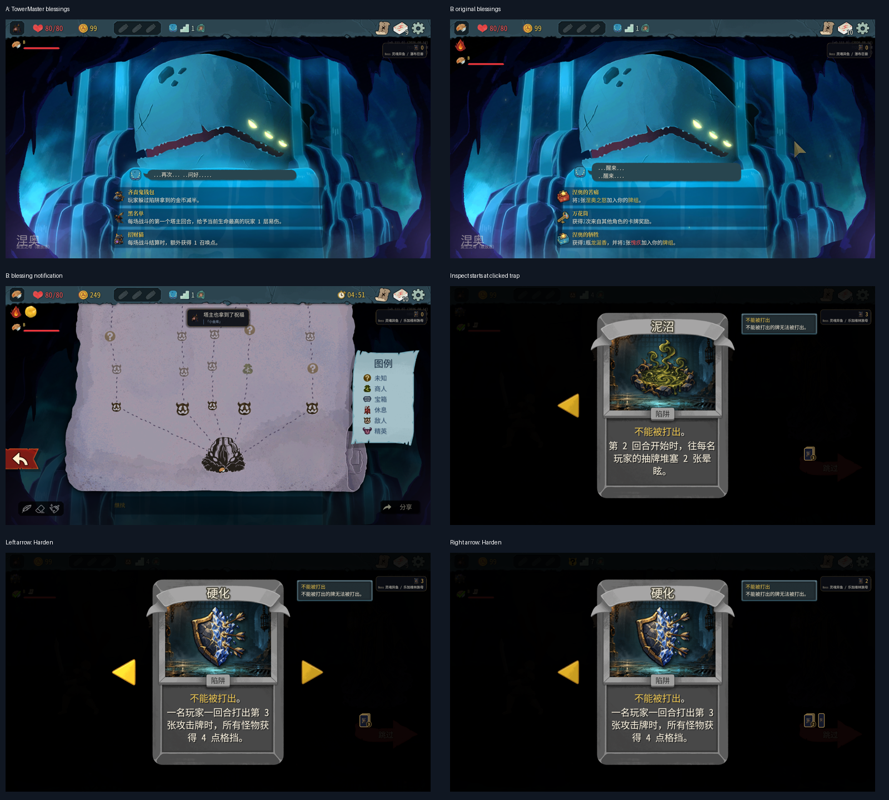
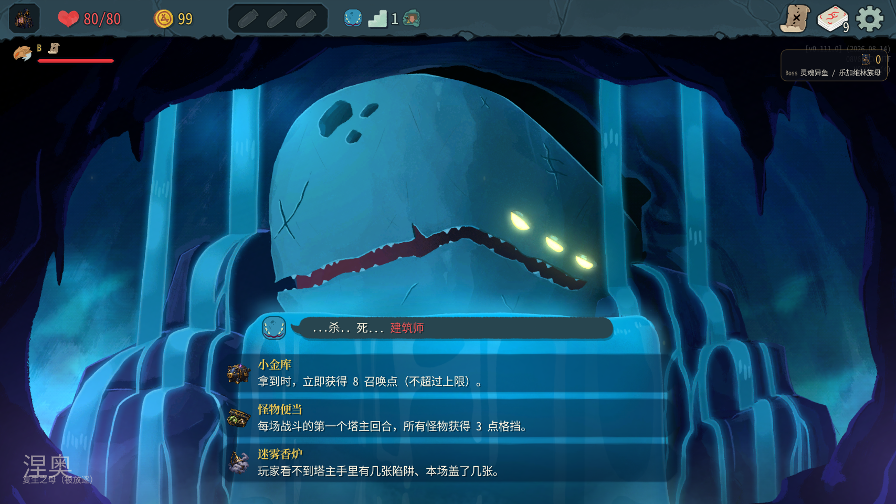
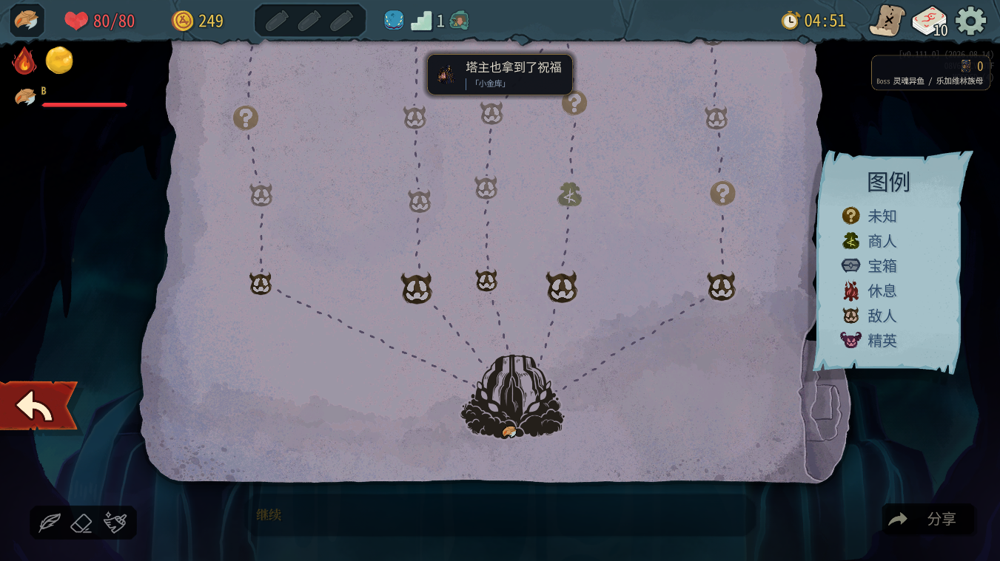
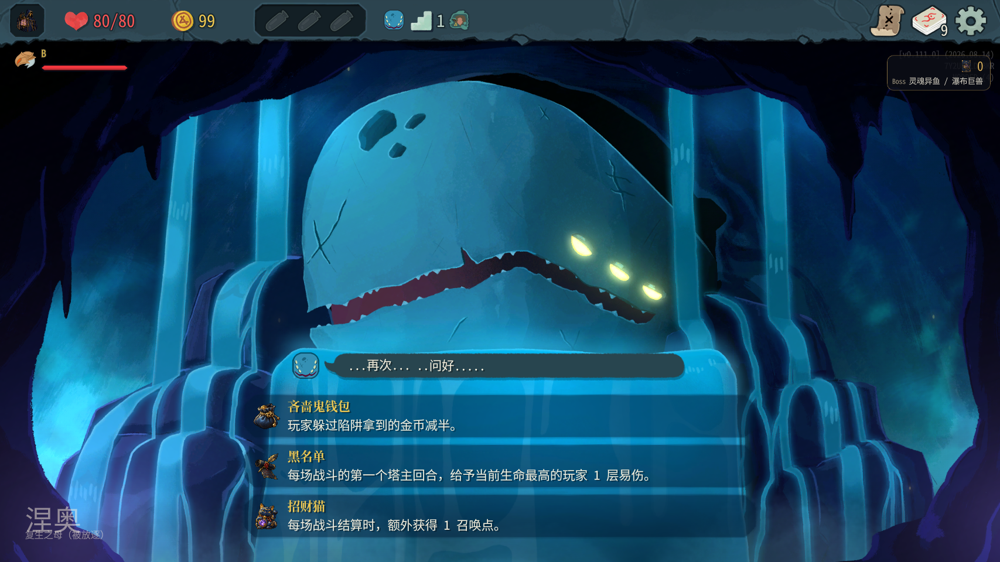
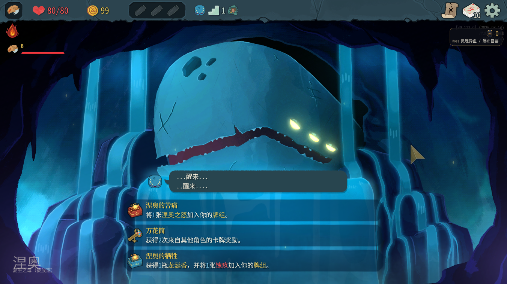
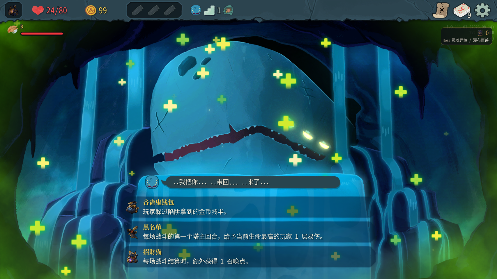
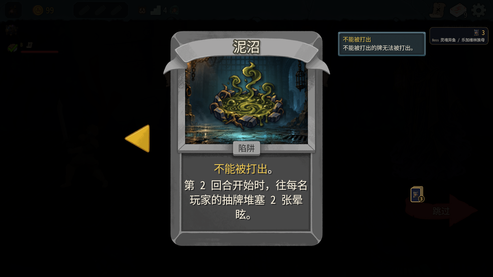
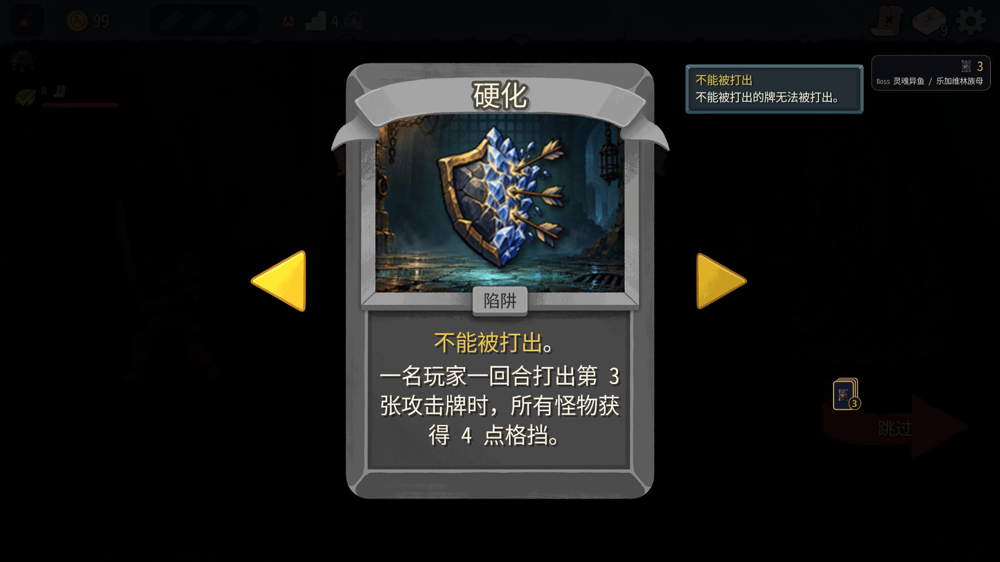
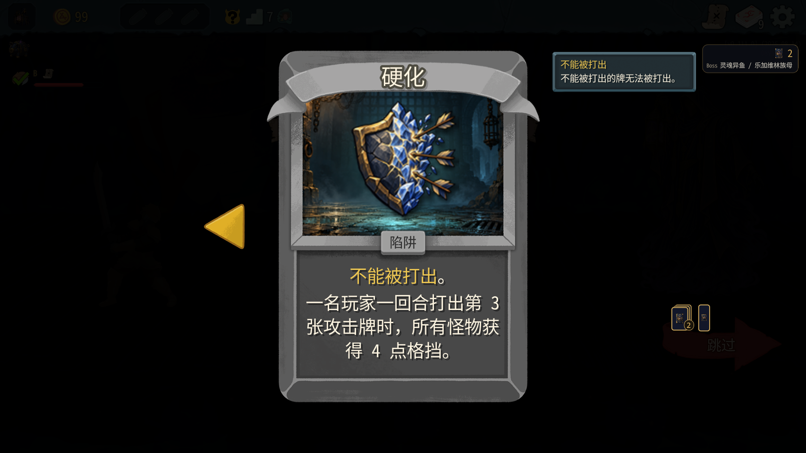
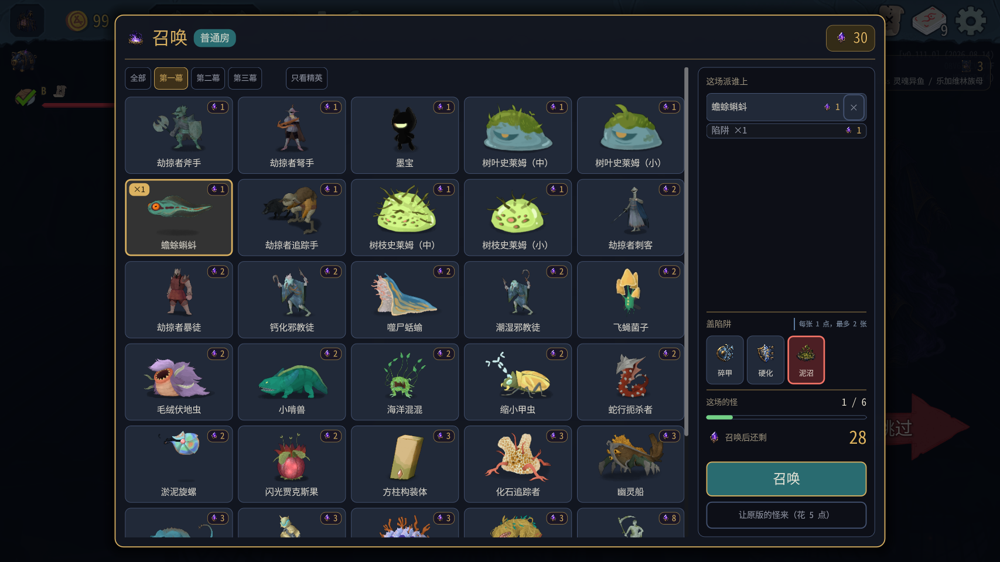

# 0.0.53 验收记录



版本 `claude/optimistic-rubin-hr3eit`，提交 `2d4e2e0`，manifest **0.0.53**。2026-10-10，游戏 v0.111.0。只操作测试 A=100001（塔主/房主）和 B=100002；川换皮保持禁用，没有操作用户游戏。未改 mod 代码，不做平衡结论。

## 安装与启动

编译安装成功，0警告、0错误；实际测试 **109通过**（核心49、mod60），0失败。安装目录使用仓库 towermaster.test.json，SHA256 一致：`CE7D223D1626984CFD04F2F8E54D0CF4819EC3B6BDEB2B783F4866E23D169301`，master_cards=true、master_turn=true。等待两端 NMainMenu 可见后才开始操作，启动正常。

```text
A [01:52:53.493] INFO 塔主先古祝福：已挂到 9 个古人（Darv、DeprecatedAncientEvent、Neow、Nonupeipe、Orobas、Pael、Tanx、Tezcatara、Vakuu）
B [01:52:53.496] INFO 塔主先古祝福：已挂到 9 个古人（Darv、DeprecatedAncientEvent、Neow、Nonupeipe、Orobas、Pael、Tanx、Tezcatara、Vakuu）
```

## 第一幕先古祝福

主样本 seed=16014750781473045132，Underdocks。A 的三个选项为小金库、怪物便当、迷雾香炉，中文名字、说明和独立图标正常，没有本地化 key、空白或 Broken Card。

```text
A [01:53:14.678] INFO 塔主先古祝福：Neow，第 1 幕，塔主的选项换成 小金库、怪物便当、迷雾香炉
B [01:53:14.557] INFO 塔主先古祝福：Neow，第 1 幕，塔主的选项换成 小金库、怪物便当、迷雾香炉
A [01:58:02.456] INFO 塔主先古祝福：塔主选了「小金库」
A [01:58:02.463] INFO 塔主账本：小金库，召唤点 +8（想加 8），现在 20
B [01:58:02.540] INFO 塔主先古祝福：塔主选了「小金库」
```

真实鼠标悬停小金库，按钮高亮，页面说明可读；没有看到额外独立悬停说明框，故不把独立提示框列为通过。其余两个选项没有逐个真实悬停。真实鼠标点小金库后，两端反射 Player.Relics 都出现 TowerMasterRelicPiggyBank。账本12→20，恰好+8；未测试接近上限时的截断。A 页面变成继续，B 出现“塔主也拿到了祝福／小金库”，可正常走地图、挑陷阱、召唤并进入战斗，无黑屏。




主样本 B 用接口选择原版金色珍珠。为补拍未选择时的完整原版选项，另开 seed=1951654896615604423：A 为吝啬鬼钱包、黑名单、招财猫；B 为涅奥的苦痛、万花筒、涅奥的牺牲。两端保留不同的身份选项，均是中文。




## 读档

- 选完小金库、停在先古房间：回主菜单，退出两个已确认 clientId 的测试进程，重开并多人读档。两端仍有小金库，召唤点20、战斗0；先古房间已完成，不再重复选择或加8。可以直接地图投票进入第一场。
- 6场胜利及宝箱后，同进程回菜单读档：两端仍有小金库；召唤点30、战斗6、B生命57，与退出前一致。宝箱奖励选择已跳过，读档未重复获得遗物。
- 第二个新局停在尚未选择的先古房间，同进程读档：A/B 三个选项文字和顺序各自保持一致。
- **未覆盖**：第二幕先古之民排除已拥有遗物；未选择先古选项时的完全重启读档。主样本只到第一幕第9层。




## 陷阱小卡原版详情

第4场召唤前，选中一只蟾蜍蝌蚪和泥沼。真实右键泥沼小卡，原版 NInspectCardScreen 在最上层显示对应的泥沼；左箭头翻到硬化。Escape 关闭后召唤面板恢复，接口读到 monsters=[Toadpole]、traps=[2]，选择保留，确认召唤成功。

下一次召唤前，真实右键碎甲，初始详情为碎甲；右箭头翻到硬化，Escape 关闭后继续召唤和战斗成功。因此召唤小卡能在同组左右翻看，不再只有单张。






**未覆盖**：每幕挑陷阱页“手里已有”的小卡右键与翻页。第一幕开局手里为空；没有进入第二幕，不以召唤面板的成功替代此项。

## 战斗与跑图回归

全部沿地图投票进房间，未用 room/fight/win。B 使用正常能量和抽牌，以接口逐张出牌并等待实际执行后再出下一张；没有 energy/draw 或自动加点。塔主通过原版手牌接口结束先手，测试实际打出治疗和虚弱。第2场误给虚弱指定怪物目标，接口返回 played=false；改为对玩家指定目标后可正常打出，此为测试调用问题。

| 样本 | 房间/阵容 | 胜利回合 | B战后生命 | 累计动作摘要 A/B |
|---|---|---:|---:|---:|
| 1 | 普通，两只蟾蜍蝌蚪 | 4 | 69 | 12/12 |
| 2 | 普通，一只蟾蜍蝌蚪 | 2 | 73 | 18/18 |
| 3 | 普通，一只蟾蜍蝌蚪，塔主治疗 | 2 | 72 | 24/24 |
| 4 | 普通，一只蟾蜍蝌蚪，泥沼，塔主虚弱 | 4 | 71 | 36/36 |
| 5 | 问号自然战斗，下水道蚌 | 5 | 58 | 48/48 |
| 6 | 普通，一只蟾蜍蝌蚪，硬化 | 2 | 57 | 56/56 |

每场 tm_compare_logs 的动作摘要比较均一致。商店可正常离开；自然问号战斗、宝箱及奖励流程正常。泥沼在第2回合触发，硬化在一回合第3张攻击后触发；未影响回合结束或胜利。宝箱候选为三张塔主遗物牌，本轮跳过。

```text
A [02:07:16.524] INFO 塔主陷阱：泥沼 触发（第 2 回合开始时，往每名玩家的抽牌堆塞 2 张晕眩。）
A [02:07:16.541] INFO 塔主回合 #25 第2回合：陷阱 mire@1 触发，数值 2
```

最终包含读档/新局操作，两端各 **59条动作摘要，逐行比较一致**。这不是胜率或平衡性样本。

## 黑屏与日志

**黑屏未出现**，未触发采集 ActionExecutor、pendingOptionTasks、同步TCS、Tween和房间栈的异常分支。选项文字正常，无需本轮追加 RelicOption 本地化来源调研。

统计两个测试进程周期的日志，原始文件仅留本地，未提交：

| 来源 | A ERROR | A WARN | B ERROR | B WARN | StateDivergence A/B |
|---|---:|---:|---:|---:|---:|
| TowerMaster | 0 | 0 | 0 | 0 | 0/0 |
| 游戏日志 | 0 | 260 | 0 | 106 | 0/0 |

TowerMaster ERROR/WARN 原文列表：**空（0条）**。游戏 WARN 主要为 Asset not cached、Packet writer growing 等；不能把这些算成 TowerMaster WARN，也不能声称游戏完全无警告。例：

```text
[WARN] Asset not cached: res://images/ui/top_panel/character_icon_ironclad_outline.png
[WARN] Warning: Packet writer is growing from 1024 bytes to 2048 bytes!
```

本轮功能操作和截图主要通过MCP；真实鼠标只用于祝福悬停/选择和陷阱右键详情/翻页/关闭。未提交反编译源码、原始日志或游戏资源。

测试结束后仅关闭已核对身份的测试 A/B（PID 25844、23832），用户游戏未触碰。完整重启读档时立即截的两张图落在淡入过渡帧，未用作验收证据或提交；后续挑陷阱/召唤/战斗证明流程恢复，不能将这两帧称为卡死黑屏。
