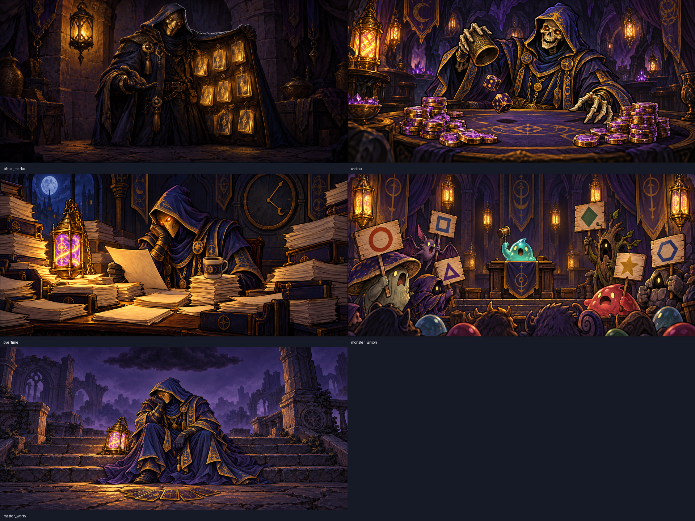
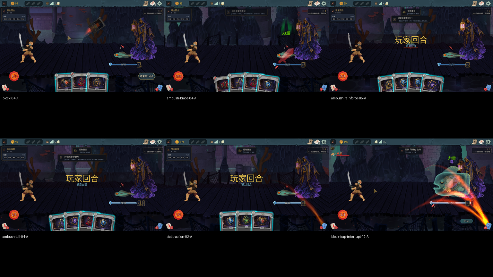
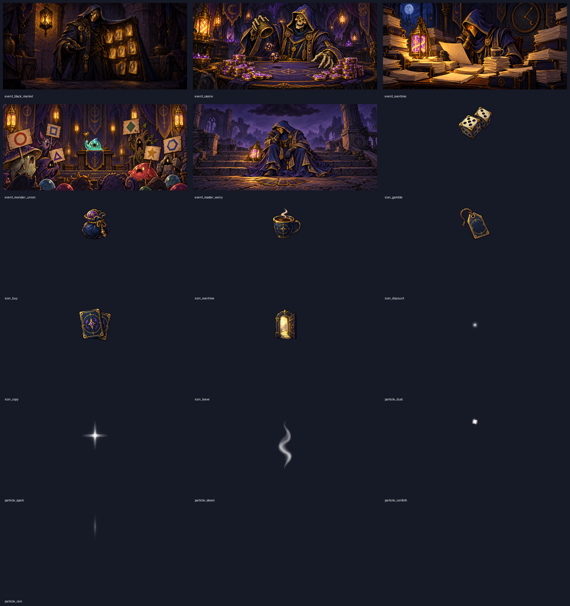

# 0.0.55 界面、动画与事件美术验收





## 环境与结果范围

2026-10-10；分支 claude/optimistic-rubin-hr3eit，6ba6645，manifest 0.0.55，游戏 v0.111.0。编译/安装成功，**109 项测试通过（core49 + mod60）**，0 warning/0 error。A=100001 房主/塔主，B=100002 爬塔；仅使用测试实例。两端共用本轮安装；仓库与安装 towermaster.test.json SHA256 都为 `CE7D223D1626984CFD04F2F8E54D0CF4819EC3B6BDEB2B783F4866E23D169301`，master_cards=true。游戏日志：`[INFO] Skipping loading mod liuchuan, it is set to disabled in settings`。

不改模组代码；只提交新生成美术、截图/GIF、报告、只读调研与方法签名。没有提交原始日志、反编译源码、游戏资源。功能调用/截图使用 MCP；本轮未执行真实鼠标项目，不冒称鼠标通过。

## 1. 去掉整张塔主闪光

普通战依次测试加固、伏兵、援军、买路钱。tm_master_ambush 强制三选一（对应 index1/0/2）；效果在两端执行，动作摘要一致。连续截图原帧仅本地留存，仓库提交GIF及关键帧。各动作连续截图中未发现整张立绘紫色闪烁或整体放大。灯笼的局部暖光仍存在，是骨骼灯部件的局部 modulate。Boss 场景两端额外读取 MasterPresence._figure：Scale=(1,1)，Modulate=(.8,.8,.92,.85)，不是动作期间把整张图放大。

|记录|A/B连续截图与GIF|
|---|---|
|加固（举灯）|ui055-block-00…23-A/B；[GIF](screenshots/ui055-animation-block.gif)|
|伏兵（举灯+盾）|ui055-ambush-brace-00…11-A/B；[GIF](screenshots/ui055-animation-ambush-brace.gif)|
|援军（新增小怪）|ui055-ambush-reinforce-00…11-A/B；[GIF](screenshots/ui055-animation-ambush-reinforce.gif)|
|买路钱（推灯）|ui055-ambush-toll-00…11-A/B；[GIF](screenshots/ui055-animation-ambush-toll.gif)|
|静态降级|[GIF](screenshots/ui055-animation-static-action.gif)|
|加固后翻开鼓舞|[GIF](screenshots/ui055-animation-block-trap-interrupt.gif)|

慢放采样临时把两端 TimeScale 设 .15，每组结束恢复1；GIF 是采样记录，不是原速录像。用户原话：「刚才游戏有明显掉帧卡顿 貌似是动画的问题」，解释临时慢放后用户确认：「原来是你降低了速度 难怪」「那应该没事」。这次反馈不作为已证实的动画性能缺陷；也未做 FPS 基准或宣称无性能问题。

### 打断特效与静态立绘

第一幕 Boss 测试：加固出牌后，测试接口调用 `TrapPhase.RoundStarted(3)` 强制提前触发鼓舞，随后结束塔主回合让 deferred trap 执行，连续截图。**这是强制时机测试，不是自然第三回合样本**。两端出现加固护盾特效、鼓舞力量及推灯动作；/traps fired_count=1，unfired空；摘要61/61一致。未看到 preceding shield 丢失。截图 ui055-block-trap-interrupt-12-A/B。

静态降级：仅临时移走安装 art 的六张 rig PNG，清理两端 Art.Cache 使下一间新房实际重新读图，普通战加固，立绘没有紫闪/整体放大。预期 WARN「缺部件图 rig_smoke.png，用静态立绘」。finally 已还原六张文件并再次清理贴图缓存；新战日志重新「骨架搭好（6 个部件）」。没有改 rig JSON、动画参数或代码。

自然补测：新局第四场盖泥沼+空陷阱，第1回合只防御后结束，第二回合泥沼自然触发，/traps fired_count=1、unfired仅bluff；[埋牌GIF](screenshots/ui055-animation-bury.gif)、ui055-mire-natural-A/B.png。随后正常打赢，B78/80，空陷阱不发躲过金币。慢放开场后第一次结束回合早于塔主手牌就绪，B调用被invalid_phase拒绝；等待active=true再次结束后正常，未重复入队出牌。

## 2. 第二幕补测

第一局种子2331385014037370271，从先古之民沿地图走过普通战、问号事件、宝箱、篝火，打到灵魂异鱼 Boss。7场普通战胜利（其中1场静态降级），Boss按正常3能量/正常抽牌、读取攻击意图做防守；第9回合自然阵亡，Boss剩108/211。**未进第二幕**，第二幕古人排除已有遗物、第二幕已有陷阱小卡真实右键翻页均未覆盖。未使用 room/fight/win、给玩家加能量或抽牌；不作胜率/平衡结论。

Boss初次调用取牌早于手牌就绪，发生空手误结束和随后 invalid_phase；已停止并读档重试，第二次等待手牌及阶段就绪再操作。故首次试打不作为规则/平衡样本。invalid_phase 拒绝未就绪玩家出牌符合保护设计。

额度恢复后重启：原测试游戏已不在进程列表；重新启动 A PID31528、B PID5468。上一局已阵亡，StartLoad 弹「失效存档」，B随后连接超时；没有把已结束局当成冷读档成功。新开种子6474695620929300045（Overgrowth），正常选魔术师礼帽，继续普通战；下面同步统计按进程/新局分开。

## 3. 事件只读调研

见 [events-054-flow.md](game-api/events-054-flow.md)，附6个命名空间的元数据签名，已核对游戏 DLL SHA256。覆盖共享/独立事件、选项序号同步、LocString与合并 events 表、多页完成、配图尺寸与本地显示替换、原版粒子数字、事件战等待所有玩家到齐的风险。重点：8种共享事件不宜只换塔主选项；5种事件战模型应跳过首版镜像，防止B等待塔主 ReadyToEnterCombat。

## 4. 新美术（16张）

5张event_*：2560×1200 RGB、不透明、原版默认 Portrait 比例32:15。6张icon_*：128×128 RGBA；5张particle_*：32²/48²/64²/24²/8×32 RGBA。脚本检查11张透明素材均有alpha、四角alpha=0；5张场景不透明。使用 imagegen，以塔主立绘作风格参考，暗紫/深蓝、暖金提灯，无文字。咖啡杯初稿偏下，经 imagegen 局部重绘提高杯口至约(61%,57%)，随后重新安装/预览。



## 5. 动效预览

tm_master_event_preview 五种均返回 art=true、ambience=true；先按原版逻辑尺寸2560×1200测试，再1280×600（同32:15）完整构图补拍20帧/200ms GIF，4秒。截图输出1707×960，从实际画面缩放坐标裁取配图，不能把逻辑1920×1080直接当截图像素。每种之后close=true。原版配图逻辑比屏幕大，原尺寸裁切是布局特性，不是少画。

|场景|预览|观感/建议（未改代码）|
|---|---|---|
|黑市|[GIF](screenshots/ui055-ambience-black_market.gif)|灰尘十分微弱，比原版大范围光尘更弱；若需要提高可读性，先提高dust图在纹理中的占比，不提高发射数量。|
|赌场|[GIF](screenshots/ui055-ambience-casino.gif)|星光/紫尘微弱，数量与原版几组sparkle相近、alpha更低；不抢主体，筹码主体在中下发射区。|
|加班|[GIF](screenshots/ui055-ambience-overtime.gif)|热气轻，杯口重绘后对准区；蒸汽5/.18 alpha比原版水滴/大覆盖更弱。|
|工会|[GIF](screenshots/ui055-ambience-monster_union.gif)|彩纸7粒、10秒、10–18px/s、alpha.32，比原版feathers13粒+重力130更慢更弱；顶部发射。|
|烦恼|[GIF](screenshots/ui055-ambience-master_worry.gif)|细雨9、1.6秒、70–90px/s、alpha.28，雨下在乌云区域，略偏很淡；相对原版水滴10/重力98更克制。|

粒子视觉强弱是观感判断，不是单凭数量量化；没有闪屏。新图小尺寸透明留白较多，粒子本身很小，属于可见度偏弱而非廉价爆闪，建议Claude在实际事件接线后按截图评估是否把粒子图主体占比稍增。原版参数表含来源场景行号，见调研。

## 6. 同步与异常

旧局：每次普通战结束均逐行比较「动作摘要」一致；最后Boss读档重置日志区间内摘要22/22一致，StateDivergence两端0。读档之前的最长连续区间68/68一致；不把重叠采样数量相加。新局重启后4场普通战摘要32/32逐行一致，两端StateDivergence=0、TowerMaster ERROR/WARN=0。TowerMaster ERROR 为0。WARN全部原文/堆栈如下；测试接口反射失败与刻意缺图降级分别标记，不冒充业务故障。

### A

```text
[02:27:49.586] WARN 测试接口 /reflect：System.InvalidOperationException: Late bound operations cannot be performed on types or methods for which ContainsGenericParameters is true.
   at System.Reflection.RuntimeMethodInfo.ThrowNoInvokeException()
   at System.Reflection.RuntimeMethodInfo.Invoke(Object obj, BindingFlags invokeAttr, Binder binder, Object[] parameters, CultureInfo culture)
   at System.Reflection.MethodBase.Invoke(Object obj, Object[] parameters)
   at TowerMaster.TestBridge.Invoke(Object obj, JsonObject a, Type staticType)
   at TowerMaster.TestBridge.Reflect(JsonObject a)
   at TowerMaster.TestBridge.<>c__DisplayClass17_0.<<OnMainThread>b__0>d.MoveNext()
--- End of stack trace from previous location ---
   at TowerMaster.TestBridge.Route(String method, String path, String token, String body)
[02:52:26.479] WARN 测试接口 /reflect：System.ObjectDisposedException: Cannot access a disposed object.
Object name: 'Godot.Control'.
   at Godot.GodotObject.GetPtr(GodotObject instance)
   at Godot.Node.IsInsideTree()
   at TowerMaster.TestBridge.ToJson(Object value, Int32 depth)
   at TowerMaster.TestBridge.Reflect(JsonObject a)
   at TowerMaster.TestBridge.<>c__DisplayClass17_0.<<OnMainThread>b__0>d.MoveNext()
--- End of stack trace from previous location ---
   at TowerMaster.TestBridge.Route(String method, String path, String token, String body)
[02:53:01.639] WARN 塔主动画：缺部件图 rig_smoke.png，用静态立绘
```

### B

```text
[02:53:01.584] WARN 塔主动画：缺部件图 rig_smoke.png，用静态立绘
```

其中 A 泛型 ResourceLoader.Load 反射失败，是测量场景尺寸的辅助调用选到开放泛型；后改为只读包内场景数字。A disposed object 是离开战斗后读取已释放 MasterPresence._figure 的辅助调用；不是正常出牌触发。缺图 WARN 是静态降级测试的预期结果。

未覆盖项：第二幕两项真实鼠标、自然触发后的原速高帧率录像；未生成任何平衡结论。
